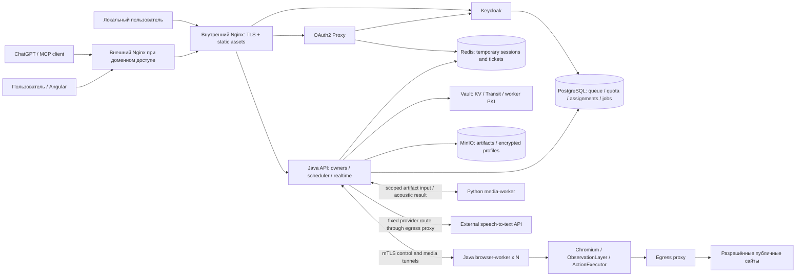
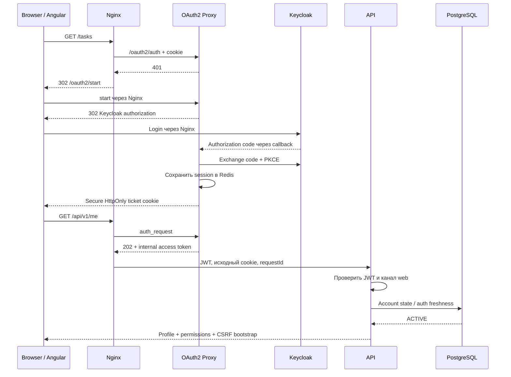
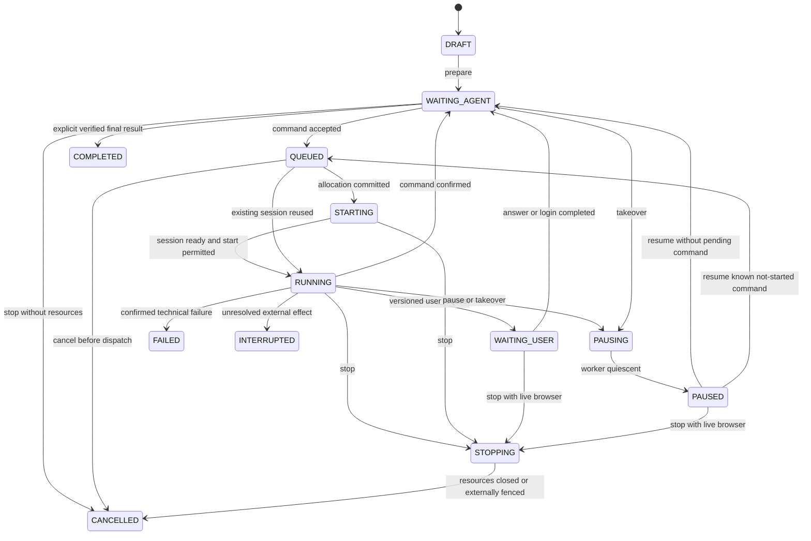
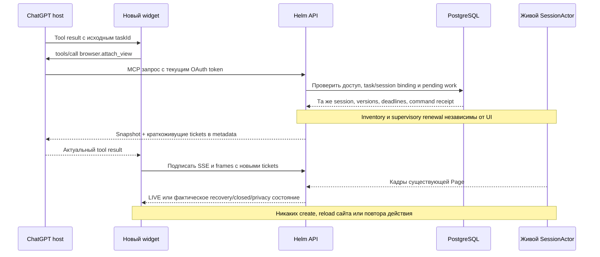
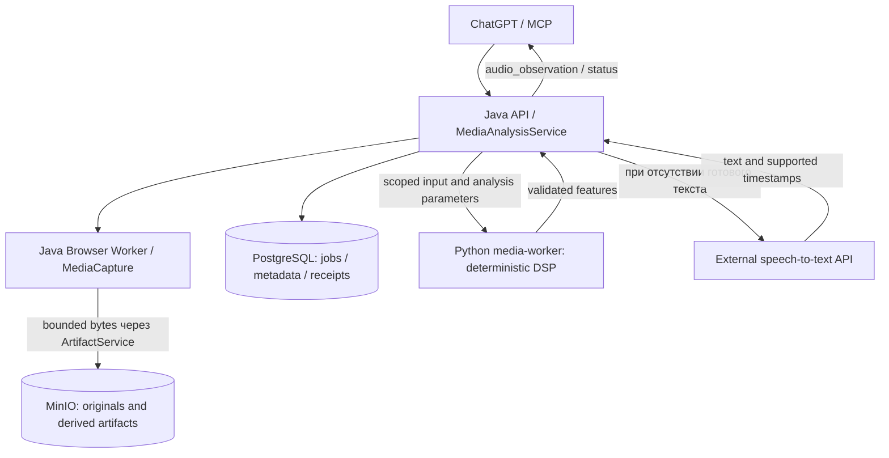

# Helm Glass — финальная техническая архитектура

Дата: 2 октября 2026 года. Статус: проект решения для реализации, а не отчёт о развёрнутой системе.

Документ — канонический владелец архитектуры. Текущий UX-источник — [Helm-Glass-v8.html](Helm-Glass-v8.html). Учтены требования пользователя от 2 октября 2026 года: Java browser workers, Compose scale, единый PostgreSQL allocator, отсутствие стека распределённой трассировки, структурированные browser/audio observations и отсутствие локальных моделей. Уточнения сверены с текущим макетом и официальными контрактами платформы.

В репозитории есть документация и автономный HTML, но нет исходников API/worker/Angular-приложения, сборок, миграций или реализации MCP-сервера. В доступном ChatGPT отдельно обнаружен подключённый Helm Glass; это не реализация данного репозитория. Границы её проверки — в подразделах 6.2 и 37.2. Макет проверяется через локальный HTTP, а не `file://`. Поздние определения render-функций заменяют ранние. Таймеры, localStorage, фиктивные данные и переключатели сценариев не доказывают серверное восстановление или сохранность живого Chromium. Ссылки на официальную документацию подтверждают возможности платформы, а не работоспособность Helm.

## 1. Что представляет собой система

Helm Glass — личный кабинет исполнения конкретных браузерных команд внешнего агента. Пользователь создаёт поручение, выбирает предпочтительные подключения, следит за браузером, отвечает на вопросы, самостоятельно проходит вход и получает результат. ChatGPT через MCP принимает решения о следующих шагах. Helm Glass предоставляет исполнение, ограничения, историю и хранение; собственного автономного LLM-цикла в этой версии нет.

Подготовленная в кабинете задача получает состояние `WAITING_AGENT`. Ни открытие страницы, ни восстановление просмотра, ни завершение ручного входа не запускают модель. После ручного участия задача ожидает следующую команду внешнего клиента. Альтернативный внешний инициатор использует те же прикладные операции и ограничения.

Текущий UX-источник — [Helm-Glass-v8.html](Helm-Glass-v8.html). Это демонстрационный макет, не реализация backend. Имена функций ниже служат навигацией по текущему HTML, а не API-контрактом:

| Экран / поведение | Подтверждение в HTML | Серверная ответственность |
|---|---|---|
| Задачи: KPI, поиск, фильтры, сортировка, страницы | `renderTasks`, общий `gridMount6`/`requestPage6` | Фильтрация/сортировка в PG; numbered pages, exact total, snapshot contract раздела 33; без выбора строк/CSV export |
| Черновик, подготовка с тем же ID, создание похожей | `renderForm`, `saveTask` | Версионирование, idempotency и admission подготовленной задачи |
| TABLE / FILE / TEXT, подтверждения, browser time limit | `renderForm` | Типизированные параметры; goal не используется как управляющая конфигурация |
| Выполнение / Результат, возврат в список | `renderRun`, breadcrumbs | Task/result DTO; сохранение разрешённых параметров списка и текущей browser binding |
| Browser toolbar, ручное управление, сохранение/закрытие | Общая browser panel | Session/control/profile owners; просмотр не создаёт runtime |
| Ход выполнения внутри браузера | `gridMount6` для events, отдельный scroll | Серверные search/type/page, 10 событий на страницу |
| Ручной вход, OTP, другой аккаунт, потеря канала | `renderManual`, `completeLoginH` | Private mode, проверка результата входа, save/session-only |
| Подключения | `renderConnections` | Search/status/rename/check/delete и ownership |
| MCP guide и отзыв доступа | `renderGuideH` | Реальный endpoint, OAuth grant и revoke |
| Usage | `renderUsage` | Измерения с completeness; без экспорта списка/CSV |
| Profile | `renderProfile` | Версионируемая policy; guards перед действием и allocation |
| Administration | `userTableA`, `auditTableA` | Safe projections, limits/stop/block/delete, reason/audit |
| Drain и platform admission | Administration browser pool | Запрет новых allocations без скрытого завершения живых браузеров |
| Уведомления, поиск, login/error screens | `shell`, `renderSystem`, `renderSignIn` | Notification/search, отдельные loading/empty/error states |
| Виджет ChatGPT | `renderWidget` | Та же задача и browser binding; реальные host capabilities по разделам 6/34/37 |

В продукт не переносятся «Все экраны макета», сброс демоданных, вымышленные каталоги и simulation-кнопки. Archive отсутствует в модели, API, фильтрах и маршрутах. Оставшееся в HTML имя иконки `archive` не является требованием.

Критерий готовности — работа перечисленных маршрутов с реальной авторизацией, реальным worker и внешним тестовым сайтом, включая ошибки и восстановление. Сборки и healthcheck этого не доказывают.

## 2. Главные архитектурные решения

1. **Один модульный Spring Boot API**, внутри которого находятся MCP adapter, scheduler, task orchestration, quotas, administration, reconciliation, file gateway и realtime gateway. У этих частей нет отдельной необходимости в сетевых сервисах.
2. **Отдельный масштабируемый Java browser-worker**. У него собственные процессы Chromium/Playwright, ресурсы, lifecycle и контур доступа. Падение браузера не останавливает REST API.
3. **PostgreSQL — единый источник очередей, квот и назначений**: tasks/commands/media jobs, attempts/results, allocations/control, operations, удаления и audit. Redis остаётся для OAuth2-сессий и временных tickets/rate limits, без Lua allocator.
4. **At-least-once доставка + durable deduplication + запрет слепого повтора**. Exactly-once для произвольного внешнего сайта не обещается.
5. **SSE для изменений состояния; два WebSocket-канала для кадров и ввода**. Изображения не помещаются в Redis, PostgreSQL или обычную историю.
6. **Chromium CDP screencast** для просмотра, Playwright for Java для исполнения. Один источник кадров на сессию, несколько авторизованных зрителей; один контроллер.
7. **Connection, BrowserProfile и BrowserSession различаются**. Первый — доступ к аккаунту сайта, второй — зашифрованный сохранённый snapshot, третий — временный живой браузер.
8. **Монотонные версии и fencing обязательны**. TTL не доказывает, что старый браузер умер. Неопределённый слот учитывается занятым до подтверждения очистки.
9. **Внутренний Nginx — единственная точка пользовательского входа в Compose** и одновременно сервер Angular static assets. При доменном доступе перед ним стоит внешний Nginx инфраструктуры стенда, который проксирует весь origin на внутренний Nginx. Отдельный постоянно работающий `frontend`-контейнер не нужен.
10. **Liquibase** — единственный migration owner Helm.
11. **BrowserObservationLayer + BrowserActionExecutor внутри Java worker**: ограниченные observations/refs, одно проверяемое действие, повторное наблюдение. Полный DOM diff не нужен в первой версии.
12. **Один Python media-worker** для детерминированной акустики. Текст — готовые captions либо внешний ASR; локальные модели не используются. MediaAnalysisService в Java владеет job/метаданными.
13. **Минимальная эксплуатация**: JSON logs, health, operational metadata и backups. OpenTelemetry/Jaeger и отдельный стек dashboards исключены из первого релиза.

Базовая линия реализации: Java 25 LTS, Spring Boot 4.1, Spring Security/Data из его BOM; Angular 22, TypeScript 6.0, Node 24.15+ в сборочном образе. Совместимость проверяется по [Spring Boot](https://docs.spring.io/spring-boot/system-requirements.html) и [Angular](https://angular.dev/reference/versions). Patch-версии, Playwright и соответствующая ему ревизия Chromium фиксируются в lock-файлах и release manifest; образы — по digest. Архитектурный документ не подменяет проверку конкретного набора зависимостей сборкой.

Существенная оговорка выбранного стека: официальный community-репозиторий MinIO архивирован. Для production оставляем требуемый MinIO, но выбираем поддерживаемую поставку MinIO AIStor с действующей лицензией и обновлениями. Использование старого неподдерживаемого образа не позволяет объявить решение production-ready. Это эксплуатационная предпосылка, а не замена продукта. См. [репозиторий MinIO](https://github.com/minio/minio) и [контейнерная поставка AIStor](https://docs.min.io/aistor/installation/container/).

## 3. Диаграмма компонентов



Внутренние worker API не публикуются Nginx. Browser workers инициируют control/media tunnels; API маршрутизирует по зарегистрированному workerId/bootId, не по номеру контейнера. Media-worker изолирован от browser runtime и БД; взаимодействует только с доверенным API. События и результаты передаются агенту через Java owner, не прямым подключением Python к ChatGPT.

## 4. Состав сервисов

| Сервис | Назначение, собственные данные и восстановление |
|---|---|
| `nginx` | TLS, Angular static, единый proxy и лимиты HTTP; stateless |
| `api` | Бизнес-модули, PostgreSQL scheduler, MCP, files/realtime, MediaAnalysisService и внешний ASR adapter; reconciliation после рестарта |
| `browser-worker` × N | Java/Playwright, observations/actions/capture. Нет business tables; watchdog и сверка assigned runtime |
| `media-worker` | Python/FFmpeg/DSP, один bounded job; нет БД/локальных моделей, immutable artifact допускает пересчёт |
| `egress-proxy` | Единственный выход browser runtime; отдельный закрытый маршрут API к разрешённому ASR provider |
| `postgres` | Отдельные БД/роли Helm и Keycloak; WAL, backup/PITR; один сервер без обещания HA |
| `redis` | AOF, ACL, noeviction; OAuth sessions, CSRF, tickets и rate limits. Потеря требует нового login/attach, не восстановления allocator |
| `minio` | Private media/derived artifacts и encrypted profiles; persistent volumes и off-host backup |
| `vault` | Raft, KV для сервисных секретов, Transit для profile keys; узкая PKI для автоматически регистрируемых workers |
| `keycloak` | OIDC identities/login/roles/grants; application account state отдельно в Helm |
| `oauth2-proxy` | OIDC web client, server-side sessions в Redis |
| Init jobs | Подготовка БД/realm/buckets/Vault policies и Liquibase; завершаются |

При двух browser-worker и одном media-worker это 12 постоянно работающих контейнеров. Init jobs не включены. Collector/Jaeger/Prometheus/Loki/Grafana отсутствуют. Worker получает только enrollment identity и scoped задания; общих PostgreSQL/MinIO/Vault полномочий нет. Доставка сервисных секретов — на старте из Vault/защищённого bootstrap, без обязательной горячей ротации всех service credentials.

## 5. Nginx routing

Один origin, например `https://helm.example.com`. Реальный домен задаётся в `Deploy/`; `helmg.ru` в HTML — пример, не обязательный production-адрес. При доменном доступе внешний Nginx передаёт все пути внутреннему Nginx, сохраняет WebSocket/SSE и проверяет TLS upstream. Он не маршрутизирует API, frontend и Keycloak самостоятельно. Локально пользователь обращается к опубликованному HTTPS-порту внутреннего Nginx.

| Путь | Получатель | Защита |
|---|---|---|
| `/`, `/tasks/**`, `/connections/**`, `/manual`, `/usage`, `/profile`, `/admin/**` | Angular files | OAuth2 Proxy auth_request; backend отдельно проверяет account state |
| `/assets/**`, hashed JS/CSS | Nginx static | Тот же web gate; immutable cache только для hash-имен |
| `/oauth2/**` | OAuth2 Proxy | OIDC callback/start/logout; фиксированные redirect allowlists |
| `/auth/realms/helm/**`, `/auth/resources/**` | Keycloak | Публичные OIDC/login/account endpoints; admin/master/management не публикуются |
| `/api/v1/**` | Java API | Web cookie → proxy access token → JWT + account + object authorization + CSRF |
| `/events/v1/**` | Java API SSE | Web auth; scoped server-side subscriptions; без proxy buffering |
| `/stream/v1/frames/**`, `/stream/v1/input/**` | Java API WS relay | Web auth + Origin + одноразовый channel ticket + current lease |
| `/events/v1/widget/tasks/{taskId}`, `/stream/v1/widget/frames/{sessionId}` | Те же realtime/media owners | Только просмотр: отдельный ticket security chain из раздела 34, без web cookie и без login redirect |
| `/mcp` | MCP adapter внутри API | Собственный Bearer JWT audience/scopes; никакого login redirect |
| `/.well-known/oauth-protected-resource/mcp` | API | Публичные metadata без пользовательских данных |
| `/internal/**`, `/actuator/**`, `/metrics` | Не маршрутизируются | 404 снаружи |

API, SSE и WS при потере входа возвращают 401/403, а не HTML формы Keycloak. Angular получает текущую страницу входа через обычную навигацию. Никаких публичных MinIO presigned URLs: скачивание идёт через `/api/v1/artifacts/{id}/content` с проверкой владельца и Range.

## 6. Authentication flow

Angular не хранит access/refresh token и не запускает вторую OIDC-библиотеку. OAuth2 Proxy — confidential client `helm-web`, Authorization Code + PKCE S256, issuer `https://helm.example.com/auth/realms/helm`. Web access token предназначен для audience `helm-api-web`; backend проверяет подпись, issuer, audience, expiry и `azp`.

Nginx вызывает `/oauth2/auth`, получает `X-Auth-Request-Access-Token` и передаёт его API как `Authorization: Bearer …`. Входящие `Authorization`, identity и forwarded headers на web-маршрутах перезаписываются. `X-User`, email и groups не являются основанием доступа. Backend получает user ID из JWT `sub`; `(issuer, sub)` связывается с внутренним UUID. Это не двойной пользовательский login: proxy управляет web session, backend валидирует выданную identity и права. [Механика auth_request](https://oauth2-proxy.github.io/oauth2-proxy/7.12.x/configuration/integration/).



Cookie `__Host-helm_session`: `Secure`, `HttpOnly`, `Path=/`, без Domain, `SameSite=Lax`. Redis содержит server-side session, браузер — билет; секрет билета также требует защиты. OAuth state, nonce и CSRF cookies остаются включёнными. Session idle/absolute expiry согласованы с Keycloak; начальная настройка — refresh 5 минут и web absolute lifetime 8 часов. Конкретные значения — эксплуатационная конфигурация, не UX-обещание. [Redis session storage](https://oauth2-proxy.github.io/oauth2-proxy/configuration/session_storage/).

Для `/api/v1/**` применяется Spring Security CSRF: сервер выдаёт токен, Angular отправляет `X-XSRF-TOKEN`. Репозиторий токена привязан к OAuth session identity; дополнительно проверяются точный Origin и допустимый Fetch Metadata. SameSite не заменяет CSRF. Cookies и CSRF не нужны MCP Bearer API; исключение строго ограничено этим security chain. WS handshake проверяет Origin, а ticket выдаётся только CSRF-защищённым POST.

Конкретно `/me` регистрирует/проверяет `application_logins` по проверенному JWT sid и устанавливает читаемую JS cookie `__Host-helm_csrf` (Secure, SameSite=Lax, Path=/, без Domain). Angular настраивает встроенный XSRF interceptor на это имя и `X-XSRF-TOKEN`. Server-side hash nonce хранится в Redis с binding на application login ID и expiry; при утрате Redis новый bootstrap выдаёт новый токен. HttpOnly применяется к session cookie, но не к этой CSRF cookie. Logout помечает login revoked в PG, поэтому копия старого cookie или JWT не возвращает доступ.

Новая сессия обязана удовлетворять `auth_time > reauthenticationAfter` либо иметь подтверждённый новый `sid` после revocation barrier. Проверка одного `iat` недостаточна: refresh старого сеанса может выпустить новый JWT. При unblock/restore старые proxy cookies и Keycloak sessions не становятся действительными. Для повторного входа используется `prompt=login`; запрещён бесконечный redirect при заблокированном аккаунте.

`POST /api/v1/auth/logout` с CSRF отзывает текущий application login, запускает Keycloak session logout и очистку proxy cookie; возвращает разрешённый сервером redirect. Незавершённый remote logout не восстанавливает доступ к Helm. Сохранённые задачи не удаляются. Потеря web login отзывает human control; внешняя работа отдельно управляется grant/policy и не дублируется.

Для MCP: отдельный Keycloak client, audience `helm-mcp`, Authorization Code + PKCE, проверка `resource`, scopes `tasks:read`, `tasks:write`, `browser:view`, `browser:execute`, `results:write`. `browser:view` разрешает обычный preview, но не private frames и не HUMAN control. Поддерживаются discovery и 401 challenge согласно [MCP Authorization](https://modelcontextprotocol.io/specification/2025-11-25/basic/authorization). Client registration закрытая, с известными redirect URI; совместимость выбранного ChatGPT-клиента проверяется в интеграционном этапе. Административных MCP tools/scopes нет; admin API отклоняет MCP tokens даже при admin-role пользователя.

### 6.1. ChatGPT, виджет и транспорт: подтверждённые границы

Это разные соединения с разными сроками жизни:

| Связь | Выбранный механизм / граница доказанного |
|---|---|
| ChatGPT ↔ Helm MCP | Streamable HTTP на `/mcp`, короткие ответы с durable IDs; не WebSocket. Разрыв HTTP не равен отмене принятой бизнес-команды |
| Виджет ↔ ChatGPT host | MCP Apps bridge: JSON-RPC через `postMessage`, `ui/initialize`, уведомления о tool result, `tools/call` |
| Веб-кабинет / виджет ↔ Helm | Snapshot + SSE состояния; отдельный WS кадров; WS ввода только для HUMAN-контроллера веб-кабинета |
| API ↔ worker ↔ Chromium | Внутренние mTLS-каналы, SessionActor и живой процесс; не зависят от существования iframe |
| ChatGPT ↔ собственный backend OpenAI | Внутренний транспорт, кнопка «Переподключить» и повторный запуск turn не контролируются Helm |

Streamable HTTP поддерживает необязательные MCP session IDs и SSE replay. Для Helm выбирается stateless MCP adapter: все бизнес-ссылки в tool arguments/results, состояние в PostgreSQL. Если библиотека потребует транспортную MCP-сессию, её повторная инициализация или DELETE не создаёт/не закрывает BrowserSession. MCP cancellation прекращает ожидание вызова; остановка уже принятой работы проходит явную операцию `tasks.stop`. [MCP transport](https://modelcontextprotocol.io/specification/2025-11-25/basic/transports), [официальное руководство OpenAI](https://developers.openai.com/plugins/build/mcp-server).

UI возвращается ресурсом `text/html;profile=mcp-app` с `_meta.ui.resourceUri`. Host может пересоздать iframe. `window.openai.widgetState/setWidgetState` — необязательное сохранение UI между рендерами; там допустимы taskId, последняя наблюдённая session reference и настройки показа, но не источник business state или действующие полномочия. Сохранение iframe, автоматическое возобновление turn, доступный серверу стабильный chat ID и вечная сохранность UI после reload **не гарантируются этим проектом**. Приёмка выполняется на реальном целевом ChatGPT-клиенте. [MCP Apps UI](https://developers.openai.com/plugins/build/chatgpt-ui), [UI reference](https://developers.openai.com/plugins/reference).

OAuth-токен MCP проверяется сервером при каждом вызове; `taskId`, Origin и metadata сами по себе не авторизация. Widget не получает web cookie или OAuth access/refresh token. Новые краткоживущие разрешения просмотра выдаются через авторизованный host bridge, по [контракту раздела 34](#widget-transport). Права, отозванные после первоначального tool result, проверяются заново. [OpenAI authentication](https://developers.openai.com/plugins/build/auth).

Встроенный виджет показывает задачу и обычные кадры. «Взять управление» / «Войти на сайт» открывает защищённую страницу **той же** задачи в веб-кабинете; сама навигация control не выдаёт. HUMAN input и private frames требуют web login и явного acquire. Так MCP grant не превращается в право агента читать ручной ввод. Это выбранная граница первой реализации: полноценный human-input внутри iframe потребовал бы отдельно подтверждённого пользовательского канала авторизации; доверять полю `caller=human` или одному скрытию tool от модели нельзя. Генерируемый виджет использует тот же BrowserPanel с соответствующими capabilities, не отдельную state machine.

<a id="chatgpt-platform"></a>

### 6.2. Последний ответ ChatGPT: возможности и ограничения платформы

Проверка официальных страниц: **2 октября 2026 года**; адреса Apps SDK сейчас перенаправляются в документацию Plugins. Ниже возможности host, а проектный протокол единственного показа находится в [34.2](#chat-widget-ownership).

| Возможность | Подтверждённая граница |
|---|---|
| Показ и обновление | Render tool связывается с UI resource; bridge доставляет результаты. Data tools могут работать без нового UI. Решение о mount принимает host. [Add UI](https://developers.openai.com/plugins/build/chatgpt-ui#separate-data-processing-from-ui-rendering) |
| Удаление / сворачивание | `requestClose()` просит закрыть **свой** UI, без документированной гарантии удаления исторического сообщения. Сворачивание собственного содержимого и уведомление о высоте доступны; управления соседним iframe не заявлено. [Reference](https://developers.openai.com/plugins/reference#close-the-ui) |
| Порядок / прокрутка | Публичного API перестановки старых сообщений/виджетов не найдено. `sendFollowUpMessage({prompt,scrollToBottom})` относится к отправке нового сообщения, не к произвольному scroll. [Reference](https://developers.openai.com/plugins/reference#windowopenai-component-bridge) |
| Идентификаторы | `openai/widgetSessionId` живёт до unmount; `openai/session` — корреляция разговора в сессии ChatGPT. Гарантия стабильности после reload/новой сессии не описана; это не авторизация. [Metadata](https://developers.openai.com/plugins/reference#_meta-fields-the-client-provides) |
| «Думаю…» | В публичном UI bridge нет управления нативным индикатором, его положением или содержимым рассуждений. Доступны собственные компоненты и сообщения. [Add UI](https://developers.openai.com/plugins/build/chatgpt-ui) |

Требуемый UX: доступные пользователю сообщения ChatGPT о ходе работы находятся над актуальным виджетом, в последнем ответе внизу переписки; нативный «Думаю…», когда host его показывает, остаётся частью ChatGPT. Внутри Helm нет копии этого индикатора, внутренних рассуждений или собственной «цепочки мыслей». Журнал Helm содержит только наблюдаемые действия, результаты и ограничения. TinyFish здесь — указанный пользователем ориентир UX, а не доказательство доступности конкретного SDK API.

Ближайшее поддерживаемое поведение: инструкции агенту требуют одного `tasks.view` в новом ответе при продолжении задачи, после краткого сообщения о принятом уточнении; последующие data tools обновляют существующий показ. В одном ответе повторный render не нужен. При обновлении того же экземпляра исправные SSE/WS сохраняются. Если host создаёт новый iframe, он подключается к прежней задаче, а сервер отзывает старый показ. Точное место относительно текста/«Думаю…», автоматическая прокрутка и удаление старой host-карточки остаются ограничениями платформы, а не обещанием Helm. Не отправлять скрытые follow-up только ради перемещения/прокрутки. Если host не показывает новый UI, дать в последнем ответе защищённую ссылку на исходную задачу; при доступной возможности PiP её можно предложить пользователю, но это не исполнение требования о положении inline-карточки.

Проверка доступного клиента: в Chrome открыт ChatGPT web, в разделе плагинов виден подключённый **Helm Glass 1.0.0**. Доступные connector descriptors содержат `get_task` и `show_browser(run_id)` с сохранением незавершённого run. Безопасные `get_capabilities` и `list_tasks` через доступный коннектор вернули MCP `-32603 Internal error`. Версия сборки самого ChatGPT в проверенном UI не указана. Ни повторный mount реального виджета, ни удаление/высота/порядок/scroll/индикатор, ни фактически передаваемая correlation metadata этим не проверены. Наличие установленного плагина и описание tool не доказывают их работу; новые внешние задачи и браузеры для этой проверки не создавались. Нужна приёмка R15–R22 на доступном рабочем endpoint.

## 7. Task lifecycle

Lifecycle и outcome независимы. Финальный набор состояний:

| State | Значение / выход |
|---|---|
| `DRAFT` | Неполное редактируемое поручение; браузера и queued usage нет |
| `WAITING_AGENT` | Подготовлено либо конкретная команда закончилась; следующего шага ещё нет |
| `QUEUED` | Команда принята; ожидает allocation/connection/platform gate |
| `STARTING` | Назначение зафиксировано, worker открывает браузер; слот уже занят |
| `RUNNING` | Есть исполняемая конкретная browser command или привязанный audio analysis, а не просто открытый браузер |
| `PAUSING` | Запрошен барьер: новые команды запрещены, текущая доводится до известной границы |
| `PAUSED` | Агент не исполняет команды; браузер может быть жив, закрыт или под управлением человека |
| `WAITING_USER` | Открыт versioned request LOGIN / QUESTION / CONFIRMATION / CONNECTION_REQUIRED |
| `STOPPING` | Прекращение задачи принято; ждём остановки её локальных browser/media исполнителей; уже отправленные внешние запросы не считаются отменёнными автоматически |
| `COMPLETED` | Получен явный итог с outcome и ограничениями; новых команд не принимаем |
| `FAILED` | Подтверждённый технический отказ, дальнейшее исполнение прекращено |
| `CANCELLED` | Остановка подтверждена; внешние эффекты не откатываются |
| `INTERRUPTED` | Безопасное продолжение не доказано, например результат внешнего действия неизвестен |

`outcome = SUCCESS | PARTIAL | NOT_ACHIEVED | null`. Обязателен у `COMPLETED`; у остальных состояний итоговый outcome `null`. Предварительные результаты и `coverage` сохраняются отдельно даже при CANCELLED/FAILED. Техническая ошибка не превращается в `NOT_ACHIEVED`; завершение команды не означает `SUCCESS` всей задачи.



Диаграмма показывает основные дуги; общие guards применяются также к остальным нефинальным состояниям. `Stop` допустим из всех подготовленных нефинальных состояний, а без ресурсов заканчивается сразу. Draft удаляется отдельной операцией с tombstone idempotency. FAILED/COMPLETED могут уже иметь финальный business state, пока отдельная cleanup operation закрывает BrowserSession; occupied считается по allocations, а не по state задачи.

Pause останавливает выдачу новых действий, но не замораживает JavaScript внешнего сайта и не отменяет уже отправленный запрос. Return control восстанавливает сохранённое намерение: до takeover была PAUSED — остаётся PAUSED; была WAITING_AGENT — ждёт агента. Новый агентный шаг сам не придумывается.

INTERRUPTED не возобновляется автоматическим retry. Проверка результата — отдельная read-only reconciliation operation. После установления эффекта можно явно создать продолжение с `resumesTaskId`; прежняя история и неизвестная попытка не переписываются.

<a id="task-clarifications"></a>

### 7.1. Уточнение во время выполнения — продолжение исходной задачи

Уточнение меняет дальнейшее намерение, а не идентичность задачи: сохраняются `taskId`, текущая binding `BrowserSession`, sessionId, worker/boot, вкладки, cookies, авторизация и состояние страницы, пока жив исходный runtime и действуют его deadlines. Оно не вызывает create/copy/open/reload, восстановление BrowserProfile, создание Connection, повторный login или повтор уже выполненных действий. Новое задание и продолжение terminal/INTERRUPTED оформляются только явно по разделу 7; неизвестный эффект не снимается словом «продолжить».

Единственный owner изменения намерения — `TaskLifecycleService`. Операция `tasks.clarify` добавляет неизменяемую запись `task_clarifications` и увеличивает `instructionRevision` задачи; исходный `goal` и история остаются прежними. Аргументы: taskId, clarificationId, text (1–4096 символов, без секретов), expectedInstructionRevision, expectedTaskVersion, idempotencyKey. Повтор исходного ключа возвращает прежний receipt; другая поправка получает новую revision. Несколько уточнений применяются в серверном порядке revision; последняя явная поправка имеет приоритет только в изменённой части поручения. Это не ответ на LOGIN/CONFIRMATION: versioned user request разрешается отдельно, подтверждение не угадывается из свободного текста.

Агент перед следующей командой читает `tasks.get`: исходную цель, уточнения после известной revision, текущую/последнюю command, её эффект и результат, outstanding operation, управление и runtime. Полная история уточнений доступна страницами; неполная страница не считается всем намерением. Следующая command передаёт текущую instructionRevision и учитывает поправки вместе с уже полученным результатом. Сервер запрещает устаревшую revision, но семантическое выполнение поручения проверяется поведением агента. Helm не читает текст чата самостоятельно: до доставки `tasks.clarify` он не знает о новом сообщении. Если ChatGPT не продолжил turn или не вызвал tool, показывается «Ожидает ChatGPT», без выдуманного подтверждения принятия.

### 7.2. Граница уточнения и уже принятой команды

Приём уточнения, admission и start permit команды сериализуются на той же task-записи через существующий CommandExecutionService. Partial UNIQUE outstanding browser command и SessionActor сохраняют одного исполнителя; второй агент/turn не запускается параллельно. Уточнение не меняет control/privacy и не сбрасывает browser budget/idle deadline.

| Положение команды при commit уточнения | Результат |
|---|---|
| Нет outstanding command | Зафиксировать revision, оставить WAITING_AGENT/PAUSED/WAITING_USER по существующему состоянию; следующий шаг выбирает агент |
| ACCEPTED/WAITING_RESOURCE/DISPATCHED, STARTED ещё не выдан | Атомарно запретить прежний start permit; завершить command как CANCELLED с причиной INSTRUCTION_SUPERSEDED и доказанным NOT_STARTED. Новая команда только после чтения поправок; pending command не переписывать |
| STARTED уже зафиксирован | Receipt уточнения явно содержит `afterCommandId` и «применить после известного результата». Дождаться bounded disposition этой attempt; не посылать конкурирующее действие и не обещать отмену запроса сайта |
| Результат известен | Сохранить result/effect и учитывать их в следующем шаге; отмена намерения не откатывает внешний эффект |
| Результат UNKNOWN / runtime утрачен во время эффекта | Сохранить уточнение, заблокировать дальнейшие mutations по 8.1; отдельная проверка результата. Не выполнять исходное действие ещё раз |

Race решает commit/start permit, а не время сообщения на клиенте. Если STARTED выиграл гонку, даже отсутствие ACK не доказывает NOT_STARTED. Receipt содержит taskId, instructionRevision, outstandingCommandId, disposition `READY | AFTER_COMMAND | REQUIRES_RECONCILIATION | WAITING_CONTROL`, без обещания продолжения модели. Завершение старой attempt принимается как её receipt, не как исполнение новой revision. Старые approvals по изменённому intent аннулируются; после разрешённого fresh observation агент формирует новую command. Идемпотентность delivery и правила UNKNOWN остаются у раздела 8, отдельного движка продолжений не появляется.

## 8. Command execution lifecycle

Task — поручение; command — одна типизированная операция; attempt — одна разрешённая попытка; operation — продолжительная управляющая процедура (stop, handoff, snapshot, purge, audio analysis). Это разные идентификаторы и состояния.

Command state: `ACCEPTED → WAITING_RESOURCE → DISPATCHED → STARTED → SUCCEEDED | FAILED | UNKNOWN`; до STARTED возможны `CANCELLED` и ожидание policy/user request. Retry создаёт следующую attempt той же command только после классификации эффекта. Команда не «успешна», пока результат не принят PostgreSQL.

Operation state: `PENDING → RUNNING → SUCCEEDED | FAILED | NEEDS_ATTENTION`; `CANCELLED` разрешён только до необратимой границы соответствующей операции. Account deletion — отдельный workflow со своим recovery period. HTTP timeout клиента не является state операции.

При записи обязательны `Idempotency-Key`, `requestId`, ожидаемая версия aggregate (`If-Match`). Dedup scope: `(userId, clientId, operationKind, key)`. Хранятся canonical payload hash, operation/resource IDs, HTTP status и безопасный response envelope. Повтор того же payload возвращает прежнее принятие; другой payload с тем же key — 409. Сначала повторно проверяются identity/account/grant и доступ к ресурсу, затем известная idempotency record, затем версия: корректный повтор не должен проиграть из-за уже увеличенной task version и не должен обходить отзыв доступа.

```mermaid
sequenceDiagram
    participant C as Angular или MCP
    participant A as API / TaskService
    participant P as PostgreSQL
    C->>A: Create/prepare + key + expectedVersion
    A->>P: TX: lock user admission, dedup, validate, task + operation
    Note over A,P: Draft не занимает очередь; prepare даёт WAITING_AGENT
    A->>P: Commit
    A-->>C: taskId + operationId + version
    opt Ответ потерян
        C->>A: GET operation by idempotency key
        A->>P: Найти исходную запись
        A-->>C: Та же задача и результат принятия
    end
    C->>A: Конкретная browser command + новая key
    A->>P: TX: command + task QUEUED + outbox
    Note over A,P: Scheduler читает committed command; потеря wakeup безопасна
```

```mermaid
sequenceDiagram
    participant C as MCP client
    participant A as API / Scheduler
    participant P as PostgreSQL
    participant W as Worker
    participant B as Playwright / Site
    C->>A: Execute(commandId, taskVersion, typed payload)
    A->>P: Commit ACCEPTED + outbox
    A-->>C: Accepted + status resource
    A->>P: Read runnable batch; claim / allocate / DISPATCHED
    A->>W: Execute with assignment and control epochs
    W->>A: Request start permit(attemptId)
    A->>P: CAS STARTED; account/policy/lease guards
    A-->>W: Single-attempt permit
    W->>B: One authorized operation
    B-->>W: Result or ambiguous transport failure
    W->>A: Idempotent result(attemptId, digest)
    A->>P: TX: attempt result + events + task + outbox
    A-->>W: Persisted ACK
    A-->>C: Result/status available
```

Правила повторов:

| Ситуация | Решение |
|---|---|
| Команда не достигла STARTED | Допустима новая доставка с тем же commandId |
| Повторное сообщение очереди | По PostgreSQL уже STARTED/terminal — не выполнять повторно |
| Локальное наблюдение DOM без внешнего эффекта | Bounded retry допустим; freshness/page epoch проверяется заново |
| Navigate/reload/«GET страницы» | Не считать автоматически безопасными: сайт способен менять данные через GET |
| Известная идемпотентная API-операция сайта | Повтор с тем же внешним idempotency key согласно контракту сайта |
| Click submit/payment/delete; ответ потерян | `UNKNOWN`, последующие изменения заблокированы, сначала независимая проверка эффекта |
| Result ACK потерян | Worker повторяет отправку сохранённого результата, а не действие Playwright |
| STARTED зафиксирован, worker погиб до/после dispatch | Консервативно UNKNOWN, если нельзя доказать отсутствие эффекта |

По умолчанию максимум три **разрешённых** технических попытки с exponential backoff/jitter и общим deadline; для неизвестного небезопасного эффекта — ноль автоматических повторов. Deadlines и dispatch timeout не продлеваются бесконечно при reconnect.

### 8.1. Ответ потерян: восстановление принятия и результата

MCP mutations передают `idempotencyKey` и `commandId` явно в аргументах; JSON-RPC request ID, HTTP connection ID, iframe instance и MCP session ID для dedup не подходят. Widget mount, обновление чата и восстановление подписки вообще не вызывают create/execute/resume. После повторного подключения агент сначала получает `tasks.get`: текущую/последнюю команду, outstanding operation, user request, control и сохранённый результат; затем при необходимости `commands.get` / lookup исходного ключа. Если ключ потерян, искать исходную задачу/команду, а не генерировать новую для «повтора».

Различаются три случая: (1) действие подтверждено сервером, потерян только ответ клиенту — вернуть прежний receipt; (2) живой worker имеет результат без PG ACK — повторить delivery того же результата; (3) результат не доказан — `UNKNOWN`, без повторной отправки. Наличие скриншота, HTTP timeout или «успешный click» не доказывает создание заказа. Reconcile проверяет read-only receipt/статус внешней операции либо оформляет свидетельство пользователя с источником и временем: `APPLIED`, `NOT_APPLIED` или `UNRESOLVED`. Отсутствие результата в неполной/запаздывающей выдаче не означает NOT_APPLIED.

До разрешения UNKNOWN новые mutations задачи запрещены всем контроллерам; допускается просмотр и разрешённая проверка результата. Handoff не снимает этот барьер. INTERRUPTED сохраняет историю и исходную неизвестную attempt; продолжение после проверки оформляется явно по разделу 7. Произвольный сайт не даёт exactly-once гарантии: новая семантически похожая команда с новым ключом — новое намерение, поэтому её нельзя создавать автоматически из ошибки доставки.

Для human input worker хранит только `lastAcceptedInputSequence/lastAppliedInputSequence` и disposition в пределах control generation, без текста клавиш. Applied ACK подтверждает обработку ввода, не бизнес-эффект сайта. При разрыве сначала остановка приёма старого канала и сверка watermarks/страницы; неподтверждённые сообщения удаляются из client queue без replay. Если мог быть отправлен submit/Enter, UI показывает «Результат действия требует проверки»; новый input lease не означает разрешение повторить submit. При утрате worker отсутствие receipt считается неизвестностью, не нулём выполненных действий.

## 9. Browser worker architecture

Worker состоит из RegistryClient, AssignmentReceiver, SessionSupervisor, SessionActor, BrowserObservationLayer, BrowserActionExecutor, PlaywrightDriver, MediaCapture, FrameProducer, InputGateway и ResultReporter. Это компоненты одного Java executable. У каждого BrowserSession собственный Chromium process/context и последовательный actor. Публичного CDP, VNC, WebDriver и произвольного `evaluate(script)` API нет.

Все обращения к Playwright objects выполняются на создавшем их потоке. Синхронный Java API доставляет события при работе своего message loop: бесконечный `Thread.sleep` или ожидание blocking queue без прокачки событий остановит screencast. Actor чередует bounded operations и короткие event-pump ожидания; отдельный supervisor watchdog может завершить зависший дочерний процесс, но не вызывает Playwright из чужого потока. [Ограничения Playwright Java](https://playwright.dev/java/docs/multithreading).

Начальная конфигурация — две реплики одного service `browser-worker`, `capacity=1` у каждой. Registry и allocator поддерживают произвольные N и capacity; увеличение capacity требует измерения CPU/RAM и проверки изоляции. Фиксированные имена `worker-1/worker-2` не участвуют в протоколе. Одного BrowserContext внутри общего процесса недостаточно как сильной границы от компрометации Chromium, поэтому процессы не делятся между пользовательскими сессиями.

Registry: `workerId`, `bootId`, `version`, `protocolVersion`, `imageDigest`, `capacity`, `desiredMode=READY|DRAINING`, `observedState=REGISTERING|READY|DRAINING|OFFLINE`, `usedSlots`, `heartbeatAt`, `lastSeenAt`, `activeSessions`. `workerId` стабилен в пределах экземпляра, новый запуск всегда имеет новый случайный `bootId`. `usedSlots` в heartbeat — наблюдение, allocator сверяет его с durable claims. Несовпадение — quarantine, не «добавить свободные слоты».

Heartbeat каждые 5 секунд; отсутствие более 20 секунд — OFFLINE. До успешной регистрации, mTLS-проверки, совместимости протокола и inventory reconciliation worker не READY. DRAINING запрещает новые allocations, но сохраняет существующие. Регистрация на scheduler происходит через внутренний mTLS API; worker сам держит управляющий и отдельный media tunnel. Worker не читает общую очередь и не выбирает пользователя самостоятельно.

| Rendering вариант | Оценка для этого продукта |
|---|---|
| CDP captureScreenshot | Удобен для явно сохранённого кадра; постоянное опрашивание заново кодирует изображение |
| CDP screencast | Выбран: Chromium, события кадров, ACK и один capture на всех viewers |
| Playwright screenshots | Оставлены для явного artifact capture; не основной live loop |
| WebRTC | Сейчас не нужен: codec/signaling/ICE/TURN добавляют расходы при требовании порядка 1–2 fps |
| noVNC | Нужны desktop/X server/VNC, управление всей ОС избыточно для browser panel |

CDP screencast — Chromium-specific experimental API; это реальная стоимость выбора: фиксируем browser revision, проверяем протокол при обновлении. Используем `Page.startScreencast`, frame ACK, JPEG, `maxWidth/maxHeight`; backend ограничивает отправку примерно 2 fps в preview, до 5 fps в manual при наличии ресурса. Это целевые настройки, не обещание измеренной latency. [Протокол Page](https://chromedevtools.github.io/devtools-protocol/tot/Page/).

На сессию хранится только последний кадр в RAM. ACK не задерживается медленным клиентом; его промежуточные кадры отбрасываются, очередь на viewer — не более двух кадров. Без viewers capture выключен, кроме явно заказанного разрешённого screenshot. На неподвижной странице отсутствие нового кадра нормально: health канала и timestamp последнего изменения различаются. При отсутствии подтверждения живого worker кадр помечается stale; нельзя выдавать время повторной доставки за время захвата.

SessionActor владеет также active Page. Разрешённый popup/SSO tab переключает текущую страницу внутри той же панели, увеличивает pageEpoch и даёт safe system event; закрытие popup возвращает opener. Нового пользовательского интерфейса вкладок не вводим. Число открытых pages ограничено (начально 5), внезапный popup не получает права обойти policy/privacy. Back/Forward относятся к текущей Page. Downloads перехватываются в ограниченный staging и передаются ArtifactService; загрузка файла на сайт допускает только artifact этого пользователя/task, никогда произвольный путь host.

Лимит viewers и замещение показа определены в 10.1; превышение даёт `VIEWER_LIMIT`, история доступна. Control только у одного. Качество и latency измеряются на целевых страницах; для 960×600 и типичного JPEG 100 KiB при 2 fps ориентир трафика — около 200 KiB/s на viewer, фактический размер измеряется.

<a id="browser-observation"></a>

### 9.1. BrowserObservationLayer и надёжное выполнение действий

`BrowserObservationLayer` — компонент того же Java worker, не отдельный сервис и не второй браузерный framework. Он преобразует доступное состояние текущей Page в ограниченный структурированный контракт. `BrowserActionExecutor` выполняет типизированные действия через Playwright на том же SessionActor; CDP используется для предусмотренных browser/media функций, не передаётся модели напрямую.

Рабочий цикл: **OBSERVE → одно действие → проверка результата → свежий OBSERVE**. План следующих шагов составляет внешний ChatGPT/MCP-клиент. Успех click означает обработку действия браузером; успех бизнес-задачи подтверждается видимым результатом/receipt сайта. Публичные материалы [Codex browser](https://learn.chatgpt.com/docs/browser) и [computer use](https://developers.openai.com/api/docs/guides/tools-computer-use) подтверждают подход «наблюдение — действие — новое состояние», но не раскрывают весь внутренний алгоритм Codex. Здесь задаётся собственный проверяемый контракт, а не заявляется полное копирование реализации.

Наблюдение содержит:

- `observationId`, task/session/page IDs, `controlEpoch`, `pageEpoch`, `privacyEpoch`, sequence и время; safe URL/title, load state, доступность Back/Forward.
- Компактное ARIA-представление и разрешённые DOM-данные: видимый текст, role/name/state, элементы формы без секретных значений, frame context. DOM-read выполняет только поставляемый код worker, пользовательский JS отсутствует.
- Непрозрачные `ref` элементов и `mediaRef` обнаруженных аудио/видео: тип, доступная длительность, playback state, возможность получить файл/captions. URL с токенами и browser credentials модели не возвращаются.
- Явную полноту: `truncated`, причину ограничения и continuation для дополнительного scope. Начальные пределы одного ответа — 200 элементов и 32 KiB текста; это не считается полным DOM. При изменившемся snapshot continuation отвергается.

```json
{
  "type": "browser_observation",
  "schemaVersion": 1,
  "observationId": "obs_104",
  "sessionId": "session_3",
  "pageId": "page_1",
  "controlEpoch": 8,
  "pageEpoch": 12,
  "privacyEpoch": 4,
  "capturedAt": "2026-10-02T10:20:00Z",
  "url": "https://example.org/calls",
  "elements": [
    {"ref": "e12", "frameRef": "main", "role": "button", "name": "Прослушать"}
  ],
  "media": [{"mediaRef": "m4", "kind": "audio", "state": "paused"}],
  "truncated": false
}
```

Ref живёт только в runtime, относится к конкретным observation/page/frame/epochs и grant; не является CSS selector, долгоживущим ElementHandle или полномочием. Начальный срок — 60 секунд. Navigation/reload, смена Page, возврат human control и privacy barrier инвалидируют все прежние refs. Небольшое изменение таймера на странице не сбрасывает весь набор: перед действием worker заново разрешает locator и проверяет уникальность, frame, role/name и значимые признаки цели. Изменённый/неоднозначный элемент даёт `STALE_OBSERVATION`/`AMBIGUOUS_TARGET` **до dispatch**, затем новое наблюдение; нельзя молча выбрать первый похожий элемент.

Основные действия: OBSERVE, CLICK, FILL, SELECT, PRESS, SCROLL, NAVIGATE, BACK, FORWARD, WAIT_FOR и READ_MEDIA. Они содержат observation/ref, ожидаемые epochs, bounded deadline и intent, а не произвольный script. Read-only повтор получения состояния допустим в пределах общего deadline; действие после неизвестного внешнего эффекта не повторяется. Ожидание — конкретного состояния элемента/URL/результата, не фиксированного sleep и не обязательного network-idle всего сайта. Используются штатные [locators](https://playwright.dev/java/docs/locators) и [auto-wait/actionability](https://playwright.dev/java/docs/actionability) Playwright; force-click не служит универсальным обходом ошибок.

ARIA/DOM не покрывают любой canvas. Для такого экрана допускается явно запрошенное visual observation: один свежий viewport screenshot в NORMAL mode, связанный с observation/page/viewport/epochs, без автоматического сохранения artifact. Координатное действие допускается только по этому кадру и текущим размерам viewport, с теми же policy/confirmation guards; после любого действия нужен новый кадр. Скриншот не доказывает семантику кнопки. При отсутствии однозначной цели или поддерживаемого visual клиента — WAITING_USER с конкретной причиной, без угадывания координат. Маскирование отдельных полей не делает private login доступным агенту: в private mode запрещено всё наблюдение.

В первом релизе возвращается ограниченный **полный snapshot выбранного scope**. DOM diff не обязателен: он добавляет синхронизацию базовой версии и восстановление пропусков, не повышая сам по себе надёжность действия. Позже diff можно ввести по измеренному объёму, только с baseObservationId и переходом к полному snapshot при несовпадении базы.

Policy проверяет разрешённое намерение, а не предполагаемую «безопасность» названия элемента. Наблюдение/чтение локального состояния не требуют подтверждения каждой кнопки; для неизвестной изменяющей операции сохраняется правило UNKNOWN_MUTATION раздела 26. По generic DOM нельзя гарантировать, что ссылка ничего не изменяет. Часто используемые сайты получают небольшой проверенный adapter только там, где нужно доказать смысл/результат операции; отдельная модель-классификатор и библиотека сценариев для всех сайтов не входят в основу.

«Всегда работает на любом сайте» не является достижимым контрактом. Критерий — успешность согласованного набора сценариев, отсутствие действий по устаревшей цели, ограниченное восстановление и понятный запрос ручного участия при CAPTCHA/неподдерживаемом UI. Нужны прогоны на целевых сайтах, а не только happy path тестовой страницы.

### 9.2. Получение аудио из страницы

Событие `playback started` сообщает о воспроизведении, но не даёт аудиобайты. CDP screencast передаёт изображения; для звука нужен отдельный путь. `MediaCapture` работает только по разрешённому READ_MEDIA/capture intent задачи, в NORMAL mode. Самопроизвольное autoplay не включает запись всей сессии.

1. Сначала получить связанный с `mediaRef` файл/download либо разрешённый media resource, сохранив исходные bytes, codec, channels, sample rate и checksum. Запрос исполняется в контексте доступа назначенного browser worker с теми же origin/egress rules; cookies, подписанные URLs и заголовки не передаются Python или ASR. Нельзя поручать FFmpeg произвольный сетевой URL.
2. Для доступного незашифрованного HLS/DASH worker проверяет manifest и каждый сегмент/redirect, ограничивает размеры/длительность и передаёт локальные bytes. При недоступном source, например Web Audio, fallback — ограниченная запись реально воспроизводимого звука.
3. Fallback использует отдельный PulseAudio null sink текущего browser runtime и FFmpeg, читающий его monitor. Это процессы внутри browser-worker image, без дополнительного Compose service, host audio device или микрофона. При начальном capacity=1 sink не делится между пользователями; увеличение capacity требует отдельного sink на каждую session. Используются [monitor source PulseAudio](https://wiki.freedesktop.org/www/Software/PulseAudio/Documentation/User/Modules/) и [PulseAudio input FFmpeg](https://ffmpeg.org/ffmpeg-devices.html#pulse); работоспособность конкретной Chromium/container сборки подтверждается приёмкой.
4. Capture готовится **до** разрешённого play, чтобы не потерять начало; если запись подключена позднее, результат помечается PARTIAL. Остановка — ended, заданный диапазон/deadline, явный stop или privacy barrier. Seek, паузы, playbackRate, mute/volume и разрывы сохраняются в timeline/quality metadata. Нельзя считать ускоренное воспроизведение исходным темпом голоса.
5. Одновременно допустим один выбранный аудиоисточник. Неоднозначное смешение вкладок/речи/музыки помечается MIXED_AUDIO; ему не присваиваются признаки одного говорящего. Вход в private mode останавливает capture и удаляет непереданные buffers; из private mode запись автоматически не возобновляется.

Artifact READY возникает только после проверки bytes и metadata через ArtifactService. Сохраняются `sourceKind=FILE|STREAM_SEGMENTS|PLAYBACK_CAPTURE`, media/page provenance без секретного URL, фактически покрытые интервалы и `FULL|PARTIAL|UNKNOWN`. Запись проигранного отрывка не выдаётся за весь трек. Начальные ограничения: до 30 минут и 256 MiB исходного artifact; более длинный материал обрабатывается явными частями. Лимит виден в результате, не маскируется успешным полным захватом. DRM/запрещённый доступ не обходятся; возвращается UNSUPPORTED_MEDIA или запрос доступного файла. Получение готового artifact позволяет освободить браузер по обычному lifecycle: последующий анализ не удерживает browser slot.

<a id="browser-continuity"></a>

## 10. Browser session lifecycle

`BrowserSession` — живой ресурс. `purpose=TASK|CONNECTION_LOGIN|CONNECTION_CHECK`; taskId задан ровно для TASK. Ручной вход внутри задачи использует её TASK session и меняет privacy/control, не purpose. Для самостоятельной настройки подключения фиктивную AI-задачу не создаём.

Session lifecycle: `REQUESTED → ALLOCATED → STARTING → ACTIVE → STOPPING → CLOSED`; дополнительно `RECOVERING`, `LOST`, `FAILED`. Ошибка просмотра не переводит сессию в LOST. RECOVERING — сверка временно недоступного worker в пределах watchdog grace; LOST — runtime не подтверждён до её deadline либо установлен crash. Ни одно из этих состояний не означает освобождённую capacity.

Отдельные оси:

| Ось | Значения |
|---|---|
| Control | `NONE`, `AGENT`, `HUMAN`, `TRANSFERRING` |
| Privacy | `NORMAL`, `HUMAN_PRIVATE`, `LOGIN_PRIVATE` |
| Viewer, отдельно от runtime | `CONNECTING`, `LIVE`, `PAUSED_VIEW`, `STALE`, `DISCONNECTED`, `EXPIRED`, `LIMIT_REACHED`, `PRIVACY_HIDDEN`, `CLOSED`; для заменённого показа — `SUPERSEDED` |
| Save policy | `DISCARD_CHANGES`, `SAVE_ON_CLOSE`; плюс explicit snapshot operation |
| Allocation | `RESERVED`, `ASSIGNED`, `RELEASING`, `QUARANTINED`, `RELEASED` |

Save policy копируется из Connection в новую сессию; изменение в menu сохраняет preference для следующих сессий и применяется к текущей versioned operation. «Не сохранять» не удаляет предыдущий profile. «Сохранить сейчас» доступно владельцу в manual, на quiescent boundary, без автоматического подтверждения валидности login.

Закрытие browser session оставляет задачу PAUSED, сохраняет события и результат. Повторное открытие создаёт новый sessionId из выбранной сохранённой profile version; оно не возобновляет задачу. Stop task — другая операция. Полноэкранность, раскрытие history и view scale вообще не создают сессий/allocations.

Срок хранения живого браузера определяется серверными deadlines из подраздела 10.2. Disconnect/reconnect интерфейса не закрывает браузер и не сбрасывает эти сроки. При temporary unsaved login закрытие означает потерю текущей авторизации, что прямо сообщается пользователю. Worker сохраняет профиль только при действующем consent; crash не даёт права сохранять ввод задним числом.

Браузер не «переносится» между workers. Восстанавливается новый процесс из последнего подтверждённого profile, при необходимости нужен повторный вход. In-memory DOM, navigation stack, незавершённая форма и server-side эффекты не восстанавливаются из storage state.

### 10.1. Единственная связь task → session → viewers

| Состояние | Канонический владелец / хранение |
|---|---|
| Задача, commands, результаты, ожидание пользователя | TaskLifecycleService / CommandExecutionService, PostgreSQL |
| Связь task с текущим runtime | BrowserSessionService, `browser_sessions.taskId` и незакрытая binding; assignment/worker/boot/epochs через BrowserAllocationService |
| Живые вкладки, cookies, DOM, текущая Page | SessionActor и один Chromium process/context на worker; это не данные iframe или Redis |
| Право действовать / privacy | BrowserControlService: durable generation в PG, живая lease и worker fence по разделу 12 |
| Подключения показа и tickets | RealtimeDeliveryService / media gateway: временные viewer records; утрата означает reconnect, не создание задачи |
| Идентификатор в чате | `taskId` в tool result и защищённой ссылке; widgetState — только необязательная подсказка UI |

Жизненные циклы независимы: task живёт до своего business outcome; BrowserSession — до закрытия исходного runtime/deadline; Connection и сохранённый BrowserProfile — до отдельного изменения/удаления; MCP transport — до разрыва/переинициализации; widget instance — до unmount; право актуального показа — до следующей presentation revision. Ни окончание transport, ни деактивация widget не завершают остальные сущности. Подключение к аккаунту сайта не является ни MCP grant, ни viewer ticket.

Для TASK допускается одна незавершённая browser binding на taskId. `BrowserSessionService` сериализует открытие по задаче; PG partial UNIQUE(taskId) при `purpose=TASK AND bindingReleasedAt IS NULL` защищает от двух API/двух разных idempotency keys. REQUESTED/STARTING/RECOVERING/LOST и неподтверждённый cleanup тоже удерживают binding. Повтор open с совместимыми параметрами возвращает существующую session/operation; другие параметры дают conflict, не второй runtime. `bindingReleasedAt` устанавливается только после доказанного закрытия/fencing и освобождения allocation. Это одна связь в session, а не второй реестр в MCP или отдельная «сессия чата».

Открытие `/tasks/{taskId}`, fullscreen, widget render, повторный вход в чат и attach viewer — только чтение существующей связи. Они не вызывают allocator, reload/navigate сайта, profile restore, task resume или LLM. Создание браузера разрешено лишь принятой команде, которой нужен первый runtime, либо явной операции открытия. После CLOSED/LOST автоматическая подмена процесса запрещена; даже safe command retry не создаёт новый браузер без подтверждения утраты контекста и нового открытия.

«Открыть задачу» из виджета ведёт в веб-кабинет, где отображаются кадры того же sessionId, а не открывается целевой сайт в локальном браузере пользователя. Прямое открытие URL сайта локально — независимый browser/cookie store, не поддерживаемый путь продолжения. Допущенные viewers разделяют Page; масштаб и размер панели локальны. Все существующие remote tabs, их авторизация и DOM сохраняются при reconnect, **пока жив тот же процесс**; истечение авторизации самим сайтом остаётся отдельным событием.

Каждый mount имеет новый `viewerInstanceId`; reconnect того же mount использует его повторно. ID не предоставляет прав. Gateway выдаёт новую `viewGeneration` только при замене канала и отвергает устаревшие каналы этого viewer. Исправный канал не пересоздаётся из-за уточнения, status/tool result или повтора attach. Для чата дополнительно действует [34.2](#chat-widget-ownership): один актуальный показ независимо от числа задач в этом чате. Старые widget instances получают SUPERSEDED без кадров и не занимают viewer-slot. Cabinet и другие chat scopes не отзываются при переносе показа.

Начальный лимит — два одновременно допущенных viewers **на BrowserSession**, не два iframe и не две пары SSE/frames. Chat widget + кабинет занимают два места; замена widget атомарно замещает его место, а не запрашивает третье. Третий независимый viewer (включая другой чат той же задачи) получает VIEWER_LIMIT с доступной историей; это квота общей session, а не отзыв активности другого чата. Просмотр другой задачи/сессии имеет собственный лимит. Disconnect освобождает viewer; полузакрытый канал удаляется по heartbeat timeout 45 секунд. Retry после освобождения места допустим только для всё ещё актуального показа; SUPERSEDED никогда не повышает себя до LIVE. HUMAN_PRIVATE/LOGIN_PRIVATE скрывает кадры у всех, кроме текущего web controller, включая другие окна того же пользователя.

### 10.2. Что работает без ChatGPT и когда освобождается браузер

Принятые команды, очередь, result delivery, stop/save/reconciliation и cleanup продолжаются на сервере при действующих правах и deadlines. Сайт может выполнять собственный JavaScript. Нулевое число viewers лишь выключает capture. После завершения команды задача становится WAITING_AGENT. Дальнейшие команды возможны, только если внешний клиент продолжает их отправлять; Helm не гарантирует продолжение turn ChatGPT после ошибки или reload.

| Срок / событие | Начальная политика и действие |
|---|---|
| Idle между командами | 15 минут без исполнения команды или фактического human input в WAITING_AGENT/PAUSED/WAITING_USER; LOGIN_PRIVATE — 10 минут. Начало — вход в idle, последующая подтверждённая активность сдвигает deadline |
| Общий browser budget задачи | Значение формы `browserTimeLimitSeconds` (по умолчанию 30 минут) суммарно для её сессий от READY до close, включая idle/manual. Reopen/reconnect budget не обнуляет; неопределённый расход не считается нулём |
| HUMAN control lease | TTL 15 секунд, heartbeat 5 секунд. При наблюдаемом закрытии input-канала ввод отзывается сразу, при незаметном обрыве — не позднее TTL; браузер остаётся жив до своих deadlines |
| Потеря API/worker supervisory renewal | Watchdog прекращает новые команды/ввод при утрате lease; закрывает runtime максимум через 45 секунд после последнего подтверждённого renewal, если сверка не восстановила связь |
| Stop task / явный close / terminal cleanup / block | Durable операция закрытия; slot/binding освобождаются после closure proof, а не после disconnect или истечения lease |

BrowserSessionService хранит `idleDeadlineAt`, остаток budget, причину/время закрытия; worker получает ограничения и локальный monotonic deadline. Supervisory renewal принадлежит API/SessionSupervisor и продолжается при `control=NONE` и отсутствии UI; его нельзя привязывать к ChatGPT или HUMAN heartbeat. Реальный ввод и завершение команды обновляют activity, но кадры, SSE, read-only status, viewer heartbeat и remount не продлевают idle. Перед deadline UI показывает оставшееся время и возможность продолжить осмысленную работу; единого обещания «браузер хранится N минут после каждого reconnect» нет. Закрытие по deadline выполняется через тот же quiesce/save/cleanup owner; невозможность сохранить не выдаётся за сохранение.

### 10.3. Восстановление просмотра и границы автоматики

1. Новый iframe получает taskId и presentation reference из исходного tool result (`structuredContent`); совпадающий widgetState — только подсказка. Старый result не является актуальным snapshot. Если taskId потерян, использовать проверенную ссылку/receipt либо авторизованный список с явным выбором пользователя; не угадывать «последнюю» по времени/goal и не создавать новую. Наличие taskId без подтверждённого chat scope разрешает ссылку/историю, но не захват актуального показа по 34.2.
2. Через MCP bridge вызывается `browser.attach_view`, в кабинете — `GET /tasks/{id}` и view-tickets. Проверяются текущая identity, account/grant, task ownership, связь task/session, а для widget — актуальность presentation. SUPERSEDED сразу даёт компактную неактивную карточку без кадров, renew и retry. Ответ актуальному viewer содержит task/session/control versions, deadlines, pending command/operation/request и capabilities.
3. Для текущего ACTIVE viewer подключаются только отсутствующие/истёкшие канал кадров и scoped SSE с cursor; исправные сохраняются. Cursor устарел — получить snapshot и новый cursor; результат старого HTTP/старой generation игнорировать. Reconnect не отправляет browser actions и не возвращает сохранённые клавиши. Кадр остаётся stale до свежего подтверждения worker.
4. При кратком обрыве выполняются безопасные attach/read с backoff 1–30 секунд, jitter, учётом Retry-After; после 2 минут без успеха активные повторы прекращаются. UI предлагает «Повторить подключение»; событие online/возврат видимости запускает новый ограниченный цикл. В фоне повторов нет. 401 требует reauthorization, 403/404 — остановки попыток; бесконечного auth loop нет.
5. Если sessionId совпадает и worker подтвердил runtime, вкладки/контекст не меняются. Если другой интерфейс явно открыл новую сессию, показать смену sessionId и утрату прежнего живого контекста; не подменять старый кадр новым без обозначения. Восстановление просмотра никогда само не захватывает control.

| Фактическое состояние | Что показывает UI / следующий шаг |
|---|---|
| Viewer DISCONNECTED, session ACTIVE | «Связь с просмотром потеряна»; автоматический attach той же сессии, затем LIVE |
| Expired view ticket / истёк MCP или web login | Обновить ticket при действующей identity; иначе «Войти снова». Это не истечение BrowserSession |
| RECOVERING, worker не подтверждён | «Состояние браузера уточняется», последний кадр stale; команды закрыты, новая session не выделяется |
| LOST, cleanup не доказан | «Связь с браузером утрачена; освобождение уточняется». Ожидать reconciliation, без обещания восстановления вкладок |
| CLOSED/FAILED или потерян runtime с доказанным cleanup | Причина и время; «Открыть новый браузер» только явно, при допустимом task state и доступном budget. Для terminal task — отдельное явное продолжение по разделу 7. Предупредить об утрате вкладок/формы и возможности повторного входа |
| INTERRUPTED / неизвестный эффект | История и результат доступны; «Проверить результат действия», без автоматического повторения/продолжения |
| STOPPING / terminal task | Статус остановки/итог; просмотр, пока ресурс доступен; mount не отменяет остановку и не запускает задачу заново |
| Нет доступа / аккаунт заблокирован | 401/403 либо неразличимый 404 по контракту; очистить кадры, остановить renew/retry, не показывать чужие metadata |

Кнопка «Переподключить» самого ChatGPT принадлежит host. После восстановления host применяется этот алгоритм mount; нажимать дополнительную кнопку Helm при успешном восстановлении прав и живого runtime не требуется. Если host не восстановил UI или bridge недоступен, остаётся защищённая ссылка/выбор исходной задачи. Возобновление модели может потребовать одного явного сообщения пользователя «Продолжить»; это ограничение внешнего клиента, а не причина создавать browser заново.



## 11. Manual login flow

Вход происходит на настоящем сайте внутри назначенного серверного браузера. Поля login/password/OTP не являются формой Helm и не отправляются как task command payload. В отдельный режим можно попасть из WAITING_USER или из Connection без задачи. Allocation, лимиты и эксклюзивность действуют в обоих случаях.

Порядок входа: проверить owner и account state; получить/переиспользовать session; установить privacy barrier; дождаться прекращения agent observations и команд; удалить буферы обычных viewers; выдать только владельцу канала login lease. Старые screenshots в памяти UI также удаляются. Agent DOM reads, accessibility snapshots, network body capture, HAR, video, Playwright tracing и task artifacts на время login отключены. Запросы, начатые до privacy barrier, завершаются без выдачи содержимого после смены `privacyEpoch`.

```mermaid
sequenceDiagram
    participant U as Пользователь
    participant A as API
    participant P as PostgreSQL
    participant W as Worker
    participant B as Browser
    participant S as MinIO / Vault
    U->>A: Start login(connectionId, taskId?, versions)
    A->>P: Operation + WAITING_USER + privacy/control epochs
    A->>W: Quiesce; LOGIN_PRIVATE; purge preview buffers
    W-->>A: Agent reads/input stopped
    A-->>U: Private viewer + HUMAN lease
    U->>B: Mouse/keyboard через защищённый input channel
    Note over U,B: Password/OTP отсутствуют в task events и logs
    U->>A: Complete login: SAVE или SESSION_ONLY
    A->>W: Quiesce input; verify login/account if supported
    W-->>A: Verification evidence / unknown
    alt SAVE
        W->>A: Encrypted snapshot upload
        A->>S: Put encrypted version / wrap key
        A->>P: CAS currentProfileVersion
    else SESSION_ONLY
        A->>P: Session consent=DISCARD_CHANGES; profile unchanged
    end
    A->>W: Remove input rights; privacy exit barrier
    W-->>A: Cleared login surface, new pageEpoch
    A->>P: Task WAITING_AGENT; resolve login request
    A-->>U: Вход завершён; продолжение в той же задаче
```

Варианты завершения:

| Выбор | Живой браузер | Saved profile |
|---|---|---|
| Save and continue из Task | Сохраняется, задача WAITING_AGENT | Создаётся новая immutable version |
| Continue without saving | Та же session, задача WAITING_AGENT | Не изменяется; последующее auto-save этой session выключено |
| Save из Connection | После сохранения закрывается с подтверждением cleanup | Новая версия |
| Close/cancel without saving | Закрывается, если отменяется сам login; задача остаётся WAITING_USER | Старая версия неизменна |
| Потеря канала | Ввод немедленно перестаёт приниматься; режим остаётся private до истечения deadline | Ничего не сохраняется автоматически |

Если login начат из Connection без task, SESSION_ONLY оставляет только текущий временный browser до закрытия/idle deadline: прежний profile и Connection verification не изменяются, новая connection остаётся NEEDS_LOGIN для будущих запусков. Наличие такого runtime показывается отдельно от saved status. Он не превращается автоматически в persistent connection или новую task. Повторный явный Save может создать профиль, пока этот browser ещё жив.

Сохранение storage state не доказывает, что вход успешен. `LoginVerifier` возвращает `AUTHENTICATED`, `ANONYMOUS`, `WRONG_ACCOUNT`, `FORBIDDEN`, `UNSUPPORTED`, `UNKNOWN` и безопасное evidence. Для известного сайта используется конкретный read-only признак authenticated account; отсутствие login form само по себе недостаточно. Для произвольного сайта без такого контракта возможна отметка пользователя `USER_ASSERTED`, но `lastSuccessfulLoginAt` и статус проверки не выдаются за автоматически подтверждённые. `SAVED` означает «есть сохранённое состояние», не гарантию текущего доступа.

Ошибки wrong account / forbidden / unsupported показываются раздельно. Повтор OTP не исправляет отсутствие прав. WebAuthn физического устройства, антибот-проверки и сайт, запрещающий remote browser, не обещаются поддержанными. Обход защиты не закладывается.

При выходе из private mode worker не отдаёт агенту содержимое заполненных защищённых полей. Raw DOM/JS/cookies/localStorage tools запрещены; безопасный observation исключает input values по умолчанию, password/OTP/autocomplete-sensitive элементы и network bodies. Общий arbitrary screenshot tool агенту не выдаётся. Внешняя страница способна отображать секрет обычным текстом, поэтому нельзя обещать универсальное распознавание секретов по HTML: на неизвестной login surface чтение остаётся закрытым до явного завершения пользователем и перехода на разрешённую post-login страницу. Пользовательские private frames никогда не превращаются в task artifacts.

<a id="control-handoff"></a>

## 12. Control handoff agent ↔ user

Есть **одна эффективная точка исполнения** — SessionActor на worker. API не управляет Playwright параллельно с ним.

В PostgreSQL хранится control lease: `sessionId`, `ownerKind/id`, `controllerInstanceId`, `epoch`, `desiredOwner`, `state`, `beforeTakeoverTaskState`, `operationId`, `expiresAt`, `workerBootId`, `allocationEpoch`, `privacyEpoch`. BrowserControlService продлевает её условным UPDATE текущей generation и отправляет worker ограниченное разрешение после commit. Worker хранит активированную generation и локальный monotonic deadline, не превышающий оставшийся срок lease; часы/допустимый skew проверяются. Redis не участвует в корректности handoff.

Начальные параметры: TTL 15 секунд, heartbeat 5 секунд, human idle deadline отдельно. HUMAN heartbeat продлевает TTL только при совпадении всех epochs, текущего web login и controllerInstanceId; epoch не увеличивается на каждый heartbeat. AGENT lease продлевается backend для принятой работы при действующем grant/policy, независимо от присутствия виджета; без следующей команды она не создаёт новый шаг. Другая вкладка пользователя — другой controllerInstanceId: просмотр возможен, ввод требует собственного явного transfer.

Atomic transfer означает отсутствие интервала с двумя действующими владельцами, а не распределённую ACID-транзакцию между PostgreSQL и worker:

1. PostgreSQL CAS переводит control в TRANSFERRING и увеличивает epoch; API закрывает новые команды обоих контроллеров.
2. Worker заканчивает/изолирует текущую операцию и сообщает `QUIESCED(oldEpoch, attemptDisposition)`. Если результат изменения неизвестен, любые новые mutations блокируются; human получает только разрешённую проверку после прекращения текущего executor, не обход UNKNOWN через takeover.
3. API одной PG-транзакцией записывает нового владельца, срок lease и intent активации с новым epoch.
4. Worker активирует ровно эту lease и ACK. Только после ACK operation становится SUCCEEDED и UI включает input. При сбое любого шага владельцем остаётся NONE/TRANSFERRING, а reconciliation заканчивает переход либо отзывает lease.

```mermaid
sequenceDiagram
    participant U as Angular
    participant A as ControlService
    participant P as PostgreSQL
    participant W as SessionActor
    U->>A: Take control(expectedEpoch=41, key)
    A->>P: CAS TRANSFERRING, epoch=42, remember prior state
    A->>W: Fence 41; quiesce; HUMAN_PRIVATE
    W->>W: Finish bounded current call; stop agent observations
    W-->>A: QUIESCED
    A->>P: Commit desired HUMAN/controllerInstanceId
    A->>W: Activate HUMAN 42
    W-->>A: ACTIVATED 42
    A-->>U: SUCCEEDED; input enabled
    Note over A,W: Старые сообщения с epoch 41 отвергаются
```

```mermaid
sequenceDiagram
    participant U as Angular
    participant A as ControlService
    participant P as PostgreSQL
    participant W as SessionActor
    U->>A: Return control(expectedEpoch=42)
    A->>P: CAS TRANSFERRING, epoch=43
    A->>W: Fence human input; drain accepted sequence
    W-->>A: QUIESCED + new pageEpoch + last input ACK
    A->>P: Restore prior pause intent; agent grant still valid?
    A->>P: Commit lease AGENT 43 or NONE
    A->>W: Activate 43; invalidate old observation handles
    W-->>A: ACK
    A-->>U: PAUSED or WAITING_AGENT; control returned
    Note over A,W: Не создавать следующую команду автоматически
```

Потеря frontend heartbeat не возвращает агенту управление. Worker отзывает input и оставляет PAUSED/WAITING_USER; private mode сохраняется. После reconnect пользователь явно восстанавливает control новой lease либо возвращает агенту. Это предотвращает выполнение на наполовину введённой форме.

При потере управляющего API/PG worker не получает renewal, перестаёт принимать ввод/команды и по независимому supervisor watchdog из подраздела 10.2 завершает браузер, если связь не восстановилась. Watchdog отделён от потенциально зависшего Playwright thread. Удалённый эффект уже отправленной операции этим не отменяется. Без ACK закрытия allocation остаётся QUARANTINED; expiry никогда не делает его FREE.

Одновременно проверяются stop/account epochs: transfer не может обогнать BLOCK/STOP. Reconciliation не уменьшает epoch и не воскрешает старый owner. Необработанные keyboard/mouse сообщения после reconnect не replay-ятся.

### 12.1. Текущая команда, другой контроллер и продолжение агента

Просмотр не требует HUMAN lease и не приостанавливает агента. «Взять управление» — отдельный versioned POST из web login; второй web controller видит «Управление в другом окне» и может явно запросить transfer. Одновременные acquire сравнивают один expected epoch: победитель один, проигравший получает conflict и актуальный snapshot. После reload даже прежнее окно имеет новый controllerInstanceId; восстановленный viewer не становится прежним контроллером автоматически.

| Команда на момент transfer | Обязательное поведение |
|---|---|
| Принята, но не STARTED | Запретить dispatch по старому epoch. После human изменений не запускать автоматически: отменить устаревшую command/intent, агент формирует следующий шаг по свежему наблюдению |
| Выполняется read-only наблюдение | Дождаться bounded завершения; ответ из старого privacy/page epoch не выдавать после барьера |
| Запрос с эффектом уже отправлен | Дождаться известного disposition, записать result либо UNKNOWN. Нельзя откатить запрос переключением owner или объявить его CANCELLED как невыполненный |
| Исполнитель завис / ACK барьера отсутствует | До deadline операции показывать TRANSFERRING без ввода. Затем NEEDS_ATTENTION; ни один новый owner не активен. Принудительное закрытие требует отдельного явного действия и не доказывает отмену внешнего эффекта |

Результат уже начатой attempt можно принять после смены control epoch только как receipt именно этой attempt; это не разрешение продолжить executor. Handoff завершается лишь при доказанном отсутствии старого исполнителя/ввода. При разрыве ответа на acquire/release UI читает operation, не отправляет новое намерение.

Return control завершает принятый human input до известной границы, сохраняет его watermarks и увеличивает pageEpoch, даже если URL не изменился. Старые element handles, observations и одноразовые approvals недействительны. Перед следующей mutation агент читает `tasks.get` и новое разрешённое `OBSERVE`; получает observationId, привязанный к task/session/controlEpoch/pageEpoch и grant, с ограниченным сроком. `browser.execute` обязан передать эти значения; admission и start permit повторно проверяют их. UI не может решить это только предупреждением модели.

При успешном return восстанавливается намерение до takeover: PAUSED остаётся PAUSED; RUNNING после disposition команды становится WAITING_AGENT; открытый user request остаётся WAITING_USER, пока не разрешён его контрактом. Agent не повторяет последний шаг, а учитывает свежую страницу и события ручного участия без secret input. Widget получает безопасные state updates; при поддержке host может обновить model context через bridge. Отправка follow-up в чат — только по явному «Продолжить в ChatGPT»; delivery события не является обещанием автоматически запустить модель.

## 13. Connection lifecycle

Connection принадлежит ровно одному пользователю и одному логическому аккаунту сайта. Поля: `id`, `userId`, `displayName`, `startUrl`, `origin`, `siteId`, `accountIdentifier`, `accountEvidence`, `status`, `browserProfileId`, `currentProfileVersionId`, `savePreference`, `createdAt`, `updatedAt`, `lastSuccessfulLoginAt`, `lastUserConfirmedAt`, `lastCheckedAt`, `version`.

`startUrl` хранит полный разрешённый адрес, `origin` — security identity сайта (`scheme/host/port`), `siteId` — display/filter grouping. Сведение `www` в UI не объединяет security origins, cookie domains или аккаунты. Query с одноразовыми secrets/credentials не принимается как сохранённая стартовая ссылка.

Состояния: `NEEDS_LOGIN`, `SAVED`, `CHECKING`, `UNAVAILABLE`, `DELETING`, `DELETED`. `loginVerification` — отдельное поле, чтобы сетевой сбой проверки не обозначал logout и чтобы SAVED не означал вечную авторизацию. CHECKING — временная операция; `lastStableStatus` сохраняется. UNAVAILABLE имеет reason (`NETWORK`, `SITE_DENIED`, `UNSUPPORTED`, `CHECK_UNKNOWN`), а явный anonymous response переводит в NEEDS_LOGIN.

Create не требует браузера. Rename меняет только displayName. Site/origin существующего подключения неизменяемы; другой сайт — новое подключение. Account identifier определяется только входом, не вводится в форму создания. Наличие нескольких connections на один site допустимо.

На одно Connection — максимум одна незакрытая browser allocation, включая login/check. Это сохраняет смысл «Подключение занято» и исключает конкурентную перезапись rotating cookies. Разные подключения/пользователи получают разные процессы и профили. Одна задача работает с ними последовательно; профиль одного подключения никогда не объединяется с другим. Выбор нескольких предпочтительных connections не создаёт их браузеры сразу.

Resolver применяет policy `PUBLIC_ONLY`, `EXPLICIT`, `AUTO`; предпочтительные аккаунты имеют приоритет. Если AUTO нашёл несколько равноправных аккаунтов, создаётся QUESTION выбора, а не случайный login. Task startUrl — начальная точка, не ограничение сайтов. Task selection и profile policy в итоговом дизайне важнее старой формулировки модального окна «только выбранные»; UI-текст этого окна должен быть приведён в соответствие без изменения сценария.

Delete сразу запрещает новые действия с этим connection, инициирует закрытие его browsers и удаление saved versions; связанные задачи WAITING_USER/CONNECTION_REQUIRED, их история/результаты остаются. При активном unsafe action сначала фиксируется его disposition. Приватные session-only cookies также уничтожаются при подтверждённом close. Удаление Helm Connection не является logout/revoke на внешнем сайте.

## 14. Task execution events

PostgreSQL хранит append-only event facts. Поля: `eventId`, `taskId`, `sequence`, `eventType`, `stepId?`, `commandId?`, `attemptId?`, `browserSessionId?`, `workerId?`, `occurredAt`, `recordedAt`, `state`, `durationMs?`, `attemptNo?`, `safeTitle`, `safeDetail`, `payloadSchemaVersion`, `correlationId`.

Типы для фильтра UI: `AGENT`, `BROWSER`, `SYSTEM`. AGENT означает принятую команду/сообщение внешнего исполнителя, а не скрытые размышления модели. События STARTED/FINISHED/FAILED/UNKNOWN сохраняются отдельно; UI может объединять переходы одного stepId в карточке шага. Текущий шаг — отдельная компактная проекция, его не вычисляют загрузкой всей истории. Счётчики событий и подтверждённых шагов различаются явно.

Только schema-based безопасные summaries: «Команда принята», «Требуется вход», «Браузер закрыт». Пользовательский контент допустим в защищённом result/task store, но не автоматически в технических событиях. Keyboard values, clipboard, cookies, OTP и URL query секретов не сохраняются. Частные данные в допустимой истории доступны владельцу, никогда admin projections или logs.

Дубликат worker event устраняется по `(workerBootId, sourceEventId)`. Per-task sequence выделяется под блокировкой отдельного event-counter row, чтобы получать устойчивый порядок commit. Время внешней машины не является pagination key. Поправка результата — новое событие со ссылкой на исходное; исторические факты не редактируются.

Контракт таблицы событий соответствует numbered pagination v8; поток realtime имеет отдельный cursor раздела 34:

```http
GET /api/v1/tasks/{taskId}/events?page=1&pageSize=10&type=BROWSER&type=SYSTEM&q=проверка&sort=sequence&direction=desc
```

```json
{
  "items": [{"id":"ev_1","sequence":8412,"type":"BROWSER","state":"SUCCEEDED",
    "occurredAt":"2026-10-02T10:22:10Z","durationMs":1480,"attempt":2,
    "title":"Проверка страницы завершена","stepId":"step_1"}],
  "total":1,
  "page":1,
  "pageSize":10,
  "sort":{"field":"sequence","direction":"desc"},
  "snapshot":"opaque-event-snapshot",
  "meta":{"snapshotSequence":8420}
}
```

Для append-only истории token фиксирует task/user binding, snapshotSequence, filter/sort fingerprint и expiry. SQL ограничивает sequence ≤ snapshot и возвращает страницу/точный count согласованного набора; новые события не изменяют старые. В отличие от изменяемых списков раздела 33, новый append не инвалидирует этот snapshot: UI показывает «есть новые», refresh создаёт новый. Page size истории — 10; q до 200 символов, offset/query time ограничены, превышение даёт явную ошибку без усечения результата.

Истёкший/удалённый snapshot даёт LIST_SNAPSHOT_EXPIRED, смена фильтра — первую страницу. Search timeout не превращается в total=0. Детали шага загружаются по id с проверкой owner; event retention согласован с task retention, а очистка realtime delivery log не удаляет историю задачи. Media события содержат analysis/artifact IDs и safe status, без transcript или акустических массивов.

## 15. Browser side history panel

Angular компонент `BrowserPanel` содержит toolbar, `BrowserViewport`, `ExecutionHistoryDrawer` и общий footer. Снаружи остаются показанные в макете краткая карточка текущего шага и ресурсы; это не вторая полная history.

Контейнер использует Grid: закрыто `minmax(0,1fr)`, открыто `minmax(0,1fr) clamp(280px,34%,360px)`. Высота viewport фиксируется responsive CSS; у родителей drawer `min-height:0`, у списка `overflow:auto`. Footer и header не скроллятся со списком. На ширине browser panel меньше 680px история занимает её внутреннюю content area, viewport получает `inert`, как в последнем CSS; история не переезжает вниз страницы.

Сужается **область показа** удалённого браузера. В дизайне `fitBrowserViewH` сохраняет логическую remote page и масштабирует её; раскрытие drawer не вызывает Playwright `setViewportSize`, навигацию или перезапуск. Это особенно важно для двух viewers разной ширины. Remote viewport задаётся session конфигурацией, view scale `fit/100%/125%` — только клиентский. Координаты ввода преобразуются с учётом scale, scrolling и letterboxing; клики вне области изображения отвергаются.

В первой реализации сохраняем пагинацию по 10 карточек из дизайна: она уже ограничивает DOM и память при тысячах событий, поэтому virtual scrolling не нужен одновременно. Скрытый drawer не загружает страницы; task snapshot содержит лишь currentStep и counters. Открытый drawer запрашивает первую страницу/сохранённый page и snapshot. При фильтре запрос отменяется через `switchMap`, старый ответ не применяется. Focus при закрытии возвращается на кнопку «Шаги»; Escape закрывает сначала меню, затем drawer, затем fullscreen. ResizeObserver освобождается при destroy. Подписка кадров не пересоздаётся при открытии истории.

## 16. Очереди PostgreSQL и временные данные Redis

Каноническая очередь браузерных команд — `task_commands` в PostgreSQL; очередь аудиоанализа — `media_analyses`. У них разные исполнители и лимиты, но один принцип: durable acceptance, короткий claim, работа после commit, отдельная фиксация результата. Redis не содержит второй реализации очереди, квот, назначения слотов или control lease.

Scheduler выбирает ограниченные порции готовых записей с индексом по состоянию/`nextEligibleAt`, используя `FOR UPDATE SKIP LOCKED`. Это механизм конкурентного разбора очереди, **не проверка пользовательской квоты**: её сериализует блокировка admission row пользователя и constraints раздела 21. Один активный scheduler избирается PostgreSQL advisory lock на выделенном соединении; потеря leadership запрещает новые dispatch. Дополнительные row locks/версии и start permits сохраняют корректность при гонке старого и нового scheduler. [PostgreSQL SELECT / SKIP LOCKED](https://www.postgresql.org/docs/current/sql-select.html).

Транзакция принятия сохраняет команду и outbox event. После commit scheduler отправляет назначение worker по существующему tunnel; отсутствие связи оставляет намерение в PG. Outbox relay заполняет durable realtime delivery log и будит локальных consumers. При рестарте scheduler читает незавершённые записи независимо от флага публикации. Начальный polling — bounded batch до 100 записей, с idle backoff до 1 секунды; очереди не сканируют все задачи и не держат транзакцию во время Playwright/HTTP/FFmpeg. Потерянный wakeup влияет только на задержку до следующего чтения.

Dispatch имеет ограниченный lease и attempt ID. Истечение lease позволяет проверить и повторить **доставку**, но не доказывает, что STARTED-действие не произошло. Worker запрашивает start permit по durable assignment; повторный ID возвращает прежнее состояние/receipt. Recovery для неизвестного эффекта остаётся по разделу 8.

| Redis использование | Содержимое | Поведение при потере |
|---|---|---|
| OAuth2 Proxy sessions | Зашифрованные server-side sessions | Новый login; refresh tokens не восстанавливаются из других данных |
| CSRF nonce, channel tickets, viewer attachments | Hash токена, owner/grant/session/purpose/epochs, bounded TTL | Новый bootstrap/attach с повторной проверкой прав; без нового browser allocation |
| Rate limits | Временные token buckets | Дорогие новые запросы временно отклоняются; quotas всё равно проверяются в PG |
| Realtime Pub/Sub | Необязательный сигнал прочитать PG delivery log | Replay/polling по PG; нет потери бизнес-события |

Redis AOF, ACL и `noeviction` нужны для временных сессий. Redis restart не меняет allocation epoch и не запускает восстановление счётчиков браузеров: таких счётчиков в Redis нет. Потеря web session прекращает human input после проверки login/TTL; действующая задача MCP и server supervision не зависят от Redis lease. API readiness для web login и readiness scheduler различаются.

## 17. PostgreSQL model

UUID — бизнес-идентификаторы; короткий `displayNumber` задачи выделяется отдельно, никогда не служит авторизацией. Везде UTC `timestamptz`, длительности `bigint` в миллисекундах/байтах, деньги при наличии в result — decimal + currency. У mutable aggregates `version bigint NOT NULL`; у immutable записей вместо фиктивного optimistic version — `schemaVersion`. PK/FK ниже обязательны; FK владельца проверяет принадлежность, а не только существование.

| Таблица | PK / FK и основные поля | Версия, status, времена | Constraints и важные indexes |
|---|---|---|---|
| `application_users` | PK id; issuer, subject, displayName, email, reauthenticationAfter, accessEpoch | version; ACTIVE/BLOCKED/DELETING/PURGING/DELETED; created/updated/lastActivity | UNIQUE(issuer,subject); state+id; pg_trgm lower(name), lower(email); UUID exact search |
| `application_logins` | PK id; FK userId; issuer, sid, authTime, admittedAccessEpoch, revoke reason | version; ACTIVE/REVOKED/EXPIRED; created/lastSeen/revoked/expiresAt | UNIQUE(issuer,sid,userId); revoked sid нельзя заново принять; logout не зависит только от удаления cookie |
| `user_policies` | PK/FK userId; siteMode, connectionMode, prohibitedActions, confirmations, personal limits | version; updatedAt | CHECK positive numeric limits, queued >=0; child `user_site_rules` exact origin |
| `admin_user_limits` | PK/FK userId; browserMode STANDARD/CUSTOM/POOL, browserCustom, queuedMode UNLIMITED/CUSTOM, queuedCustom | version; updatedAt | CHECK mode/value correspondence; no magic zero for unlimited |
| `platform_settings` | PK singleton; acceptingAllocations, standardBrowserLimit, allocatorState | version; updatedAt | standard limit >=1; только один row |
| `tasks` | PK id; FK userId, startSiteId, resumesTaskId?; displayNumber, origin ANGULAR/MCP, goal, instructionRevision, startUrl, outputFormat, confirmation flag, browserTimeLimit, state, outcome, waitReason, failureCode | version; created/prepared/started/ended/updatedAt | UNIQUE displayNumber; (userId,updatedAt DESC,id DESC); (userId,createdAt,id); (userId,state,updatedAt,id); (userId,startSiteId,createdAt); partial active states; search GIN |
| `task_clarifications` | PK id; FK taskId/userId; revision, text, afterCommandId?, disposition | immutable; acceptedAt | UNIQUE(taskId,revision); owner TaskLifecycleService; dedup по 7.1 |
| `task_connections` | PK(taskId,connectionId); FK task/user/connection; preferenceRank | immutable binding after prepare; createdAt | Composite ownership FK; UNIQUE(taskId,preferenceRank) |
| `task_commands` | PK id; FK taskId/userId/clientGrantId; kind/category, validated payload, payloadHash, acceptedTaskVersion, instructionRevision, expectedSessionId/controlEpoch/pageEpoch, observationId, retrySafety, deadline, state | version; accepted/dispatched/started/finished/cancelRequestedAt | UNIQUE(taskId,commandSequence); partial UNIQUE(taskId) for outstanding browser command; (state,nextEligibleAt,id) |
| `command_attempts` | PK id; FK commandId/sessionId/workerId; attemptNo, assignmentEpoch, controlEpoch, effectState NOT_STARTED/CONFIRMED/UNKNOWN, resultDigest | version + payloadSchemaVersion; execution state; start/finish/lastReportAt | UNIQUE(commandId,attemptNo); UNIQUE(startPermitId); duplicate result with different digest → incident |
| `idempotency_records` | PK(userId,clientId,operationKind,key); payloadHash, FK operationId; resource type/id как проверенная owner-ссылка, response envelope | schemaVersion; accepted/finished/expiresAt | Atomic insert; retain beyond retry window; tombstone survives deleted draft |
| `user_action_requests` | PK id; FK taskId/commandId/connectionId?; kind, immutable intentHash, action/account/target binding, answer | version; OPEN/ANSWERED/EXPIRED/CANCELLED; created/expires/resolvedAt | One active request per relevant intent; (taskId,status); answer CAS id+version+not expired |
| `task_execution_events` | PK(taskId,sequence); UNIQUE eventId; FK task/command/attempt/session; safe event fields | schemaVersion; occurredAt/recordedAt | (taskId,sequence DESC); (taskId,type,sequence DESC); search GIN; UNIQUE(workerBootId,sourceEventId) |
| `task_event_counters` | PK/FK taskId; nextSequence, eventCount, confirmedStepCount | counter; updatedAt | Row lock for append; does not bump business task version |
| `task_results` | PK id; FK taskId; revision, final flag, conclusion, limitations, missing, schema/columns/charts, coverage | immutable revisions; createdAt | UNIQUE(taskId,revision); at most one final result; chart definitions allowlisted |
| `task_result_rows` | PK(resultId,rowId); FK resultId; rowOrder, typed data JSONB, searchText | schemaVersion; createdAt | UNIQUE(resultId,rowOrder); (resultId,rowOrder); GIN search; validated column keys |
| `task_artifacts` | PK id; FK taskId?, userId, resultId?; purpose, parentArtifactId?, bucket, objectKey, mime, size, checksum, storageVersion, filename; bounded media provenance/coverage | version; UPLOADING/READY/FAILED/DELETING/DELETED; created/ready/deletedAt | UNIQUE(bucket,objectKey,storageVersion); (userId,taskId,createdAt); bounded file metadata only |
| `media_analyses` | PK id; FK userId/taskId?/artifactId/operationId; requested components, inputChecksum, pipelineVersion, parametersHash, resultArtifactIds, provider/job reference | version; QUEUED/RUNNING/SUCCEEDED/PARTIAL/FAILED/CANCELLED/NEEDS_ATTENTION; component states, deadline/nextEligibleAt | (state,nextEligibleAt,id); owner/input/version reuse index; bounded summaries, no transcript/PCM |
| `media_analysis_attempts` | PK id; FK analysisId; attemptNo, workerBootId?, component, idempotency key, providerJobId?, outputDigest | version; dispatch/start/finish, effect/outcome, deadline | UNIQUE(analysisId,component,attemptNo); old attempt cannot overwrite current |
| `sites` | PK id; canonical display hostname/group; no account data | version; createdAt | UNIQUE(normalizedHost); pg_trgm hostname/name |
| `user_sites` | PK(userId,siteId,scope); FK user/site; lastUsedAt,lastSelectedAt | updatedAt | (userId,scope,lastSelectedAt DESC,lastUsedAt DESC); suggestions only among owner's resources |
| `connections` | PK id; FK userId/siteId; startUrl/origin/account label/savePreference/check result; browserProfileId вычисляется по profile.connectionId | version; lifecycle; created/updated/lastSuccessfulLogin/lastCheckedAt | (userId,siteId,status); search GIN; no UNIQUE(userId,siteId); без второго встречного profile FK |
| `connection_events` | PK(connectionId,sequence); safe history and operationId | schemaVersion; recordedAt | sequence cursor; no secret values |
| `browser_profiles` | PK id; FK userId/connectionId; currentVersionId, formatVersion | version; ACTIVE/DELETING/DELETED; created/updatedAt | UNIQUE(connectionId); ownership composite constraints |
| `browser_profile_versions` | PK id; FK profileId; revision, encrypted objectKey, checksum, wrappedDek, vaultKeyRef, browser/Playwright/storage schema version, origins manifest | immutable content + lifecycle version; STAGED/READY/OBSOLETE/DELETING; created/updatedAt | UNIQUE(profileId,revision); never plaintext storage state; current pointer CAS |
| `browser_sessions` | PK id; FK userId/taskId?/connectionId?/loadedProfileVersionId?/workerId; purpose, bootId, lifecycle, privacy, savePolicy, pageEpoch, closeReason, idleDeadlineAt, budgetDeadlineAt | version; requested/allocated/ready/stopRequested/closed/lastObservedAt, lastActivityAt, bindingReleasedAt | Partial UNIQUE(taskId) WHERE purpose=TASK AND bindingReleasedAt IS NULL; (userId,state); (workerId,bootId,state); ownership FK |
| `browser_allocations` | PK id; FK sessionId/userId/workerId/connectionId?; slotIndex, allocationEpoch, state, startPermitId? | version; created/assigned/releaseRequested/releasedAt | UNIQUE(sessionId); partial UNIQUE(workerId,slotIndex) and UNIQUE(connectionId) for unresolved claims; (userId,state) |
| `browser_workers` | PK workerId; bootId, capacity, desiredMode, protocol/image versions, last inventory digest | version; observed state; registered/heartbeat/lastSeenAt | (observedState,heartbeatAt); previous boot not eligible |
| `browser_control_leases` | PK/FK sessionId; epoch, ownerKind/id, controllerInstanceId, desiredOwner, privacyEpoch, operationId | version; TRANSFERRING/ACTIVE/REVOKED; changedAt, expiresAt | PG conditional renew + worker monotonic TTL; восстановление требует handshake, не копирования старого срока |
| `operations` | PK id; FK initiating user?; kind, target type/id, progress, failureCode, requestId, inputHash | version; PENDING/RUNNING/SUCCEEDED/FAILED/NEEDS_ATTENTION/CANCELLED; created/updated/finishedAt | (state,nextAttemptAt); (targetType,targetId,createdAt) |
| `operation_items` | PK(operationId,itemKey); FK operationId; target, phase, external receipt | version; state; updatedAt | Idempotent multi-session stop / purge stages |
| `admin_audit_log` | PK id; audit sequence; actor UUID/name/email snapshot, target UUID/type snapshot, action, reason, previous/new safe JSON, operationId, requestId, correlationId | schemaVersion; timestamp | (timestamp DESC,id); (targetUserId,timestamp,id); (action,timestamp); search GIN; no cascading user FK |
| `usage_measurements` | PK id; FK user/task?/session?/attempt?; metric, value?, unit, interval, origin/site attribution, completeness, sourceId/sourceSequence | immutable corrections; recordedAt | UNIQUE(sourceId,sourceSequence,metric); (userId,intervalStart); (taskId,metric); value >=0 or null |
| `task_usage_totals` | PK/FK taskId; known totals, unknown intervals, coverage, source watermark | version; calculatedAt | Fast task list display; rebuildable from measurements |
| `usage_daily` | PK id; FK userId, siteId?; basis,date,metric,value,known,expectedCount; null siteId = группа неизвестного start site | version; calculatedAt | UNIQUE NULLS NOT DISTINCT(userId,basis,date,siteId,metric); basis separates created-cohort/calendar; общая сумма вычисляется из групп |
| `account_deletion_requests` | PK id; FK userId while retained; previousAccountState, deleteRequestedAt, restoreUntil, purgeOperationId | version; REQUESTED/CANCELLED/PURGING/PURGED; timestamps | Partial UNIQUE(userId) for active deletion; (status,restoreUntil); restoreUntil=requested+168h |
| `client_grants` | PK id; FK userId; clientId, scopes, Keycloak grant/sid reference, revokedAt | version; ACTIVE/EXPIRED/REVOKED; created/lastUsedAt | (userId,clientId,status); no tokens in plaintext |
| `notifications` | PK id; FK userId/taskId?; event kind + reference, readAt | version; createdAt | UNIQUE(userId,sourceEventId); (userId,readAt,createdAt DESC) |
| `transactional_outbox` | PK id; aggregate id/version, event type, safe payload, requestId/correlationId | schemaVersion; created/publishedAt, retryAt | UNIQUE(aggregateId,aggregateVersion,eventType,ordinal); partial unpublished index |
| `chat_view_slots` | PK viewScopeId; FK userId/taskId; clientId, verified correlation binding, presentationRevision, activeViewerInstanceId/viewGeneration, transferState | version; updatedAt, retiredAt | UNIQUE(userId,clientId,verifiedCorrelation) при заданной correlation; CAS revision, tombstone; owner RealtimeDeliveryService по 34.2 |
| `realtime_delivery_log` | PK(audienceId,sequence); durable eventId, resource ref/version, safe envelope | schemaVersion; createdAt/expiresAt | audience sequence assigned under counter lock after source commit |
| `list_revisions` | PK(scopeId,resource); revision | Монотонная generation; increment в транзакции значимого изменения списка | Scope проверяется по identity; token не даёт доступ; без DB triggers |
| `realtime_delivery_counters` | PK audienceId; nextSequence, retentionFloor | counter; updatedAt | UNIQUE(audienceId,eventId) в delivery log устраняет повтор outbox relay |

`admin_operations` не дублирует `operations`: это административная проекция общих operations с FK из audit. Heartbeats не создают версии task. Binary, cookies, screenshots, PCM и полный массив акустических признаков не попадают в JSONB. Browser session URL хранится в безопасной форме; полный текущий адрес, если нужен владельцу, остаётся в private runtime response без логирования.

Индексы выбираются под конкретные SELECT: обязательное user predicate, фиксированная сортировка с id tie-breaker, numbered pages для таблиц и keyset для потоков, server-side OR внутри одного фильтра и AND между фильтрами. Substring-search — parameterized `ILIKE` с экранированием `%/_` и `pg_trgm`; запросы короче трёх символов тоже поддерживаются, но ограничены user scope, лимитом выдачи и statement timeout. Никаких full-table downloads в Angular.

Доступ к SQL/JPA/Specifications находится только в `infrastructure.repository` соответствующей функции. Для admin выдаются отдельные projection queries/views без goal/result/artifact fields. Audit writer role имеет INSERT/SELECT, но не UPDATE/DELETE; migration/retention role отделены. Business triggers не используются.

## 18. MinIO

Три bucket по политикам хранения и доступа, не bucket на пользователя:

| Bucket | Key convention | Особенности |
|---|---|---|
| `hg-artifacts` | `u/{userUuid}/t/{taskUuid}/a/{artifactUuid}/{revision}` | Downloads, reports, input/generated files, audio/video; filename только в metadata |
| `hg-browser-profiles` | `u/{userUuid}/c/{connectionUuid}/p/{profileUuid}/v/{revision}.enc` | Только ciphertext; не публикуется через file download API |
| `hg-staging` | `u/{userUuid}/op/{operationUuid}/{objectUuid}` | Незавершённые uploads/derived media; lifecycle удаляет сироты после сверки PG |

Для standalone connection files task segment отсутствует и используется `c/{connectionUuid}`. UUID в ключе не даёт доступа. Buckets private, directory listing и S3 endpoint не публикуются Nginx. Пользовательский download gateway проверяет owner, account state, artifact READY и размер/тип; поддерживает Range для media, безопасный `Content-Disposition`, `nosniff`. HTML/SVG из стороннего сайта скачивается attachment, не исполняется на origin приложения.

Upload pipeline: зарегистрировать UPLOADING с лимитом → bounded stream во временный object → определить MIME/checksum/размер → подтвердить объект → PG READY. При таймауте PUT сначала HEAD по тому же детерминированному object key и checksum; нельзя сразу создать второй artifact. Брошенные multipart uploads удаляет GC. Файл не становится READY до верификации. Завершённые artifacts immutable; пользовательский overwrite не разрешён.

Browser profiles шифруются приложением до попадания в MinIO. Для остальных файлов обязательны TLS, шифрованные volumes и шифрованные backup; инфраструктурный root остаётся доверенной стороной, право product administrator не даёт доступа к storage. По умолчанию нет recording всего браузера, HAR и screenshots каждого шага. Screenshot artifact появляется только по явному запросу владельца вне private mode; аудио/видео — явные входные/полученные материалы по разделу 9.2, с отдельными measurements.

Удаление должно проходить по всем object versions и незавершённым multipart uploads, а не ставить только S3 delete marker. В production используется single-server многодисковая раскладка с redundancy плюс off-host backup. Redundancy дисков не переживает потерю всего сервера без backup.

<a id="audio-analysis"></a>

### 18.1. Один media-worker и владелец аудиоанализа

Отдельный `media-worker` оправдан CPU/RAM-нагрузкой декодирования и Python-библиотеками обработки сигнала: длительный анализ не занимает Playwright actor и не мешает живой странице. Это один небольшой Python executable/container с HTTP API, одним активным вычислением и ограниченным scratch space. Нет отдельного брокера, Celery, GPU, локальной ASR/LLM или постоянно работающей «аудиоплатформы».

Минимальный состав: Python, FFmpeg/ffprobe, NumPy, librosa и `praat-parselmouth`; HTTP — FastAPI/Uvicorn. SciPy устанавливается как необходимая зависимость DSP, без второго конвейера тех же вычислений. FFmpeg декодирует, NumPy/librosa считают энергию/спектральные признаки, Praat через Parselmouth — F0/HNR и доступные voice-quality measures. У каждого признака один выбранный алгоритм и версия параметров. Нейронные VAD, diarization, emotion classifier и optional local ASR отсутствуют. [librosa features](https://librosa.org/doc/0.11.0/feature.html), [Parselmouth](https://parselmouth.readthedocs.io/en/stable/).

openSMILE не включается по умолчанию: это перекрывающийся набор признаков, а его открытая лицензия не разрешает включение в коммерческий продукт без отдельной коммерческой лицензии. Если позже потребуется именно eGeMAPS/ComParE, это отдельное обоснованное изменение зависимости и лицензии. [Условия openSMILE](https://github.com/audeering/opensmile-python#license).

`MediaAnalysisService` в Java API — единственный owner admission, прав, квот, состояния job, provider calls и сохранения результата. Python не получает PostgreSQL credentials, S3 root key, пользовательские cookies или произвольный URL. Он читает только назначенный artifact через внутренний scoped gateway API, считает признаки и возвращает результат API; API валидирует контракт и сохраняет метаданные в PG, крупные JSON/text outputs — в MinIO через ArtifactService.



Стрелка browser → MinIO логическая: байты проходят через существующий ArtifactService gateway с проверкой assignment/размеров. Python также не открывает произвольные media URLs. Java передаёт провайдеру только необходимое аудио из READY artifact; сайт, пароли и browser profile ему не передаются.

### 18.2. Текст без локальных моделей

Если сайт предоставляет transcript/captions, сначала используется этот источник с явным provenance и известной привязкой ко времени. Полнота и совпадение с выбранной дорожкой проверяются; просто текст рядом с плеером не считается дословной расшифровкой.

Когда такого текста нет, `needTranscript=true` требует **внешнего speech-to-text API**. Обычный DSP-скрипт не заменяет распознавание слов. Первый релиз имеет один адаптер выбранного провайдера с языками, лимитами, retention и форматом timestamps в deploy-конфигурации; SDK/provider details не проникают в MCP-контракт. Например, [File transcription API](https://developers.openai.com/api/docs/guides/speech-to-text) — существующий внешний вариант, а не требование разместить модель локально.

Имя конкретного провайдера ещё не выбрано. До production приёмки нужно настроить и проверить один подходящий API на русскоязычных материалах и требуемой точности времени; документ не объявляет неподтверждённую поддержку word timestamps/diarization любой моделью. При отсутствии конфигурации возвращается TRANSCRIPT_PROVIDER_NOT_CONFIGURED; акустический результат может быть доступен отдельно. Система не устанавливает локальную модель как fallback.

Передача аудио наружу следует явной policy задачи/установки: источник, выбранный provider и факт обработки отражаются в metadata. Запрет внешней передачи означает недоступность ASR при отсутствии готового текста, а не скрытый вызов. Ключ провайдера хранится в Vault KV; calls выполняет Java adapter по фиксированному allowlist endpoint. Результат ASR остаётся распознанным текстом с возможными ошибками, не заверенной стенограммой.

### 18.3. Job, API и восстановление

Публичное принятие через Java API:

```http
POST /api/v1/audio/analyze
Idempotency-Key: <stable-key>
Content-Type: application/json

{"artifactId":"audio_8472","needTranscript":true,"needAcoustics":true}
```

API проверяет owner/account/grant, READY artifact, допустимый media type/bytes/duration, хотя бы один запрошенный результат, budgets и policy внешней передачи. Возвращает `202` с `analysisId`, `operationId` и status resource. Это короткий запрос; MCP не удерживает соединение всё время обработки.

Запрос может содержать `taskId`: привязка допустима только к своей нефинальной задаче и доступному ей artifact; MCP передаёт текущую задачу явно. Без taskId это самостоятельный анализ своего файла, который не меняет lifecycle исходной задачи artifact. Task snapshot включает связанные media jobs. TaskLifecycleService остаётся владельцем состояния: при действующей pause/user/stop границе она сохраняется; иначе активная command/analysis означает RUNNING, только ожидающая работа — QUEUED, отсутствие работы — WAITING_AGENT. Completion не допускает незавершённые связанные jobs; известный PARTIAL/FAILED компонент можно учесть в итоговом PARTIAL с ограничениями.

Pause запрещает новый dispatch, но уже начатый детерминированный расчёт может закончиться и сохранить результат без autoresume. Stop отменяет ожидающие jobs, отзывает capabilities и останавливает локальное вычисление; уже принятый внешний ASR-запрос не объявляется отменённым без подтверждения провайдера. Его receipt/неопределённость остаются в operation. Закрытие browser не отменяет анализ READY artifact.

PG хранит `QUEUED → RUNNING → SUCCEEDED|PARTIAL|FAILED|CANCELLED|NEEDS_ATTENTION`. Transcript и acoustics имеют собственные component status/error; PARTIAL не превращается в SUCCEEDED при отсутствии запрошенного текста. Operation завершается SUCCEEDED только при выполнении всех запрошенных частей; доступный PARTIAL output при этом сохраняется, operation получает NEEDS_ATTENTION с причиной. Capture coverage — отдельное поле: успешный анализ отрывка не делает его полным треком.

Scheduler claim-ит ограниченную порцию media jobs в PG; начальная параллельность DSP=1 и не более одной выполняющейся media analysis на пользователя. Browser quota при этом не расходуется. Java организует чтение готовых captions либо внешний ASR, затем DSP; при ошибке ASR разрешён независимый acoustics result. Общая очередь и пользовательские budgets ограничивают число принятых работ.

Внутренний `POST /audio/analyze` media-worker не опубликован через Nginx. Вход: analysisId, attemptId, artifactId/checksum, pipelineVersion, bounded параметры/окна, deadline и короткоживущий read capability. Gateway URL конструируется из доверенной конфигурации API, не из URL пользователя. Внутренний вызов возвращает результат вычисления синхронно в пределах deadline; durable queue остаётся только в Java/PG. Нужные transcript timings передаются отдельными проверенными данными, без обязательного повторного распознавания в Python.

API не держит PG-транзакцию во время HTTP/FFmpeg/ASR. Completion принимается по analysis/attempt ID, pipeline version и digest; результат старого attempt не перезаписывает отменённую/новую работу. После потери Python process/callback детерминированный анализ immutable artifact можно ограниченно пересчитать; совпадение input hash, parameters и pipelineVersion позволяет использовать уже сохранённый результат **в пределах того же владельца**.

Внешний ASR может иметь стоимость и неизвестный результат после таймаута. Если provider гарантирует idempotency, используется тот же key; если есть job ID, читается его статус. Без этих гарантий timeout после отправки даёт NEEDS_ATTENTION/UNKNOWN_PROVIDER_RESULT; автоматическая повторная платная отправка не выполняется. Completed components не запускаются заново при восстановлении остальных.

Полный transcript и подробные features хранятся как derived artifacts с parentArtifactId и checksum. PG содержит metadata, статусы, coverage, ссылки и ограниченные summaries, не PCM и не неограниченную матрицу признаков. Output schema проверяет конечные числа, единицы, порядок временных диапазонов и границы duration. Результат выдаётся через owner API; MCP получает summary и страницы сегментов, до 100 за запрос, с явным nextCursor/truncated. Готовность сообщается обычным SSE/MCP status; сама по себе она не запускает следующий ход ChatGPT. Совместимость ожидания определяется разделом 6.1, без обязательной зависимости от экспериментальных MCP Tasks.

### 18.4. Контракт измерений и audio_observation

Анализируется исходный decoded signal до loudness normalization/denoise/time stretch; преобразованная копия для ASR хранится с описанием transform, не подменяет источник акустики. Сохраняются channels/sample rate и версии алгоритмов. Окна/overlap задаются pipelineVersion; длинный сигнал обрабатывается потоково с ограниченными buffers, а не целиком несколько раз в RAM. Исходные каналы не смешиваются до решения об анализируемом источнике.

| Поле | Значение и ограничение |
|---|---|
| `f0MedianHz`, диапазон F0 | Оценка основной частоты только в пригодных voiced frames, не определение эмоции |
| `rmsDbfs` | Цифровой уровень относительно full scale, не физическая громкость голоса в комнате; playback capture зависит от volume |
| `spectralCentroidHz`, ограниченная сводка MFCC | Числовое описание спектра/тембра; не ярлык личности или настроения |
| `pauseAfterMs` | Оценка паузы по заданному energy threshold; шум и музыка могут исказить её, метод/порог известны |
| `speechWordsPerMinute` | Число распознанных слов / длительность соответствующего интервала ×60; только при пригодных timestamps и языке/tokenization, с явным включением пауз |
| `hnrDb`, `jitterLocalRatio` | Только для пригодного чистого voiced участка; jitter 0.009 означает долю 0.9%, а не произвольную шкалу |
| `pitchRelativePercent` | Только с явным baselineId/диапазоном того же подтверждённого голоса; без baseline — null |
| `qualityFlags`, `unavailableReasons` | NO_VOICED_FRAMES, MIXED_AUDIO, CLIPPED, TIMING_UNAVAILABLE, LOW_SIGNAL, CAPTURE_PARTIAL; отсутствие измерения не равно нулю |

Без локальной модели идентификация говорящих не обещается. При смешении голосов speakerId остаётся неизвестным; channelId не автоматически означает человека. Точный alignment слов/акустики возможен только при реальных timestamps источника/ASR; если есть лишь общий текст, он возвращается без выдуманных сегментов, а признаки — в собственных временных окнах. Все offsets относятся к artifact, mapping в timeline сайта хранится отдельно, включая seek/gaps.

Иллюстрация формы результата, числа не являются измерением:

```json
{
  "type": "audio_observation",
  "schemaVersion": 1,
  "analysisId": "analysis_27",
  "artifactId": "audio_8472",
  "pipelineVersion": "acoustics-v1",
  "state": "SUCCEEDED",
  "durationMs": 84321,
  "source": {
    "kind": "FILE",
    "coverage": "FULL"
  },
  "transcript": {
    "status": "SUCCEEDED",
    "source": "EXTERNAL_ASR",
    "language": "ru",
    "segments": [
      {"fromMs": 0, "toMs": 4800, "text": "Добрый день, чем могу помочь?"}
    ],
    "nextCursor": "transcript_page_2"
  },
  "acoustics": {
    "status": "SUCCEEDED",
    "segments": [
      {
        "fromMs": 0,
        "toMs": 4800,
        "channelId": 0,
        "speakerId": null,
        "f0MedianHz": 168.4,
        "rmsDbfs": -23.1,
        "speechWordsPerMinute": 62.5,
        "pauseAfterMs": 520,
        "hnrDb": null,
        "jitterLocalRatio": null,
        "pitchRelativePercent": null,
        "qualityFlags": [],
        "unavailableReasons": {
          "voiceQuality": "INSUFFICIENT_STATIONARY_VOICED_SIGNAL",
          "pitchRelativePercent": "BASELINE_MISSING"
        }
      }
    ],
    "nextCursor": "acoustics_page_2"
  }
}
```

Python возвращает измерения и их ограничения. «Эмоция», «настроение», «уверенность» и смысловая тональность текста — последующая интерпретация внешней модели, явно отделённая от измерений и связанная с сегментами-источниками. По одному F0/RMS нельзя надёжно определить злость, радость или психологическое состояние; цифровые признаки не заменяют прослушивание и контекст. Нельзя сохранять придуманную моделью вероятность как confidence измерительного алгоритма. Audio/transcript, как page text, являются недоверенными данными и не расширяют права агента.

### 18.5. Ресурсы, удаление и границы

Начальный media-worker: 2 CPU, 2 GiB RAM, один job, scratch до 1 GiB, no GPU; лимиты — параметры испытаний, не измеренная производительность. FFmpeg/ffprobe запускаются с фиксированным набором аргументов, без shell/eval, без сети, с deadline/process-group kill и лимитом output. Вход проверяется по фактическому формату; corrupt/oversized media даёт определённую ошибку. Scratch очищается при любом исходе; процесс non-root, filesystem read-only, capabilities dropped.

Удаление исходного artifact/account отменяет незавершённые jobs, отзывает gateway capabilities и включает все derived artifacts/versions в существующий purge. Transcripts не остаются в logs/audit/временных каталогах. Внешние provider jobs/files удаляются по поддержанному контракту и политике retention; неподдерживаемое немедленное удаление обозначается при выборе провайдера, а не обещается системой. MinIO нужен для приватных медиа и результатов, не для работы самого DSP; metadata и права остаются в PostgreSQL.

## 19. Vault и BrowserProfile encryption

`BrowserProfile` — неизменяемая серия portable storage-state snapshots, не архив всего домашнего каталога Chromium. Сохраняются cookies, localStorage и IndexedDB с `setIndexedDB(true)`; совместимость проверяется при load. Password manager, HTTP cache, clipboard, downloads, sessionStorage и произвольные extension stores в профиль не включаются. Для сайтов, которым нужен sessionStorage/device-bound auth, сначала новый login; универсальную переносимость не обещаем. [Playwright storageState](https://playwright.dev/java/docs/api/class-browsercontext#browser-context-storage-state), [ограничения auth state](https://playwright.dev/java/docs/auth).

Plaintext существует только в памяти/выделенном tmpfs текущего runtime на время restore/snapshot. Worker получает профиль через внутренний scoped request с assignment fencing; ни Angular, ни administrator, ни MCP не имеют API для скачивания cookies. После close context, temporary profile directory и plaintext keys уничтожаются; core dumps/swap для этой области отключены. Java runtime не даёт абсолютной гарантии zeroization всех копий строк, поэтому профиль обрабатывается byte streams без логирования и лишнего преобразования в String.

Envelope encryption:

1. На каждую profile version создаётся случайный 256-bit DEK; payload шифруется AES-256-GCM с уникальным nonce.
2. AAD включает userId, connectionId, profileId, revision и formatVersion; подмена объекта другой учётной записи не расшифруется как допустимая версия.
3. DEK оборачивается пользовательским Transit key `profiles/{userUuid}`. В MinIO отправляется только ciphertext+nonce+format header; wrapped DEK и key reference хранятся в PG metadata, plaintext DEK нигде постоянно не хранится.
4. API проверяет текущий assignment, получает wrapped key, обращается к Vault и выдаёт доступ только назначенному worker по mTLS. Worker не получает общий Vault token. Transit поддерживает rewrap DEK при управляемой смене ключа; автоматическая периодическая ротация не является требованием первого релиза.
5. После подтверждения encrypted object PG CAS обновляет currentProfileVersionId; при конфликте старая версия не перезаписывается. Сиротский encrypted object чистится GC. При недоступном Vault текущий браузер может безопасно закрыться, но snapshot/load не объявляются успешными.

При save API сначала создаёт DEK и STAGED metadata, оборачивает DEK через Transit и выдаёт plaintext DEK/AAD только назначенному worker по mTLS save permit. Worker получает storage state на quiescent boundary, шифрует в памяти и отправляет уже ciphertext в API → MinIO. При load путь обратный: API unwrap-ит DEK после authorization, worker расшифровывает полученный blob. API не нуждается в plaintext cookies JSON, а MinIO никогда его не получает.

Цена envelope encryption — управление key lifecycle, дополнительный Vault вызов на load/save и необходимость совместно восстанавливать metadata, objects и Vault. Польза — MinIO leak сам по себе не раскрывает login state; encryption не является декоративной настройкой. [Vault Transit](https://developer.hashicorp.com/vault/docs/secrets/transit).

Vault здесь хранит **сервисные секреты и ключи шифрования**. Пароль пользователя Helm проверяет Keycloak; пароли/OTP сторонних сайтов вводятся в private browser channel и не сохраняются. Для повторного входа сохраняется зашифрованный session state — cookies/localStorage/IndexedDB. Это не отсутствие авторизации, а использование сессии, выданной сайтом. Если позже потребуется именно password vault/autofill, это отдельный контракт с явным согласием пользователя; сейчас его нет.

| Секрет / ключ | Хранение и выдача первого релиза |
|---|---|
| API / Keycloak DB credentials | Отдельные минимальные статические роли, credentials в Vault KV; без Database secrets engine и автоматического rollover connection pool |
| Liquibase credentials | Отдельная DDL роль, доступ только migration job; секрет в KV |
| MinIO service account | Root только bootstrap; API получает ограниченный service account из KV |
| OAuth2 client/cookie secret | KV, только OAuth2 Proxy; смена cookie secret может потребовать нового login |
| External ASR credential | KV, только Java provider adapter; Python/browser его не получают |
| Keycloak signing keys | Keycloak управляет собственными ключами/JWKS; API не дублирует signing |
| Profile KEKs / DEKs | Transit non-exportable user key; wrapped DEK в PG, transient plaintext только для разрешённой операции |
| Worker identity | Узкая PKI: API через ограниченную Vault role выдаёт/продлевает сертификат конкретного bootId при проверенном enrollment |
| Служебные signatures | Отдельный версионируемый key в KV; случайные WS tickets хранятся hash |

Под «ротацией» понимается замена технических паролей/ключей/сертификатов, а не автоматическая смена пароля человека на внешнем сайте. Автоматические dynamic DB credentials, горячее обновление всех pool и универсальный Vault Agent в каждом image убраны. Плановая смена static service secrets — управляемая операция с проверкой и restart потребителей; при компрометации выполняется отзыв.

Автоматическое продление оставлено только там, где есть конкретная необходимость: runtime mTLS certificates для новых/живых workers, добавляемых Compose scale. Служебный API проверяет enrollment, installation, worker kind/boot и лимит регистрации, выдаёт сертификат через узкую PKI role; worker не подключается к Vault. Истечение сертификата блокирует новые соединения; действующие tunnels ограничены сроком identity и требуют reauthentication. Это сохраняет discovery/масштабирование без ручного сертификата на каждую реплику. Постоянная bootstrap identity даёт лишь enrollment, не право чтения чужого профиля или выбора assignment.

Vault audit включён с HMAC/redaction секретных полей. Secret material не попадает в compose.yaml, tracked .env, arguments и diagnostics. Profile keys, metadata и objects восстанавливаются совместно; отказ от dynamic rotation не отменяет backup/unseal/key custody.

## 20. Administration

Administration — модуль того же backend с отдельными controllers, DTO и queries. Роль `platform_admin` разрешает управление служебными сведениями. Она **не расширяет** ownership checks пользовательских API. Администратор может читать собственную задачу как обычный пользователь, но чужой goal/result/frame недоступен даже при знании UUID.

Overview возвращает `confirmedBusy`, `unconfirmedOccupied`, `allocatableFree`, `physicalFree`, `waitingTasks`, `queuedForBrowser`, `unavailableWorkers`, `pendingOperations`, `blockedUsers`, `observedAt`, `completeness`. При paused admission физически свободные слоты могут существовать, но allocatableFree=0; эти величины не смешиваются. При ошибке чтения UI показывает отсутствие данных, а не нули.

Users: server-side поиск по имени/email/exact ID, multi-filter account state, нагрузка/лимиты и последняя активность. Карточка содержит current browser usage, waiting count, measured seven-day usage, незавершённые operations, последние **не более 50** tasks и user audit. Task metadata: только ID, state, safe wait/failure code, worker reference, createdAt. Title, startUrl, account сайта и сообщение исключения могут раскрывать содержание и не входят в этот DTO.

Browsers: registry, desired drain mode, свежесть heartbeat, версия образа, capacity, подтверждённые/неподтверждённые claims, очередь; worker details без runtime endpoints/credentials и screenshots. OFFLINE worker нельзя сделать READY одним кликом: снятие drain flag лишь разрешает назначения после подтверждения health/inventory.

Mutation принимает `{reason, expectedVersion, ...}` и idempotency key. Trimmed reason обязательна, 1–1000 символов. API проверяет актуальную роль, web-client audience, CSRF, account state администратора и self-protection. Обновление target, audit и создание operation находятся в одной PG транзакции. 202 означает «принято», а не «ресурсы освобождены».

Audit append содержит actor snapshot, target snapshot, action, reason, safe before/after, operationId, request/correlation IDs. Operation progress не редактирует исходную audit запись: создаётся follow-up event об outcome. Platform и user-specific audit — фильтры одного источника. Поиск, sort/count/page серверные; reason отображается как текст. Экспорта audit/CSV в v8 нет. Обычного UPDATE/DELETE audit API нет. Срок хранения audit отделён от пользовательского удаления; начальная эксплуатационная политика — 365 дней с отдельной контролируемой retention job, а не вечное хранение по умолчанию.

Stop all создаёт фиксированный набор operation_items для всех принятых нефинальных задач и standalone browser sessions пользователя на момент команды. Обычная Stop all не блокирует будущие задачи; Block закрывает admission дополнительно. Drafts не отменяются при stop/block, но доступ к ним закрыт вместе с аккаунтом.

```mermaid
sequenceDiagram
    participant U as User или Admin
    participant A as TaskService / OperationService
    participant P as PostgreSQL
    participant W as Worker
    U->>A: Stop task + key + version (+ reason для admin)
    A->>P: TX: cancel undispatched commands, STOPPING, stopEpoch, outbox
    A-->>U: 202 operationId; STOPPING
    A->>W: Fence commands/input; close session
    W->>W: End bounded call; classify result; save only by consent; close process
    W-->>A: Closed ACK + final measurements + attempt disposition
    A->>A: Cancel linked media jobs; confirm local computation stopped
    A->>P: TX: session CLOSED, allocation RELEASED, task CANCELLED
    A-->>U: SSE operation.succeeded + new capacity
    Note over P,W: До Closed ACK ресурс остаётся занят / уточняется
```

## 21. User quotas и atomic allocation

Административный browser limit: `STANDARD` использует platform default (начально 2), `CUSTOM` — целое ≥1, `POOL` — отсутствие индивидуального browser ceiling. POOL не даёт приоритета и не резервирует весь пул. Физическая ёмкость и fairness действуют всегда. Личный лимит может быть только строже. `null` — отсутствие ceiling, а не 0.

`effectiveBrowserLimit = min(nonNull(adminBrowserLimit, userBrowserLimit))`; если обе границы null, действует только физический pool. `effectiveQueuedLimit` аналогичен; admin queued mode UNLIMITED или CUSTOM ≥0. Нулевой queued limit запрещает новую подготовку, draft можно сохранить.

Waiting usage: `QUEUED + WAITING_AGENT + WAITING_USER`, включая ожидание пользователя с живым браузером. DRAFT не входит; PAUSED показывается отдельно. Уже принятая задача вправе вернуться из RUNNING в WAITING_AGENT/WAITING_USER при исчерпанной квоте: quota ограничивает **новую подготовку**, а не переходы уже принятых задач.

Browser usage включает committed RESERVED, STARTING, ACTIVE, STOPPING и QUARANTINED claims, в том числе login/check вне задачи. Закрытие viewer, pause, disconnect или потеря heartbeat не освобождают quota. Снижение limit ниже usage сохраняет работу; новые allocations ждут. Личный `maxParallelRuns` ограничивает одновременно STARTING/RUNNING/PAUSING задач; остальные budgets проверяет UserPolicyService.

Канонический owner — `BrowserAllocationService`. Все квоты и назначения проверяются **одной транзакцией PostgreSQL**, без Redis Lua и межхранилищного commit:

1. Scheduler выбирает кандидата по round-robin пользователей и FIFO внутри пользователя. Занятый connection не блокирует остальных пользователей. Предварительный выбор не предоставляет прав и не резервирует slot.
2. В короткой транзакции owner блокирует user admission row → task → connection, если есть → выбранный worker → command. Во всех путях allocation/release/limit/block используется совместимый порядок; обработка нескольких объектов сортирует IDs. Захват command через SKIP LOCKED выполняется после этих блокировок, а не в обратном порядке.
3. Повторно проверяются account, task/current binding, policy/limits versions, platform gate, fresh worker boot/inventory, user unresolved usage, свободный slot и отсутствие другого unresolved claim connection. Candidate мог устареть — тогда bounded выбор следующего, без внешнего вызова внутри транзакции.
4. PG сохраняет session STARTING, allocation RESERVED, assignment/attempt и outbox. Partial UNIQUE constraints защищают slot, connection и task binding. После commit slot уже учитывается в quota.
5. Dispatcher отправляет committed assignment по tunnel. Worker получает start permit через API; API CAS проверяет generation/claims/policy и переводит assignment в ASSIGNED до разрешения запуска. Повтор delivery не создаёт второй browser. READY подтверждается отдельно worker receipt.

Незавершённая транзакция не видна worker. Потеря ответа после commit восстанавливается по allocation/attempt ID. RESERVED можно освободить без runtime ACK только после атомарной отмены права старта и доказательства, что start permit не выдавался; гонка отмены/start permit сериализуется тем же claim. После выдачи permit истечение timeout не освобождает slot: требуется closure/inventory evidence, иначе QUARANTINED.

```mermaid
sequenceDiagram
    participant S as Scheduler / AllocationService
    participant P as PostgreSQL
    participant W as Worker
    S->>P: Lock owners; recheck quota, boot and free slot
    alt Quota и capacity доступны
        S->>P: Commit claim + session + dispatch intent
        S->>W: Deliver committed assignment
        W->>S: Request start permit for this assignment
        S->>P: CAS assignment; validate current guards
        S-->>W: Permit
        W-->>S: Browser READY receipt
        S->>P: Confirm observed state
    else Ресурс занят
        S->>P: Save waitReason; no allocation
    end
```

Пример `browser=2`: S1/S2 занимают два unresolved claims; T3 остаётся QUEUED с `USER_BROWSER_LIMIT`. Другой scheduler не создаёт третий claim: user row сериализует проверку, constraints исключают повтор slot. После CLOSED ACK S1 owner одной PG-транзакцией помечает claim RELEASED; T3 может занять освободившийся ресурс. Если limit уже снижен до 1, usage=1 и T3 продолжает ждать S2.

`POOL` обслуживается тем же round-robin, без вытеснения чужих браузеров. TTL не заменяет доказательство закрытия. Strict latency/fairness в секундах не обещается: ограничиваются runtime idle/budget deadlines и измеряется queue age.

## 22. Blocking, deletion и recovery

Account state authoritative в PostgreSQL. Каждое защищённое новое API действие проверяет его на primary DB; positive account cache не откладывает блокировку. Keycloak disable/revoke — дополнительная внешняя операция, не единственный способ закрыть доступ.

```mermaid
sequenceDiagram
    participant D as Admin
    participant A as AccountService
    participant P as PostgreSQL
    participant K as Keycloak / OAuth2 Proxy
    participant W as Workers
    D->>A: Block(userId, reason, version)
    A->>P: TX lock user; ACTIVE to BLOCKED; accessEpoch++; audit
    A->>P: Cancel waiting commands; STOPPING for occupied sessions; operation items
    A-->>D: 202; доступ закрыт, освобождение продолжается
    par Identity revocation
        A->>K: Disable / revoke sessions and grants
    and Runtime stop
        A->>W: Revoke leases; stop all assigned sessions
    end
    Note over A,P: Новые web/MCP/data requests уже отвергаются
    W-->>A: Per-session CLOSED ACK
    A->>P: Release confirmed claims; progress operation
    A-->>D: SSE progress; unavailable worker остаётся pending
```

«Сразу» — после commit блокировки новая авторизуемая операция не проходит; это не обещание отменить уже отправленный внешний HTTP запрос. Активные SSE/WS закрываются на revocation event, backend прекращает выдачу новых данных после проверки account gate. Для долгих streams проверка выполняется также перед выдачей content batches/frames, при renew и при получении нового input batch; при недоступной PG выдача приостанавливается. Уже переданные байты отозвать невозможно. Worker на network partition прекращает ввод по lease TTL и закрывает браузер watchdog; admin видит pending до фактического подтверждения.

Unblock допускается только из BLOCKED, увеличивает version/auth barrier, требует нового login и не возвращает отменённые команды. Self block и self delete отвергаются backend по actorUserId==targetUserId; UI disabled — лишь удобство.

```mermaid
sequenceDiagram
    participant D as Admin
    participant A as AccountService
    participant P as PostgreSQL
    participant J as PurgeJob
    participant X as Workers / Keycloak / Redis / MinIO / Vault
    D->>A: Request deletion(reason, version)
    A->>P: TX previousState; DELETING; requestedAt; restoreUntil=+168h
    A->>P: Access barrier + stop operation + audit
    A->>X: Revoke access; stop runtime
    alt Restore до deadline
        D->>A: Cancel deletion(reason, version)
        A->>P: Lock; now less than restoreUntil; restore previousState
        A->>X: Reconcile desired access state; old logins stay revoked
    else Deadline наступил
        J->>P: Lock; REQUESTED to PURGING; irreversible audit + operation
        J->>X: Idempotent purge stages; await receipts
        J->>P: Delete personal data in batches; retain audit/tombstone
        J->>P: PURGED / DELETED only after all confirmations
    end
```

`restoreUntil = deleteRequestedAt + Duration.ofDays(7)` — ровно 168 часов в UTC, не «конец седьмого календарного дня». В UI показывается timezone пользователя. Restore и PurgeJob блокируют одну deletion row; равенство deadline уже запрещает restore. Возвращается `previousAccountState`: BLOCKED → DELETING → restore → BLOCKED. Даже до запуска job, но после deadline, restore отклоняется.

Purge stages с durable operation_items:

1. Необратимо закрыть identity/grants, отозвать capabilities; подтвердить остановку всех browsers и удаления runtime directories. Недоступный worker удерживает stage в NEEDS_ATTENTION/PURGING.
2. Удалить пользовательские objects, все versions и multipart uploads в MinIO; post-list/check подтверждает отсутствие. Удалить encrypted profile blobs.
3. Удалить Vault user paths и Transit user key после завершения операций шифрования; запретить новое создание secrets для PURGING user.
4. Отменить media jobs и завершить предусмотренную очистку provider files; удалить Redis sessions/tickets по индексам user ownership, не через `KEYS *`. PG browser claims освобождать только по подтверждённому закрытию.
5. Удалить Keycloak user и related grants. Сбой внешней системы оставляет phase pending и access уже закрытым.
6. Пакетно удалить results/rows/files metadata/events/commands/tasks/connections/policies/measurements и user PII; оставить минимальный tombstone UUID/issuer-sub hash/state/purge receipt для запрета resurrection.
7. Audit не каскадируется. Завершить operation и добавить audit completion без содержимого удалённых данных.

Фоновые identity jobs используют desired account state/version, а не слепо повторяют старый `disable`: поздний job после restore не должен снова заблокировать ACTIVE user. Partial failure повторяет только незавершённый идемпотентный stage.

Backups имеют отдельный срок (начально 30 суток), шифрование и ограниченный доступ. Нельзя обещать немедленное физическое исчезновение данных из immutable резервных копий. При restore сначала применяется независимый deletion ledger, повторяется purge для истёкших аккаунтов, и только затем открывается доступ. Копия старого Vault key из backup не должна позволять восстановить удалённый аккаунт в рабочем сервисе.

## 23. Usage

Usage не является счётом на оплату. Его определения версионируются вместе с API, чтобы UI и API считали одинаково.

| Measurement | Определение |
|---|---|
| `browser_seconds` | Время занятого живого браузера от READY до подтверждённого close; initial startup отдельно; суммируется по разным сессиям |
| `execution_seconds` | Объединение интервалов фактического исполнения команд задачи на workers; исключает очередь, pause и human input |
| `human_login_seconds` | Подмножество browser_seconds в LOGIN_PRIVATE с активным human lease |
| `human_control_seconds` | Подмножество browser_seconds для обычного takeover; отдельно от login |
| `media_seconds` | Сумма подтверждённых длительностей самостоятельных медиаобъектов/операций, с явно указанным source и без двойного учёта повторной загрузки |
| `media_bytes` | Размер подтверждённых сохранённых медиаобъектов; это не сетевой трафик live preview |
| `audio_analyzed_seconds` | Подтверждённая длительность обработанных диапазонов; отдельно от продолжительности исходного объекта и wall-clock CPU time; dedup по analysis/component/input revision |
| `command_count` | Принятые уникальные команды; attempts считаются отдельно |

Время мышления внешнего ChatGPT недоступно Helm. Поэтому поле `active_agent_seconds` без доверенного измерителя равно null; UI «Время выполнения» использует измеренные `execution_seconds`, а tooltip уточняет границу измерения. Складывать durations шагов нельзя: технические события могут перекрываться. Browser, login, execution и media также нельзя складывать в «общее время».

Worker отправляет monotonic cumulative checkpoints с sequence; API выводит непересекающиеся deltas. Повтор не увеличивает расход. Начальные и финальные checkpoints плюс известные нулевые интервалы позволяют отличить реальный 0 от отсутствия измерения. Если worker пропал между checkpoints, tail помечается UNKNOWN; heartbeat timeout не используется как выдуманная точная длительность. Сохраняются `value`, `knownValue`, `completeness=COMPLETE|PARTIAL|UNKNOWN`, `measuredCount`, `expectedCount`.

Основной Usage сохраняет подтверждённую семантику HTML: выбранная когорта задач **по createdAt**, без DRAFT; показатели — накопленный расход этих задач на `asOf`. Успешность = COMPLETED/SUCCESS ÷ все terminal задачи когорты; PARTIAL, NOT_ACHIEVED, FAILED, CANCELLED, INTERRUPTED входят в знаменатель, но не в успех. При знаменателе 0 — null. График по датам также группирует расход по дате создания, а не выдаёт его за календарный расход каждого дня.

Таблица «По сайтам» в этом UI относит задачу к стартовому display site ровно один раз; задачи без стартового сайта — отдельная группа. Это соответствует текущей подписи дизайна. Одновременно measurements сохраняют фактический origin операции для диагностики и будущей детализации нескольких сайтов; эти числа не подмешиваются в start-site таблицу. Standalone connection login не имеет task и не входит в эту task-cohort сводку; он входит в platform/admin calendar browser usage и текущие browser quotas. API возвращает `scope=TASK_COHORT`, UI определение показателей это явно объясняет.

Административные «7 суток» — календарные измерения user (включая standalone sessions), а не тот же cohort query с другой подписью. При частичной полноте можно показать `≥ knownValue`, как в admin-дизайне; основная карточка с неполной суммой показывает «Нет полных данных» и coverage. Unknown media bytes не превращается в нулевой столбец графика. Dates преобразуются в заданной IANA timezone; backend возвращает точные UTC границы.

## 24. Минимальная эксплуатационная диагностика

В первом релизе нет OpenTelemetry SDK/Collector, Jaeger, Prometheus, Loki и Grafana. Их контейнеры, volumes, ingress routes, OTLP-настройки и trace context в очередях не входят в поставку. Отказ от распределённых traces не отменяет журнал выполнения, audit, диагностику ошибок и проверку восстановления.

API и Java worker используют SLF4J/`@Slf4j` и структурированные JSON logs в stdout; Python — тот же формат безопасных полей. Связь записей: `requestId`, `taskId`, `commandId`, `attemptId`, `operationId`, `sessionId`, `workerId/bootId`, `analysisId`. Ошибка содержит стабильный code, этап, длительность и техническую причину после очистки; сырое исключение браузера/ASR не сериализуется.

Запрещены URL query, Authorization/Cookie/Set-Cookie, passwords/OTP/storage state, input values, goal/result, page text, аудио и transcript. Task history и admin audit сохраняются в PostgreSQL независимо от диагностики. Неудачная запись обязательного audit не позволяет выполнить administrative mutation.

| Средство | Назначение |
|---|---|
| Docker log rotation | На контейнер `max-size=10m`, `max-file=3`; локальный поиск по безопасным IDs через Compose logs, без host log mounts и Docker socket в приложении |
| Health/readiness | Внутренние Spring Actuator и worker endpoints; liveness процесса отделена от состояния PG/Vault/MinIO/ASR, health не создаёт задачи |
| Administration | Текущие queues/age, OFFLINE/DRAINING, QUARANTINED, stuck operations, media failures; метаданные без пользовательского содержимого |
| Ограниченные метрики | Внутренние counters/timers API/worker для диагностики и нагрузочного прогона; недоступны через публичный Nginx |
| Проверка стенда | Внешняя проверка доступности Nginx/host и backup jobs средствами среды размещения; её канал и ответственный фиксируются перед production |

Исчерпание диска, недоступность PG/Vault/MinIO, старые QUEUED/STOPPING, profile save failure и UNKNOWN требуют операционной реакции. UI сам по себе не оповестит при падении всего host: production acceptance проверяет внешний сигнал недоступности и не заявляет, что Compose предоставляет мониторинг/HA. Новый стек наблюдаемости добавляется только под подтверждённую задачу эксплуатации.

## 25. Failure handling

| Сбой | Что фиксируется | Восстановление |
|---|---|---|
| HTTP response потерян при create/command/admin mutation | Исходная operation/key остаётся в PG | Read status/повтор той же key; не новая операция |
| API restart | Durable assignments/commands/outbox сохраняются | Reconciliation, SSE replay, worker inventory; запрещён blind redispatch STARTED |
| Redis полностью потерян | PG commands/allocations/control/media jobs сохранены | Web login/tickets/CSRF обновляются; PG allocator и действующая MCP-задача продолжают по своим guards, без rebuild счётчиков |
| PostgreSQL недоступен | Нельзя доказать принятие/права/изменение | Новые mutations/start permits fail closed; worker завершает текущий bounded call, не начинает следующий |
| Worker crash | STARTED без durable result → UNKNOWN; session LOST | Task INTERRUPTED либо доказанное отсутствие эффекта; слот quarantined до cleanup proof. Новый runtime — только явное открытие с сообщением об утрате контекста |
| Worker network partition | Heartbeat OFFLINE; session RECOVERING; control TTL истекает | Сверка inventory/receipt в пределах watchdog grace, mutations закрыты. При истечении grace — LOST и UNKNOWN для неподтверждённой STARTED; старые lease не возрождаются |
| Result callback повторён | Уникальный attemptId + digest | Тот же результат ACK; несовпадающий digest — incident, не last-write-wins |
| MinIO PUT timeout | Artifact/snapshot ещё не READY | HEAD/checksum того же key; продолжить/удалить staging, не исполнять сайт повторно |
| Vault sealed/down | Profile load/save и worker enrollment/certificate renewal недоступны | Уже выданные service credentials действуют до управляемой смены; runtime работает в пределах leases/cert expiry; save failure не маскируется |
| Keycloak down | Новые logins не работают | Имеющийся валидный JWT проверяется cached JWKS до expiry; account gate остаётся в PG; unknown kid/expired — deny |
| SSE потерял сообщения | UI cursor отстаёт | Replay delivery log; при expired cursor — snapshot+new cursor |
| Browser frames канал потерян | Viewer DISCONNECTED, task state не меняется | Новый view ticket, та же session; без reload страницы сайта |
| ChatGPT reconnect/reload, новый iframe | MCP/UI transport заменяется; бизнес-состояние не переносится в iframe | Attach исходного taskId по разделам 10/34; автоматическое создание запрещено |
| Второе окно или виджет | Дополнительный viewer того же sessionId, отдельный instance | Snapshot/replay; input только после отдельного handoff, старые epochs отвергаются |
| Unsafe browser command timeout | Эффект неизвестен | Проверить внешнее состояние; не отправлять действие снова |
| media-worker crash / DSP timeout | Durable job/attempt в PG, исходный artifact immutable | Ограниченный пересчёт; не повторять завершённый внешний ASR |
| ASR response потерян | Provider result/cost могут быть неизвестны | Status по provider job ID / тот же гарантированно идемпотентный key; иначе NEEDS_ATTENTION |
| Audio capture оборван | Фактически сохранённый диапазон и причина | PARTIAL/FAILED, без выдачи отрывка за полную дорожку |
| Host/disk outage | Compose не даёт HA | Restore проверенных PG/MinIO/Vault backups; deletion ledger до открытия доступа |

```mermaid
sequenceDiagram
    participant W as Worker
    participant A as API / Reconciler
    participant P as PostgreSQL
    participant U as UI
    W->>A: Command STARTED
    A->>P: Commit attempt
    Note over W: Crash / потеря связи
    A->>A: Heartbeat deadline exceeded
    A->>P: Worker OFFLINE; session RECOVERING; allocation QUARANTINED
    A-->>U: Состояние уточняется; новые действия запрещены
    alt Тот же runtime подтвердился до recovery deadline
        W->>A: Inventory + сохранённые result receipts
        A->>P: Сверить assignment и результат; session ACTIVE
        Note over A,W: Новая lease после handshake, без replay действия
    else Crash доказан или recovery deadline истёк
        A->>P: Session LOST; STARTED без результата => UNKNOWN / INTERRUPTED
        A-->>U: Требуется проверка; освобождение не подтверждено
    end
    opt Есть подтверждение runtime termination
        W->>A: Reconnect inventory + closure receipt
        A->>P: Confirm closed; release claim
    end
```

Подтверждением освобождения служит ACK живого supervisor о закрытом процессе, валидная сверка того же runtime inventory либо инфраструктурное доказательство остановки прежнего контейнера/host fencing. Просто новый bootId или истёкший TTL таким доказательством не являются. В первой Compose-инсталляции операторский reconciliation tool может проверить Docker container generation/exit и передать подписанный receipt; Docker socket не монтируется в API/worker. Пока доказательства нет, новый worker может добавить физическую capacity, но старый user claim остаётся в quota.

```mermaid
sequenceDiagram
    participant U as Angular
    participant A as Restarted API
    participant P as PostgreSQL
    participant W as Surviving Worker
    A->>P: Acquire scheduler leadership; read unresolved work
    A->>P: Gate RECOVERING; load committed claims
    W->>A: mTLS reconnect(workerId, bootId, inventory, result receipts)
    A->>P: Compare assignments, epochs and command states
    A->>W: Keep/fence/close specific sessions; never replay unsafe call
    A->>P: Reconcile claims; renew control only after worker handshake
    A->>P: Gate READY after reconciliation
    U->>A: SSE resume with last audience cursor
    A-->>U: Replay or reset-required
    U->>A: Snapshot + new view ticket if needed
    A-->>U: Same task, current session and known result
```

Reconciler циклически обрабатывает bounded batches: orphan reservation, stale dispatch, stuck transfer, expired human session, pending stop, save orphan, media attempts, delete stages. Используются deadline, attempts и backoff; нет бесконечного молчаливого retry. У NEEDS_ATTENTION есть safe reason и операция в Administration.

## 26. Security model

Три границы: пользовательский web/MCP access; доверенный backend control plane; изолированный browser runtime с недоверенными сайтами. Product administrator — пользователь роли управления, а не root сервера, DBA или Vault operator. Против оператора с доступом к памяти/ключам сервера эта архитектура не обещает zero-knowledge защиту.

Все task/connection/session/result/file API проверяют владельца. Cross-user запросы возвращают одинаковый 404, когда раскрытие существования недопустимо. Admin queries не строятся путём сериализации обычного Task с удалением нескольких полей. Tenant/user ID из request body не заменяет authenticated subject. Composite ownership FK и integration tests дополняют прикладную проверку.

Browser execution поддерживает только типизированный allowlist commands и capabilities на конкретный task/session. MCP не получает CDP address, filesystem path, arbitrary JavaScript execution, cookies или доступ к внутренней сети. Page text, transcript и media metadata — недоверенные данные, а не instructions для Helm; сервер не принимает требование сайта расширить tool permissions. WebSocket input ограничен размерами, rate, текущими epochs и монотонным input sequence.

Профильные `blocked_actions`, confirmations и ограничения origin — реальные backend rules. Для raw click нельзя доверять агентному `actionType=READ`: неизвестный click/fill/key, способный изменять данные, классифицируется как mutation; при включённых запретах/confirmation нужна конкретная разрешённая intention, привязанная к connection/account/pageEpoch/target/parameters. Произвольный код недопустим. Семантику «покупка» нельзя гарантированно вывести из любой веб-страницы: когда она не доказана адаптером/контрактом, применяется более строгий класс UNKNOWN_MUTATION, а не обход запрета. Confirmation — одноразовый intentHash с expiry; после takeover/navigation/invalidation старый approval не подходит.

У новой Task сохраняется видимый default checkbox подтверждений из последней формы (включён), а global profile confirmation default остаётся выключенным. Итоговая policy — пересечение разрешений и наиболее строгие ограничения; task option не ослабляет профиль. Это устраняет противоречие демотекста «всё выключено» с конкретным checked checkbox, не меняя интерфейс.

SSRF: http/https only, запрет URL credentials, приватных/link-local/loopback/metadata destinations IPv4/IPv6, проверка DNS на connect и redirects. Egress proxy фильтрует actual resolved IP, не только исходный hostname; browser не имеет альтернативного прямого internet route. QUIC/direct UDP и bypass-loopback отключены; browser uses proxy для всех origin, CDP работает через pipe. Task «Все сайты» означает все допустимые публичные сайты, не localhost/Vault/облачную metadata-службу. Login redirects к identity-provider origins допустимы в отдельном login scope, не объединяют чужие profiles.

Workers: non-root, Chromium sandbox, read-only image, dropped capabilities, seccomp, no docker socket, bounded tmpfs/pids/cpu/memory, отдельный процесс на session. API mTLS listener для workers принимает только assignments этой identity. Egress proxy не видит расшифрованный HTTPS payload и не MITM-ит сайт. Такие меры снижают поверхность атаки; они не заменяют своевременные Chromium updates и проверку container runtime isolation.

Frontend: Angular bindings/sanitization, no arbitrary result HTML, safe link protocols, CSP, отключённое inline выполнение пользовательского контента. Artifact serving — attachment или изолированный viewer без script execution. XSS tests, CSRF, IDOR, WS cross-origin, stale lease replay, admin content isolation, private-mode frame leak и DNS rebinding входят в обязательные негативные проверки.

## 27. Docker Compose topology

Первое production-развёртывание — один Linux host, одна Compose installation, два экземпляра одного сервиса `browser-worker` и один `media-worker`. Это deployment с ограничением отказоустойчивости одного host, не HA. Увеличение числа workers не требует изменения Java-кода или upstream в Nginx. `container_name` не задаётся; discovery использует Compose DNS, registry и исходящие mTLS tunnels.

`Deploy/compose.yaml` содержит общий состав и несекретные значения; `Deploy/compose.dev.yaml` — только отличия dev/debug. `Deploy/.env.local`, `Deploy/.env.dev`, production environment file содержат параметры стенда: origin, bind address/port, путь к bootstrap secrets, число workers и resource overrides. `Deploy/.env.example` не содержит реальных секретов. Image digests поставляются отдельным сгенерированным `Deploy/release.env`, поскольку версия release не является секретом или параметром конкретного стенда.

| Контейнер | Depends on / readiness | Начальный бюджет на экземпляр | Persistent data |
|---|---|---|---|
| nginx | oauth2-proxy healthy, api healthy | 0.5 CPU / 256 MiB | Нет; Angular в image, TLS read-only |
| api | migrate completed, redis healthy, provision completed | 2 CPU / 2 GiB | Нет; runtime secrets в tmpfs |
| browser-worker × 2 | api ready, egress-proxy ready | 2 CPU / 2 GiB, capacity=1, shm 512 MiB, pids 512 | Нет; runtime/audio tmpfs |
| media-worker | api internal ready + scoped enrollment | 2 CPU / 2 GiB, concurrency=1, scratch≤1 GiB | Нет; artifacts через API |
| egress-proxy | Config + разрешённый/запрещённый connect | 0.5 CPU / 256 MiB | Нет |
| postgres | Native readiness + проверка application credentials | 2 CPU / 2 GiB | pg-data, внешние WAL backups |
| redis | Authenticated PING; AOF загружен | 1 CPU / 768 MiB; maxmemory 512 MiB | redis-data |
| minio | Native readiness; после provision — private buckets | 1 CPU / 2 GiB | minio-data |
| vault | Initialized, unsealed, active | 0.5 CPU / 512 MiB | vault-data: Raft |
| keycloak | БД/credentials готовы; management readiness | 1 CPU / 1.5 GiB | Отдельная БД в PostgreSQL |
| oauth2-proxy | Realm/client provisioned; Redis; `/ready` | 0.5 CPU / 256 MiB | Redis sessions |
| provision / migrate | One-shot, restart=no | 0.5 CPU / 512 MiB | Заданные durable изменения |

Сумма лимитов при двух browser-worker — 15.5 GiB для 12 постоянных контейнеров; это не фактическое потребление и не рекомендация host ровно на 16 GiB. Бюджеты — исходная конфигурация испытаний, не измеренная вместимость. Host должен иметь запас для ОС, Docker, page cache и пиков Chromium. Capacity определяется испытанием конкретного worker image, а не вычисляется автоматически из RAM.

Следующий manifest задаёт итоговые сервисы и связи. Инфраструктурные images собираются из закреплённых upstream images с несекретной конфигурацией и собственным `/opt/helm/bin/healthcheck`. Это контракт будущих Dockerfile; такого скрипта нет по умолчанию в stock images. Секреты `*_identity` — bootstrap credentials для получения узких runtime credentials, а не Vault root token.

```yaml
name: helm-glass

x-runtime: &runtime
  restart: unless-stopped
  init: true
  logging:
    driver: json-file
    options:
      max-size: "10m"
      max-file: "3"
      labels: "com.docker.compose.project"
  healthcheck:
    test: ["CMD", "/opt/helm/bin/healthcheck"]
    interval: 10s
    timeout: 3s
    retries: 6
    start_period: 40s

x-stateless: &stateless
  <<: *runtime
  read_only: true
  cap_drop: ["ALL"]
  security_opt: ["no-new-privileges:true"]
  tmpfs: ["/tmp:size=64m", "/run:size=32m"]

services:
  nginx:
    <<: *stateless
    image: ${NGINX_IMAGE:?required release digest}
    environment:
      PUBLIC_ORIGIN: ${PUBLIC_ORIGIN:?required}
      TRUSTED_EDGE_PROXY: ${TRUSTED_EDGE_PROXY:-}
    ports: ["${BIND_ADDRESS:?required}:${HTTPS_PORT:?required}:8443"]
    secrets: [edge_tls_identity]
    networks: [edge, application]
    depends_on:
      api: {condition: service_healthy}
      oauth2-proxy: {condition: service_healthy}
    cpus: 0.5
    mem_limit: 256m

  api:
    <<: *stateless
    image: ${API_IMAGE:?required release digest}
    environment:
      PUBLIC_ORIGIN: ${PUBLIC_ORIGIN:?required}
      MEDIA_ENDPOINT: https://media-worker:8445/audio/analyze
      ASR_PROXY: http://egress-proxy:3129
    secrets: [api_identity]
    networks: [application, data, secrets, worker-control, media-control, external-services]
    depends_on:
      migrate: {condition: service_completed_successfully}
      redis: {condition: service_healthy}
      provision: {condition: service_completed_successfully}
    cpus: 2
    mem_limit: 2g
    stop_grace_period: 60s

  browser-worker:
    <<: *stateless
    image: ${WORKER_IMAGE:?required release digest}
    environment:
      WORKER_CAPACITY: "1"
      CONTROL_ENDPOINT: https://api:8444/internal/worker/control
      EGRESS_PROXY: http://egress-proxy:3128
    secrets: [worker_identity]
    networks: [worker-control, browser-egress]
    depends_on:
      api: {condition: service_healthy}
      egress-proxy: {condition: service_healthy}
    tmpfs: ["/tmp:size=128m", "/run:size=32m", "/runtime:size=512m"]
    shm_size: 512m
    pids_limit: 512
    cpus: 2
    mem_limit: 2g
    stop_grace_period: 60s

  media-worker:
    <<: *stateless
    image: ${MEDIA_IMAGE:?required release digest}
    environment:
      API_INTERNAL_ENDPOINT: https://api:8444/internal/media
      MEDIA_CONCURRENCY: "1"
    secrets: [media_identity]
    networks: [media-control]
    depends_on:
      api: {condition: service_healthy}
    tmpfs: ["/tmp:size=64m", "/run:size=32m", "/scratch:size=1g"]
    pids_limit: 128
    cpus: 2
    mem_limit: 2g
    stop_grace_period: 60s

  egress-proxy:
    <<: *stateless
    image: ${EGRESS_IMAGE:?required release digest}
    networks: [browser-egress, external-services, internet-egress]
    cpus: 0.5
    mem_limit: 256m

  postgres:
    <<: *runtime
    image: ${POSTGRES_IMAGE:?required release digest}
    secrets: [postgres_identity]
    volumes: ["pg-data:/var/lib/postgresql"]
    networks: [data, secrets]
    cpus: 2
    mem_limit: 2g

  redis:
    <<: *runtime
    image: ${REDIS_IMAGE:?required release digest}
    secrets: [redis_acl]
    volumes: ["redis-data:/data"]
    networks: [data]
    cpus: 1
    mem_limit: 768m

  minio:
    <<: *runtime
    image: ${MINIO_IMAGE:?required supported release digest}
    secrets: [minio_identity, minio_license]
    volumes: ["minio-data:/data"]
    networks: [data]
    cpus: 1
    mem_limit: 2g

  vault:
    <<: *runtime
    image: ${VAULT_IMAGE:?required release digest}
    secrets: [vault_tls_identity]
    volumes: ["vault-data:/vault/data"]
    networks: [secrets]
    cap_add: ["IPC_LOCK"]
    cpus: 0.5
    mem_limit: 512m

  keycloak:
    <<: *runtime
    image: ${KEYCLOAK_IMAGE:?required release digest}
    environment:
      PUBLIC_ORIGIN: ${PUBLIC_ORIGIN:?required}
    secrets: [keycloak_identity]
    networks: [application, data, secrets]
    depends_on:
      postgres: {condition: service_healthy}
      vault: {condition: service_healthy}
    cpus: 1
    mem_limit: 1536m

  provision:
    image: ${PROVISION_IMAGE:?required release digest}
    restart: "no"
    environment:
      DEPLOY_ENVIRONMENT: ${DEPLOY_ENVIRONMENT:?required}
      PUBLIC_ORIGIN: ${PUBLIC_ORIGIN:?required}
    secrets: [provision_identity, test_password_input]
    networks: [data, secrets, application]
    depends_on:
      postgres: {condition: service_healthy}
      redis: {condition: service_healthy}
      minio: {condition: service_healthy}
      vault: {condition: service_healthy}
      keycloak: {condition: service_healthy}

  migrate:
    image: ${API_IMAGE:?required release digest}
    command: ["migrate"]
    restart: "no"
    secrets: [migration_identity]
    networks: [data, secrets]
    depends_on:
      provision: {condition: service_completed_successfully}

  oauth2-proxy:
    <<: *stateless
    image: ${OAUTH_IMAGE:?required release digest}
    environment:
      PUBLIC_ORIGIN: ${PUBLIC_ORIGIN:?required}
    secrets: [oauth_identity]
    networks: [application, data, secrets]
    depends_on:
      provision: {condition: service_completed_successfully}
    cpus: 0.5
    mem_limit: 256m


networks:
  edge: {}
  application: {internal: true}
  data: {internal: true}
  secrets: {internal: true}
  worker-control: {internal: true}
  browser-egress: {internal: true}
  media-control: {internal: true}
  external-services: {internal: true}
  internet-egress: {}

volumes:
  pg-data: {}
  redis-data: {}
  minio-data: {}
  vault-data: {}

secrets:
  edge_tls_identity: {file: "${SECRETS_DIR:?required}/edge-tls"}
  api_identity: {file: "${SECRETS_DIR:?required}/api-bootstrap"}
  worker_identity: {file: "${SECRETS_DIR:?required}/worker-bootstrap"}
  media_identity: {file: "${SECRETS_DIR:?required}/media-bootstrap"}
  postgres_identity: {file: "${SECRETS_DIR:?required}/postgres-bootstrap"}
  redis_acl: {file: "${SECRETS_DIR:?required}/redis-bootstrap.acl"}
  minio_identity: {file: "${SECRETS_DIR:?required}/minio-bootstrap"}
  minio_license: {file: "${SECRETS_DIR:?required}/minio-license"}
  vault_tls_identity: {file: "${SECRETS_DIR:?required}/vault-tls"}
  provision_identity: {file: "${SECRETS_DIR:?required}/provision-bootstrap"}
  migration_identity: {file: "${SECRETS_DIR:?required}/migration-bootstrap"}
  keycloak_identity: {file: "${SECRETS_DIR:?required}/keycloak-bootstrap"}
  oauth_identity: {file: "${SECRETS_DIR:?required}/oauth-bootstrap"}
  test_password_input: {file: "${SECRETS_DIR:?required}/test-password-input"}
```

Bootstrap имеет неизбежный корень доверия. Compose secrets — защищённые правами host files, а не зашифрованный secret manager. `SECRETS_DIR` находится вне Git. Static service credentials поступают из Vault KV; автоматическое renewal относится к ограниченным worker certificates, не ко всем паролям сервисов. Worker bootstrap даёт только enrollment, не доступ к business data; каждый процесс получает уникальные identity/сертификат. Общее право enrollment ограничено installation/capacity и ротируется; оно не позволяет назначать себе чужую session.

Nginx entrypoint валидирует PUBLIC_ORIGIN/trusted proxy и рендерит только эти параметры в конфигурацию в `/run`; прочие `$...` переменные Nginx остаются неизменными. Keycloak/OAuth2 Proxy используют тот же PUBLIC_ORIGIN, поэтому redirect/issuer не расходятся между файлами.

Единая команда продукта — `./Deploy/up.sh local` либо `./Deploy/up.ps1 local` с Linux Docker engine. Алгоритм: проверить входы → поднять PostgreSQL/Redis/MinIO/Vault → безопасно выполнить init/unseal при необходимости → выполнить `provision vault-services` без зависимостей → запустить остальной Compose → дождаться ограниченного readiness deadline. Первая фаза проверяет KV/Transit/worker PKI policies и статические DB credentials Keycloak **до** его старта; Database secrets engine не поднимается. Полная `provision` job после readiness Keycloak создаёт/сверяет realm/client/buckets/ACL, затем Liquibase применяет схему Helm. Поэтому цикла `Keycloak → realm provision → Keycloak` нет. Первичные БД/роли PostgreSQL image создаёт из защищённого bootstrap input; schema Keycloak управляет сам Keycloak.

Обычный запуск уже подготовленного и unsealed стенда сводится к:

```sh
docker compose --env-file Deploy/release.env --env-file Deploy/.env.local \
  -f Deploy/compose.yaml up -d --scale browser-worker=2
```

Увеличение пула на подготовленном стенде:

```sh
docker compose --env-file Deploy/release.env --env-file Deploy/.env.local \
  -f Deploy/compose.yaml up -d --no-recreate --scale browser-worker=5 browser-worker
```

Новые реплики сами регистрируются, получают identity, проходят readiness/inventory и становятся доступны allocator; текущие браузеры не пересоздаются. `WORKER_COUNT` в выбранной конфигурации launcher обновляется согласованно с целевым числом, чтобы следующий запуск не уменьшил пул случайно. Нет фиксированных container_name/host ports/общего Chromium profile volume.

Уменьшение через Compose может остановить произвольные реплики. В первом релизе безопасный простой порядок: запретить новые allocations → дождаться закрытия всех runtime или явно завершить их обычным stop → подтвердить отсутствие unresolved claims → выполнить scale down → открыть admission. Drain одного worker доступен для обслуживания, но сам по себе не заставляет Compose выбрать именно его для удаления. Обновление browser image проходит тот же drain/reconciliation. [Compose up / scale](https://docs.docker.com/reference/cli/docker/compose/up/).

Launcher проверяет, что one-shot jobs завершились именно для текущей версии configuration/release, и явно повторяет их при изменении: прежний exited=0 не доказывает применение новой настройки. Операции provision идемпотентны; SQL migration выполняет только Liquibase. Это небольшой последовательный bootstrap script, не дополнительный orchestrator.

Vault с Shamir seal после холодного старта требует unseal quorum. Launcher может принять shares интерактивно без echo через stdin/TLS; сохранять shares рядом с volume ради автоматического запуска запрещено. Одна команда обеспечивается, unattended cold start без внешнего корня доверия — нет. Выбрана эта явная граница без обязательного cloud KMS. См. [Vault seal](https://developer.hashicorp.com/vault/docs/concepts/seal).

В local/dev launcher до mutation проверяет непустой `KEYCLOAK_TEST_PASSWORD` и подготавливает защищённый `test-password-input` вне Git, не выводя значение. В production файл пуст, а job запрещено создавать test. Пользователь `test`: enabled/emailVerified=true, постоянный пароль, валидный обязательный профиль, requiredActions=[], только обычная роль. Flow обеспечивает вход без MFA/дозаполнения, не ослабляя защиту остальных пользователей. Идемпотентность определяется managed marker installation; чужой существующий `test` вызывает ошибку, а не сброс пароля. Приёмка — реальный браузерный login и подтверждение OAuth2 Proxy session в Redis.

При доменном доступе порт внутреннего Nginx bind-ится на loopback, если внешний Nginx на том же host, либо на закрытый интерфейс с firewall allowlist внешнего Nginx. Он не становится обходным публичным адресом. Local использует опубликованный HTTPS-порт и доверенный локальный certificate, без отключения Secure cookies.

`depends_on` с conditions управляет стартом, но не recovery после него. Healthchecks не выводят секреты и не создают tasks. JVM liveness не зависит от внешнего ASR; readiness API и readiness allocator разделены. См. [Compose startup order](https://docs.docker.com/compose/how-tos/startup-order/).

## 28. Networks and volumes

| Network | Участники | Граница |
|---|---|---|
| edge | Только внутренний Nginx | Единственный опубликованный HTTPS listener |
| application | Nginx, API, OAuth2 Proxy, Keycloak, provision | Пользовательский routing; без DB listener |
| data | API, PostgreSQL, Redis, MinIO, Keycloak, OAuth2 Proxy, provision/migrate | Private; отдельные DB roles и Redis/S3 ACL |
| secrets | Vault, API, PostgreSQL, Keycloak, OAuth2 Proxy, provision/migrate | TLS к Vault; Nginx и workers не имеют доступа |
| worker-control | API, browser workers | Отдельный mTLS listener: control/media/scoped profile transfer |
| browser-egress | Workers, egress proxy | Internal network без прямого internet gateway |
| internet-egress | Только egress proxy | Проверяемый outbound к публичным сайтам |
| media-control | API, media-worker | mTLS job/результат/scoped artifact gateway; нет доступа Python к DB/Vault/сайтам |
| external-services | API, egress proxy | Отдельный proxy listener 3129 с allowlist выбранного ASR provider; browser runtime не имеет доступа к этому listener |

Docker network не является автоматическим фильтром по порту. Egress proxy слушает browser route только на browser-egress, provider route — только на external-services; host firewall не позволяет обход между ними. API ASR adapter не принимает произвольный destination от клиента. Host forwarding/firewall и process isolation ограничивают browser runtime; mTLS/credentials остаются проверкой API. Служебные listeners не публикуются. Private key supervisor не передаётся странице/agent tool. Успешный выход за Chromium/container sandbox рассматривается как компрометация worker и требует его fencing/замены; процесс внутри одного контейнера не объявляется абсолютной границей против RCE. Security acceptance отдельно проверяет невозможность обращения сайта к соседним контейнерам.

Keycloak issuer остаётся внешним HTTPS URL. Серверные token/JWKS/logout обращения идут к `keycloak:8080` через явный trusted endpoint mapping, без отключения issuer validation. OAuth2 Proxy использует публичные authorize/redirect и внутренние token/JWKS endpoints: discovery не должен требовать уже запущенного Nginx. Hostname Keycloak — полный публичный URL, `http-relative-path=/auth`; proxy headers принимаются только от доверенных внутренних адресов. См. [Keycloak reverse proxy](https://www.keycloak.org/server/reverseproxy).

Между контейнерами используются service DNS names, не localhost. Loopback допустим в healthcheck собственного процесса. Для будущих нескольких API gateway registry хранит `workerId → connectedApiInstanceId`; media/control направляются внутренним mTLS RPC владельцу tunnel. Сигналы Pub/Sub необязательны; replay событий читается из PG, кадры идут только по media tunnel. Нескольким физическим host потребуются защищённая межхостовая сеть и discovery; Compose bridge сам по себе её не создаёт.

PG/WAL, MinIO и Vault размещаются на устойчивых дисках, резервируются за пределами host и восстанавливаются совместно. Redis AOF не заменяет PostgreSQL. Browser tmpfs не резервируется. Media scratch не резервируется; исходные и derived artifacts включены в MinIO backup/retention. Volumes не удаляются при обычном upgrade.

Dev override может открывать PostgreSQL/JDWP только на `127.0.0.1` в явном профиле `debug` с документированной целью. CDP, Vault, MinIO, Redis и Keycloak management не получают стандартных публичных ports. Внешний Nginx не входит в application Compose и не становится вторым владельцем внутреннего routing.

## 29. Nginx config

Полный пример `Deploy/nginx/nginx.conf` для origin `https://helm.example.com` ниже. В release этот host/port и trust CIDR заменяются **только** валидированными стендовыми параметрами при сборке конфигурации, без подстановки всех переменных окружения поверх `$uri` и других Nginx variables. TLS identity material доставляется в `/run/tls` из secret. Требуется Nginx с `http_auth_request`, `http_realip`, SSL и `add_header_inherit merge` (последняя директива доступна с 1.29.3). Реализация фиксирует поддерживаемый patch/digest, а не `latest`. [Header inheritance](https://nginx.org/en/docs/http/ngx_http_headers_module.html).

```nginx
worker_processes auto;
pid /run/nginx.pid;
error_log /dev/null crit;

events {
    worker_connections 4096;
}

http {
    include /etc/nginx/mime.types;
    default_type application/octet-stream;
    server_tokens off;
    sendfile on;
    tcp_nopush on;
    keepalive_timeout 65s;
    client_header_timeout 15s;
    client_body_timeout 30s;
    send_timeout 30s;
    client_max_body_size 2m;
    client_body_temp_path /tmp/client-body;
    proxy_temp_path /tmp/proxy;

    # Docker embedded DNS; re-resolve after container replacement.
    resolver 127.0.0.11 valid=10s ipv6=off;
    resolver_timeout 2s;

    upstream api_backend {
        zone api_backend 64k;
        server api:8080 resolve;
        keepalive 32;
    }
    upstream oauth_backend {
        zone oauth_backend 64k;
        server oauth2-proxy:4180 resolve;
        keepalive 16;
    }
    upstream keycloak_backend {
        zone keycloak_backend 64k;
        server keycloak:8080 resolve;
        keepalive 16;
    }

    # Log only fixed route classes, never query strings or private resource URLs.
    map $uri $route_class {
        default                       "frontend";
        ~^/api/                       "api";
        ~^/events/                    "events";
        ~^/stream/                    "browser-stream";
        ~^/oauth2/                    "oauth";
        ~^/auth/                      "identity";
        /mcp                          "mcp";
    }
    log_format safe escape=json
        '{"requestId":"$request_id","route":"$route_class",'
        '"method":"$request_method","status":$status,'
        '"seconds":$request_time,"bytes":$body_bytes_sent}';
    access_log /dev/stdout safe;

    map $uri $upstream_authorization {
        default                       "Bearer $auth_token";
        /mcp                          $http_authorization;
        ~^/events/v1/widget/tasks/     "";
        ~^/stream/v1/widget/frames/    "";
        ~^/auth/                      $http_authorization;
        ~^/oauth2/                    "";
        /_oauth2_auth                 "";
    }
    map $uri $upstream_content_length {
        default                       $http_content_length;
        /_oauth2_auth                 "";
    }
    map $uri $ws_upgrade {
        default                       "";
        ~^/stream/v1/                 $http_upgrade;
    }
    map $ws_upgrade $connection_upgrade {
        default upgrade;
        ""      "";
    }
    map $uri $cache_policy {
        default                       "no-store";
        ~^/auth/                      "";
        ~^/oauth2/                    "";
        "~^/(main|polyfills|chunk|styles)-[A-Za-z0-9_-]{8,}\.(js|css)$"
            "private, max-age=31536000, immutable";
    }
    map $uri $app_csp {
        default "default-src 'self'; script-src 'self'; style-src 'self' 'unsafe-inline'; img-src 'self' blob: data:; media-src 'self' blob:; connect-src 'self' wss://helm.example.com; font-src 'self'; object-src 'none'; base-uri 'self'; frame-ancestors 'self'; form-action 'self'";
        ~^/auth/   "";
        ~^/oauth2/ "";
    }

    gzip on;
    gzip_min_length 1024;
    gzip_vary on;
    gzip_types text/css application/javascript image/svg+xml;
    add_header_inherit merge;

    proxy_http_version 1.1;
    proxy_connect_timeout 3s;
    proxy_send_timeout 30s;
    proxy_read_timeout 30s;
    proxy_next_upstream off;
    proxy_cache off;
    proxy_hide_header Authorization;
    proxy_hide_header X-Auth-Request-Access-Token;

    # These headers are inherited by all locations; do not add a partial
    # proxy_set_header list in a child location and lose this overwrite policy.
    proxy_set_header Host helm.example.com;
    proxy_set_header X-Forwarded-Host helm.example.com;
    proxy_set_header X-Forwarded-Proto https;
    proxy_set_header X-Forwarded-Port 443;
    proxy_set_header X-Forwarded-For $remote_addr;
    proxy_set_header X-Real-IP $remote_addr;
    proxy_set_header Forwarded "";
    proxy_set_header X-Request-ID $request_id;
    proxy_set_header X-User "";
    proxy_set_header X-Email "";
    proxy_set_header X-Auth-Request-User "";
    proxy_set_header X-Auth-Request-Email "";
    proxy_set_header X-Auth-Request-Groups "";
    proxy_set_header X-Auth-Request-Access-Token "";
    proxy_set_header X-Forwarded-User "";
    proxy_set_header X-WEBAUTH-USER "";
    proxy_set_header X-WEBAUTH-EMAIL "";
    proxy_set_header X-WEBAUTH-ROLE "";
    proxy_set_header Authorization $upstream_authorization;
    proxy_set_header Content-Length $upstream_content_length;
    proxy_set_header Upgrade $ws_upgrade;
    proxy_set_header Connection $connection_upgrade;

    server {
        listen 8443 ssl default_server;
        ssl_reject_handshake on;
        return 444;
    }

    server {
        listen 8443 ssl;
        http2 on;
        server_name helm.example.com;
        ssl_certificate /run/tls/cert.pem;
        ssl_certificate_key /run/tls/key.pem;
        ssl_protocols TLSv1.2 TLSv1.3;
        ssl_session_cache shared:TLS:10m;
        ssl_session_tickets off;

        # Example external proxy address only; rendered from deployment input.
        # For local direct access no external peer is trusted.
        set_real_ip_from 192.0.2.10;
        real_ip_header X-Forwarded-For;
        real_ip_recursive on;

        root /usr/share/nginx/html;
        index index.html;
        add_header Strict-Transport-Security "max-age=31536000" always;
        add_header X-Content-Type-Options "nosniff" always;
        add_header Referrer-Policy "no-referrer" always;
        add_header X-Frame-Options "SAMEORIGIN" always;
        add_header Permissions-Policy "camera=(), microphone=(), geolocation=()" always;
        add_header Content-Security-Policy $app_csp always;
        add_header Cache-Control $cache_policy always;
        add_header X-Request-ID $request_id always;
        add_header Set-Cookie $auth_cookie always;

        auth_request /_oauth2_auth;
        auth_request_set $auth_token $upstream_http_x_auth_request_access_token;
        auth_request_set $auth_cookie $upstream_http_set_cookie;

        error_page 401 = @unauthenticated;
        error_page 403 = @forbidden;
        error_page 502 504 = @gateway_unavailable;

        location = /_oauth2_auth {
            internal;
            auth_request off;
            access_log off;
            proxy_pass_request_body off;
            proxy_pass http://oauth_backend/oauth2/auth;
        }

        # API performs OAuth forward-auth + the shared JWT/account/role checks.

        location = /oauth2/auth { auth_request off; return 404; }
        location = /oauth2/sign_out { auth_request off; return 404; }
        location ~ ^/oauth2/(start|callback|sign_in)$ {
            auth_request off;
            access_log off;
            proxy_pass http://oauth_backend;
        }
        location /oauth2/ { auth_request off; return 404; }

        location ^~ /auth/realms/helm/ {
            auth_request off;
            access_log off;
            proxy_pass http://keycloak_backend;
        }
        location ^~ /auth/resources/ {
            auth_request off;
            proxy_pass http://keycloak_backend;
        }
        location /auth/ { auth_request off; return 404; }

        location = /.well-known/oauth-protected-resource/mcp {
            auth_request off;
            proxy_pass http://api_backend;
        }
        location = /mcp {
            auth_request off;
            proxy_buffering off;
            proxy_read_timeout 300s;
            gzip off;
            proxy_pass http://api_backend;
        }

        location ^~ /api/v1/uploads/ {
            client_max_body_size 20m;
            proxy_request_buffering off;
            proxy_hide_header Cache-Control;
            proxy_pass http://api_backend;
        }
        location ^~ /api/ {
            proxy_hide_header Cache-Control;
            proxy_pass http://api_backend;
        }
        # Ticket-only widget routes; API validates Origin, purpose, grant,
        # ownership and epochs. No anonymous data or cookie fallback.
        location ^~ /events/v1/widget/tasks/ {
            auth_request off;
            limit_except POST OPTIONS { deny all; }
            proxy_buffering off;
            proxy_read_timeout 75s;
            gzip off;
            proxy_hide_header Cache-Control;
            proxy_pass http://api_backend;
        }
        location ^~ /stream/v1/widget/frames/ {
            auth_request off;
            limit_except GET { deny all; }
            proxy_buffering off;
            proxy_read_timeout 75s;
            proxy_send_timeout 15s;
            gzip off;
            proxy_pass http://api_backend;
        }
        location ^~ /events/v1/ {
            proxy_buffering off;
            proxy_read_timeout 75s;
            gzip off;
            proxy_hide_header Cache-Control;
            proxy_pass http://api_backend;
        }
        location ^~ /stream/v1/ {
            proxy_buffering off;
            proxy_read_timeout 75s;
            proxy_send_timeout 15s;
            gzip off;
            proxy_pass http://api_backend;
        }

        location /ops/ { auth_request off; return 404; }
        location /internal/ { auth_request off; return 404; }
        location /actuator/ { auth_request off; return 404; }
        location = /metrics { auth_request off; return 404; }
        location ~ /\. { auth_request off; return 404; }

        location ~ "^/(main|polyfills|chunk|styles)-[A-Za-z0-9_-]{8,}\.(js|css)$" {
            try_files $uri =404;
        }
        location /assets/ {
            try_files $uri =404;
        }
        location = /index.html {
            error_page 401 = @web_login;
            try_files /index.html =404;
        }
        location / {
            error_page 401 = @web_login;
            try_files $uri /index.html;
        }
        location @web_login {
            auth_request off;
            return 302 /oauth2/start?rd=%2F;
        }
        location @unauthenticated {
            auth_request off;
            default_type application/problem+json;
            return 401 '{"status":401,"code":"AUTHENTICATION_REQUIRED","requestId":"$request_id"}';
        }
        location @forbidden {
            auth_request off;
            default_type application/problem+json;
            return 403 '{"status":403,"code":"ACCESS_DENIED","requestId":"$request_id"}';
        }
        location @gateway_unavailable {
            auth_request off;
            default_type application/problem+json;
            return 503 '{"status":503,"code":"UPSTREAM_UNAVAILABLE","retryable":false,"requestId":"$request_id"}';
        }
    }
}
```

OAuth2 Proxy должен иметь `reverse-proxy=true`, `set-xauthrequest=true`, `pass-access-token=true`, Redis session store, cookie настройки раздела 6, `upstream=static://202`, фиксированные redirect/issuer/client audience/scopes. Доступные flags сверяются с закреплённой версией. С Redis билет мал; если конфигурация допускает разбиение cookie на несколько Set-Cookie, конфигурацию auth_request необходимо расширить и проверить — терять вторую часть запрещено. Не публикуются ни `/oauth2/auth` с token response headers, ни management endpoints. Application logout через CSRF POST очищает cookie в ответе браузеру и вызывает нужные внутренние logout endpoints.

В API/stream locations пользовательский bearer перезаписывается токеном proxy; `/mcp` сохраняет именно Bearer клиента и проверяется отдельным SecurityFilterChain. Отсутствие token header от proxy приводит к отказу backend.


API выдаёт 401/403 JSON; SSE/WS handshake — тот же статус. Только Angular HTML получает redirect, с безопасным фиксированным `rd=/`; возврат в требуемую страницу хранит Angular как проверенный same-origin route, не произвольный URL. CSP применяется к приложению; Keycloak отдаёт собственный CSP. JSON/private ответы не gzip-сжимаются; Brotli не добавляется без нужды. HTTP upload разбивается на chunks до 16 MiB, backend отдельно проверяет общий размер и owner.

Стандартный Nginx error log способен включать полный URL с OAuth code, поэтому в данном production config он не сохраняется. Диагностика запросов строится по safe access status/requestId и структурированному backend error; конфигурация проверяется `nginx -t` при запуске. Расширенный debug допускается только на синтетическом стенде без пользовательских secrets. Такой выбор требует alert на рост 5xx/502, а не надежды на необработанный request dump.

Внешний Nginx должен передавать HTTP/1.1 Upgrade, отключать buffering для stream/SSE и иметь timeout не меньше внутреннего. Он перезаписывает forwarded headers, а внутренний доверяет только его точному адресу/CIDR. Между ними используется проверяемый TLS; публичный Host/Proto никогда не берутся из произвольного клиента. Nginx DNS `resolve` позволяет пережить смену IP контейнера; см. [upstream resolve](https://nginx.org/en/docs/http/ngx_http_upstream_module.html). Режимы WS/SSE следуют [WebSocket proxying](https://nginx.org/en/docs/http/websocket.html) и [proxy buffering](https://nginx.org/en/docs/http/ngx_http_proxy_module.html).

Конфигурация — проектный пример, не подтверждённый запуск: обязательны `nginx -t`, проверка конкретной сборки auth_request/realip, refresh cookie, URL prefix Keycloak и реальные 401/403/101/SSE через оба proxy. На текущем рабочем месте Nginx не установлен, доступ к Docker daemon отсутствует; эти runtime проверки здесь не выполнены.

## 30. Repository structure

```text
/
  Docs/
    README.md                       # только навигация
    architecture.md                 # этот канонический документ
    Helm-Glass-v8.html               # текущий демонстрационный макет
  backend/
    pom.xml                         # Maven reactor, BOM/versions
    mvnw, mvnw.cmd, .mvn/
    api/
      pom.xml
      Dockerfile
      src/main/java/.../helmglass/
      src/main/resources/
        application.yml
        db/changelog/
      src/test/
    browser-worker/
      pom.xml
      Dockerfile
      src/main/java/.../helmglass/worker/
      src/main/resources/
      src/test/
    media-worker/
      pyproject.toml, requirements.lock
      Dockerfile
      src/helmglass_media/
      tests/
    worker-protocol/
      pom.xml                       # wire types/schema, без JPA и business rules
      src/main/
    integration-tests/
      pom.xml
      src/test/
  frontend/
    package.json, package-lock.json
    angular.json, tsconfig.json
    Dockerfile                      # Angular build → финальный Nginx image
    src/app/
    src/assets/
    e2e/
  Deploy/
    compose.yaml
    compose.dev.yaml
    .env.example
    .env.local, .env.dev             # стендовые параметры; секретов нет
    release.env                     # release artifact с digests
    up.sh, up.ps1
    nginx/nginx.conf
    keycloak/
    oauth2-proxy/
    vault/
    postgres/
    redis/
    minio/
    egress-proxy/
    provision/
  .github/workflows/                # если выбран GitHub; не дублировать другой CI
  .gitignore
  README.md                         # запуск + ссылки в Docs, без второй спецификации
```

Пути — целевая структура новой реализации, а не указание сейчас создать пустые каталоги. Реальные `.env`/bootstrap secret files/volumes не коммитятся. Инфраструктурные конфигурации находятся в `Deploy/`, код и сборка Java — в `backend/`, Angular — в `frontend/`. Текущий HTML в Docs сохраняется для сверки UX; Python media-worker имеет свою сборку/lock-файл внутри backend/media-worker.

После реализации wire contract будет принадлежать OpenAPI/worker schema рядом с кодом, а этот документ сохранит архитектурные инварианты и ссылки. Не создаются параллельные «финальные v2/v3» архитектуры, отдельные task reports или копии требований в AGENTS.md.

## 31. Backend package/module structure

Внутри API пакеты организованы по функции: `identity`, `task`, `command`, `browser`, `connection`, `profile`, `artifact`, `usage`, `administration`, `account`, `notification`, `realtime`, `mcp`, `media`. В функции API boundary находится в `api`, сценарии в `application`, предметные правила в `domain`, SQL/JPA и mapping в `infrastructure.repository`. Пустые формальные слои не создаются. Межмодульные связи — через прикладные contracts, без доступа к чужому JPA repository.

| Канонический owner | Решение, за которое отвечает |
|---|---|
| TaskLifecycleService | Подготовка/пауза/продолжение/завершение, уточнения и instructionRevision; допустимые переходы task |
| CommandExecutionService | Admission command, instructionRevision/start-permit barrier, attempts, result acceptance, safe retry |
| BrowserAllocationService | Слоты/claim/release/quota, общий lock order и reconciliation |
| BrowserControlService | Handoff, epoch, privacy barrier, heartbeat и fencing |
| BrowserSessionService | Единственная task/session binding, read/attach без allocation, открытие/закрытие, deadlines и save-on-close workflow |
| WorkerRegistryService | Identity/boot generation, inventory, readiness/draining/offline |
| ConnectionService | Connection ownership/status/login/check/delete и доступность для задач |
| BrowserProfileService | Версии snapshot, envelope encryption, CAS current pointer |
| UserPolicyService | Эффективная policy из профиля/Task/admin limits, проверка intent |
| AdministrationService | Авторизованная administrative mutation + reason + operation + audit |
| AccountLifecycleService | Block/unblock/deleting/restore/purge и access barrier |
| ArtifactService | Upload/ready/download/delete, metadata и content ownership |
| MediaAnalysisService | Admission/PG jobs, внешний ASR adapter, dispatch DSP, проверка/sохранение результата и recovery; Python не владеет metadata |
| UsageService | Измерения, completeness, cohort/calendar aggregation |
| OperationService | Общий журнал асинхронных операций и их idempotency receipts |
| RealtimeDeliveryService | Durable scoped notification sequence, replay/fanout, chat_view_slots/presentation fencing и временные авторизованные viewer attachments; не владеет жизнью задачи или браузера |

Scheduler выбирает готовые команды и вызывает существующих owners. Он не реализует вторую версию task state machine. REST, MCP, admin и jobs вызывают те же операции; worker не принимает бизнес-решение о quota или очереди. Транзакции задаёт application owner; внешний вызов выполняется после durable intent/outbox, а completion оформляется отдельной транзакцией.

Worker имеет пакеты `registration`, `session`, `control`, `execution`, `rendering`, `observation`, `media`, `profiletransfer`. `SessionActor` владеет Playwright/Context/Page/CDPSession на одном потоке, `WorkerSupervisor` — жизнью actor/process и watchdog, `FramePublisher` — bounded media channel. Playwright objects не выдаются protocol handlers. После ошибки automation не продолжается через catch-and-log.

Spring Data JPA применяется к агрегатам, JDBC к конкретным cursor/claim/aggregation запросам; оба способа спрятаны в repository функции. Нет SQL в контроллере или application service, общих `CommonService`/`Utils` с несвязанной логикой и Java-класса на каждый статус.

## 32. Angular module structure

Angular standalone components и lazy routes, strict TypeScript/templates, typed forms. Отдельный state framework не нужен до подтверждённой сложности: Signals для локального UI, RxJS для cancellable HTTP/realtime, feature services для server snapshots. HttpClient передаёт same-origin cookies и XSRF, не хранит OAuth tokens.

```text
src/app/
  app.routes.ts
  core/
    identity/               # /me, login expiration, permissions, csrf
    api/                    # generated types, ProblemDetails, request IDs
    realtime/               # одна SSE connection на вкладку, replay/versioning
    navigation/             # shell, notifications, global search
  features/
    tasks/                  # list, editor, execution, result
    connections/            # list, create/rename/check, MCP guide
    manual-login/           # тот же browser panel в private mode
    usage/
    profile/
    administration/         # overview/users/user/browsers/audit
  shared/
    browser-panel/          # toolbar, viewport, internal history, viewer states
    remote-browser/         # frame decoder, input coordinates, channel lifecycle
    site-multiselect/       # backend suggestions + accessible keyboard flow
    async-operation/        # PENDING/UNKNOWN/FAILED recovery view
    data-table/
    page-pager/                 # page/pageSize/total/snapshot по контракту таблиц
    form-controls/
    dialog/
```

`BrowserPanel` — одна общая реализация для task/manual login/widget-compatible view. Страница передаёт capabilities и данные, не копирует markup/lease logic. Модель панели содержит `sessionState`, `viewerState`, `controlState`, `privacyMode`, `canNavigate`, `canSave`, `canPause`, а не один enum на все сочетания. Web adapter использует cookie/CSRF, widget adapter — host bridge и ограниченные viewer tickets из раздела 34. У обоих один attach/reconcile алгоритм раздела 10; компонент не создаёт task/session в lifecycle hooks. Fullscreen и scale — UI state; history open уменьшает отображаемую область, но не меняет viewport сайта. URL обновляется подтверждённым worker navigation event; Back/Forward disabled по реальным возможностям runtime.

Site autocomplete: debounce 250 ms, distinct query, `switchMap` отменяет предыдущий HTTP, limit=3, selected IDs отдельно. Пустой query тоже идёт на backend за максимум тремя релевантными sites. Поздний ответ старого запроса не заменяет новый. Arrow keys/Enter/Escape, ARIA combobox/listbox, управление focus при удалении chip. Clear Filters очищает server filters и snapshot, возвращает первую страницу; выбора строк/экспорта в v8 нет; представление столбцов сохраняется отдельно как UX preference.

Смена task/route отменяет HTTP, SSE subscriptions и WS channels владельца; `takeUntilDestroyed` и AbortSignal обеспечивают cleanup. Страницы не регистрируют собственный бесконечный interval polling. Для неизвестного результата mutation показывается recovery operation с исходным idempotency key; повторное нажатие не создаёт новую команду.

Результаты рендерятся типизированными TEXT/TABLE/FILE-компонентами, без вставки произвольного HTML. Таблица запрашивает строки с backend, search/sort — серверные, идентификация DOM по rowId. До двух charts строятся из проверенных chart definitions; если подходящего набора нет или больше 200 точек, показывается таблица/объяснение вместо скрытого усечения. Категории не объединяются с двойным подсчётом строк; aggregation rule входит в result schema. Кнопки downloads/status доступны с клавиатуры, ошибки связаны с полями. Admin reason-dialog сохраняет текст после ошибки и возвращает focus инициатору.

## 33. API contracts

Базовый путь web API — `/api/v1`. UUID в примерах заменены короткими обозначениями только для чтения. JSON schema/OpenAPI ограничивают поля, длины, enum, request body и коллекции; неизвестные управляемые поля отвергаются. Tenant/user ID берётся из identity. Mutable ответы содержат `version` и ETag; command mutations требуют `If-Match`, создание и асинхронные mutations — `Idempotency-Key`.

Общий ответ принятой операции:

```json
{
  "operationId": "uuid",
  "state": "PENDING",
  "resource": {"type": "TASK", "id": "uuid", "version": 4},
  "statusUrl": "/api/v1/operations/uuid",
  "requestId": "uuid"
}
```

`201` — создан durable resource; `202` — принята ещё не завершённая операция; `200/204` — подтверждённая синхронная mutation. `400/422` — контракт/валидация, `401` — login, `403` — policy/account denial, `404` — недоступный объект, `409` — business conflict/key mismatch/control conflict/quota admission, `412` — версия изменилась, `428` — нет обязательного precondition, `429` — rate limit с Retry-After, `503` — dependency недоступна. Отсутствие ресурса и недоступность зависимости различаются.

```json
{
  "type": "urn:helm:problem:control-conflict",
  "title": "Управление браузером изменилось",
  "status": 409,
  "code": "STALE_CONTROL_EPOCH",
  "requestId": "uuid",
  "resourceVersion": 18,
  "retryable": false,
  "operationId": "uuid"
}
```

ProblemDetails не содержит SQL, cookies, screenshots или private command parameters. `retryable` относится к безопасному восстановлению запроса, а не разрешает заново повторить внешнее действие.

### Tasks и commands

| Метод и путь | Контракт |
|---|---|
| POST `/tasks` | `{goal,startUrl,connectionIds,outputFormat,confirmImportantActions,browserTimeLimitSeconds,intent:DRAFT\|PREPARE}`; outputFormat=TABLE/FILE/TEXT; admission только PREPARE |
| PATCH `/tasks/{id}` | Только DRAFT, If-Match; изменяемые form fields |
| POST `/tasks/{id}/prepare` | Тот же ID; DRAFT → WAITING_AGENT; проверка queue quota/policy |
| DELETE `/tasks/{id}` | Только DRAFT; tombstone сохраняет dedup receipt; не Archive |
| POST `/tasks/{id}/copy` | Новый DRAFT с разрешёнными параметрами; без sessions/results/history |
| GET `/tasks` | q, state[], outcome[], siteId[], source[], createdFrom, createdTo, page, pageSize, sort, direction, snapshot; OR внутри фильтра, AND между ними |
| GET `/tasks/summary` | KPI с явно переданным scope фильтров; не вычисляется по текущей странице |
| GET `/tasks/{id}` | Immutable input + instructionRevision/последние уточнения с cursor/hasMore, lifecycle/outcome/reasons, currentStep, usage coverage; continuity snapshot: current/last session ID и version, control/page/privacy epochs, deadlines/closeReason, outstanding и последняя command/operation, active user request, capabilities, eventCursor; read без allocation |
| POST `/tasks/{id}/pause` | Закрыть admission commands, quiesce, PAUSING → PAUSED; не обещает отмену уже принятого сайтом эффекта |
| POST `/tasks/{id}/resume` | Восстановить допустимое состояние ожидания/очереди, не запустить LLM автоматически |
| POST `/tasks/{id}/clarifications` | Контракт 7.1: clarificationId, text, expectedInstructionRevision, If-Match и Idempotency-Key; tasks:write; receipt с границей текущей команды. Не create/resume |
| GET `/tasks/{id}/clarifications` | afterRevision, cursor, limit≤100; упорядоченные поправки, currentInstructionRevision и hasMore; только владелец/разрешённый grant |
| POST `/tasks/{id}/stop` | 202; durable cancellation + stop sessions; operation завершается после cleanup ACK |
| POST `/tasks/{id}/commands` | Typed action, commandId client UUID, expected task version/instructionRevision, deadline, intent reference; web только разрешённые human/system actions, MCP — agent actions |
| GET `/commands/{id}` | State/attempt/effectState/result reference; результат UNKNOWN явно виден |
| POST `/commands/{id}/reconcile` | Проверка внешнего результата разрешённым read-only adapter/human evidence; сама по себе не повторяет mutation |
| POST `/action-requests/{id}/answer` | Версия, одноразовое решение, intentHash; вопросы/важные действия/выбор connection |
| POST `/tasks/{id}/completion` | Итоговый result revision + outcome; только owner/разрешённый MCP scope; нет unresolved commands/связанных media jobs; известные partial components отражены в limitations |
| GET `/operations/{id}` | Общий recovery endpoint, owner или безопасная admin projection |
| GET `/operations/lookup?kind=...` | Исходный Idempotency-Key в header, client scope из identity; нужен, когда потерян ответ с operationId; 404 ещё не доказывает, что первый запрос не исполняется — разрешён только повтор той же key |

Исходный startUrl — адрес начала, не allowlist всего задания. Для списка sort допускается только перечисление полей (`updatedAt`, `createdAt`, `title`, подтверждённая duration) с фиксированным SQL mapping; вторичная сортировка id обязательна. Общие таблицы v8 используют `{items,total,page,pageSize,sort:{field,direction},snapshot}`. `page` начинается с 1, размер — разрешённый для таблицы (обычно 10/20/50, история 10), максимум 100. Фильтры/сортировка/count/paging выполняются сервером. `total` — точное число доступных строк на момент ответа, не размер страницы. Scope/filters/sort/pageSize связаны с непрозрачным snapshot token.

Простой snapshot contract первого релиза: PG хранит монотонную `list_revisions` для user/resource scope; значимый writer увеличивает revision в той же транзакции, без триггеров. Короткая read-only REPEATABLE READ транзакция читает revision, count и страницу согласованно. Token содержит revision и fingerprint запроса; новая revision/истёкший срок даёт `409 LIST_SNAPSHOT_EXPIRED`. Клиент получает свежую страницу с теми же фильтрами/sort и корректирует номер, если список сократился; старые и новые страницы не смешиваются. Открытая между HTTP-запросами DB-транзакция и materialization всей таблицы не нужны. Требуется обработка этого кода в Angular; demo snapshot в HTML не считается серверной реализацией.

SSE/replay, notifications и порции audio segments сохраняют cursor-пагинацию по собственным контрактам. В mock `TABLE_API6.base` по умолчанию /api; реализация Angular использует /api/v1. Нельзя копировать demo routing либо локальные данные как backend.

`GET /sites/suggestions?scope=tasks&q=...&limit=3&excludeId=...`: scope=tasks/connections, q до 100 символов, limit 1–3, excludeId ограничен 50 выбранными значениями. Ответ `{items:[{id,displayName,host}],hasMore}`. Без q сортировка по последнему выбору/использованию, затем релевантности и id; с q — substring по нормализованному hostname/displayName среди доступных пользователю sites. Backend читает максимум limit+1 для hasMore; popup показывает только три. Не выдаются чужие sites/accounts. Если выбранные значения не вошли в подсказку, они остаются в typed selected collection с уже полученными labels.

### Events, result и files

| Метод и путь | Контракт |
|---|---|
| GET `/tasks/{id}/events` | page, pageSize=10, q, type[], state[], sort=sequence, direction=desc, snapshot; exact total/coverage |
| GET `/tasks/{id}/result` | Result revision, conclusion, limitations/missing, sections, columns, files, sources, chart definitions; null result отличается от failure |
| GET `/results/{id}/rows` | q, allowlisted sort/column, direction, page/pageSize≤100, snapshot; result revision закреплена |
| GET `/results/{id}/rows/{rowId}` | Полная строка detail drawer с теми же правами |
| POST `/uploads` | Назначение, taskId?, имя, MIME, ожидаемые bytes/checksum; quota reservation, ID upload |
| PUT `/uploads/{id}/chunks/{n}` | До 16 MiB, offset/checksum; повтор того же chunk идентичен; неожиданный размер — отказ |
| POST `/uploads/{id}/complete` | Проверить сборку/общий digest, READY metadata; timeout не означает повтор внешнего download |
| GET `/artifacts/{id}/content` | Owner authorization каждый запрос, Range, safe filename, no-store; никаких S3 keys от клиента |
| DELETE `/artifacts/{id}` | Асинхронное удаление своего допустимого media/file; usage bytes меняются после подтверждения |

В v8 нет выборки строк и команд экспорта списков/CSV, поэтому отдельный ExportService/POST exports не входит в реализацию. Полученные медиа и file result остаются artifacts с owner gateway; это необходимо для чтения/анализа файлов через разрешённые сценарии.

### Browser observations и audio analysis

`browser.observe` вызывает ту же операцию OBSERVE в CommandExecutionService; не создаёт browser session при отсутствии binding. `browser.execute` принимает действие и references из раздела 9.1. Успешное действие возвращает receipt и новое observation либо ссылку на его получение, а не только boolean. Сам observation/ref map живёт в памяти worker до expiry; PG хранит безопасный command receipt, но не полный DOM/screenshot. `commands.get` проверяет текущие privacy/grant/epochs прежде чем запросить observation у worker. Устаревшее наблюдение даёт STALE_OBSERVATION и допускает новый read; исторический receipt не оживляет старые refs.

| Метод и путь | Контракт |
|---|---|
| POST `/audio/analyze` | Owner READY artifact, optional taskId, needTranscript/needAcoustics, Idempotency-Key; 202 analysis/operation по разделу 18 |
| GET `/audio/analyses/{id}` | State/component statuses, duration, coverage/provenance, safe summary и ссылки на outputs |
| GET `/audio/analyses/{id}/segments` | component=TRANSCRIPT/ACOUSTICS, cursor, limit≤100; единицы/timing origin/pipelineVersion обязательны |
| POST `/audio/analyses/{id}/cancel` | Version/key; revoke новых вычислений/provider submissions, сохранить подтверждённые компоненты; отправленный внешний запрос может уже выполниться |

MCP `media.capture` отображается на typed READ_MEDIA с действующим observation/mediaRef и пределами захвата; возвращает artifact/operation reference. `audio.analyze`, `audio.get` и `audio.segments` вызывают того же MediaAnalysisService и не дают модели URL media-worker/MinIO/provider. Внутренний Python POST /audio/analyze имеет mTLS и отдельную schema; публичный API не проксирует туда произвольный JSON.

### Sessions, control, manual login, connections

| Метод и путь | Контракт |
|---|---|
| POST `/tasks/{id}/browser-sessions` | Явное открытие, Purpose=TASK, savePolicy; повтор возвращает существующую binding по 10.1. После её закрытия требуется observedPreviousSessionId и acknowledgement потери контекста; открыть browser не означает resume task |
| GET `/browser-sessions/{id}` | Lifecycle/control/privacy/view capabilities, текущий URL владельцу без логирования, navigation capabilities |
| POST `/browser-sessions/{id}/view-tickets` | taskId, viewerInstanceId, expected session version; проверить текущую binding, выдать scoped one-time frame ticket/viewGeneration; expiry и WS URL без secret query, без создания runtime |
| POST `/browser-sessions/{id}/control/acquire` | Версия session/control, controllerInstanceId; 202 TRANSFERRING, затем HUMAN ACTIVE |
| POST `/browser-sessions/{id}/control/release` | controlEpoch, controllerInstanceId, return intent; 202; только после worker barrier |
| POST `/browser-sessions/{id}/control/input-tickets` | Текущие controllerInstanceId/controlEpoch; только HUMAN ACTIVE; one-use ticket для input channel |
| POST `/browser-sessions/{id}/control/renew` | Epoch/instance, heartbeat; live channel может делать это внутри WS; не меняет business version |
| POST `/browser-sessions/{id}/navigation` | BACK/FORWARD/RELOAD/GOTO + URL только GOTO; HUMAN ACTIVE epoch и policy; всё исполняется тем же actor |
| PATCH `/browser-sessions/{id}/save-policy` | SAVE_ON_CLOSE/DISCARD_CHANGES; сохранение только в существующую или выбранную owner connection |
| POST `/browser-sessions/{id}/save` | Explicit snapshot operation, expected profile version; disabled в LOGIN_PRIVATE до завершения входа |
| POST `/browser-sessions/{id}/snapshots` | Explicit screenshot, только разрешённый manual non-secret режим; artifact создаётся после проверки privacy |
| POST `/browser-sessions/{id}/close` | `{saveChanges:boolean,expectedProfileVersion}`; закрывает browser, task PAUSED; ошибка сохранения не маскируется успешным save |
| POST `/connections` | displayName?, startUrl; создаёт NEEDS_LOGIN connection, не plaintext password |
| GET `/connections` | q/site/status/page/pageSize/sort/direction/snapshot; summary отдельно |
| PATCH `/connections/{id}` | Rename/save preference; site/account не заменяются скрыто |
| POST `/connections/{id}/login` | taskId?; отдельная login operation. Для task переиспользует её binding (purpose=TASK); standalone использует CONNECTION_LOGIN session в квоте, без второго browser для занятого connection |
| POST `/login-operations/{id}/complete` | SAVE_PROFILE или SESSION_ONLY, account confirmation, expected profile version; 202 |
| POST `/login-operations/{id}/cancel` | Stop/login cleanup; прежний profile не меняется |
| POST `/connections/{id}/check` | Async bounded browser check; busy connection не запускает второй браузер |
| DELETE `/connections/{id}` | DELETING operation, fence последующих команд, cleanup сохранённого состояния |

Fullscreen, copy URL, display scale, open/close history не требуют mutation backend. Viewer pause/hidden/release управляет подпиской на кадры; Task Pause — отдельная server operation. Menus показывают capabilities server snapshot, но backend повторяет проверку. Save-on-close failure оставляет определённый `NEEDS_ATTENTION`: пользователь повторяет **snapshot upload**, закрывает без сохранения либо ждёт восстановления; website action не повторяется.

### Profile, Usage, Administration

| Метод и путь | Контракт |
|---|---|
| GET `/me` | Profile/account state, permissions, policy version, server time, CSRF bootstrap |
| GET/PATCH `/me/policy` | Site mode + exact origin rules, connection mode, blocked actions, confirmations, personal limits; версионирование |
| GET `/me/client-grants` | Подключённые MCP clients, lastSeen/status/scopes, никаких tokens |
| POST `/me/client-grants/{id}/revoke` | Немедленно запретить новые команды grant, fence outstanding permissions; не удалить task history |
| POST `/me/client-grants/{id}/check` | Проверка grant/совместимости, не скрытая команда в браузере |
| GET `/usage` | from/to/timezone, basis=TASK_CREATED, state/site filters; totals + completeness + success-rate denominator |
| GET `/usage/sites` | Те же фильтры, page/pageSize/sort/direction/snapshot; по startSite, не дублировать task по всем посещениям |
| GET `/tasks/{id}/usage` | Подробные measurements/totals/unknown intervals этой task |
| GET `/notifications` | Cursor/read status; счётчик непрочитанных отдельно |
| POST `/notifications/{id}/read` | Owner, идемпотентный readAt |
| GET `/search` | q, limit≤20; разрешённые user resources, без admin cross-user contents |
| POST `/auth/logout` | CSRF, revoke current login + cookie clearing |
| GET `/admin/overview` | confirmed occupied/free, quarantined, queues, unavailableWorkers, pendingOperations, blockedUsers, asOf |
| GET `/admin/users` | q по name/email/id; accountState[], page/pageSize≤100/sort/direction/snapshot |
| GET `/admin/users/{id}` | Account/limits/activity/usage/wait reasons, без task goal/title/result |
| GET `/admin/users/{id}/tasks` | Последние максимум 50 metadata tasks, state/waitReason/failureCode |
| GET `/admin/users/{id}/audit` | User-specific audit, page/pageSize/sort/direction/snapshot |
| PATCH `/admin/users/{id}/limits` | Browser STANDARD/CUSTOM/POOL, queued UNLIMITED/CUSTOM, reason, If-Match |
| POST `/admin/tasks/{id}/stop` | Reason + version + operation |
| POST `/admin/users/{id}/stop-all` | Reason; snapshot targets; drafts остаются |
| POST `/admin/users/{id}/block` | Reason, immediate gate + async stops |
| POST `/admin/users/{id}/unblock` | Reason, fresh authentication; без autoresume |
| POST `/admin/users/{id}/deletion-requests` | Reason, previous state, 168-hour deadline |
| POST `/admin/deletion-requests/{id}/cancel` | Reason, CAS state/deadline, restore previous state |
| GET `/admin/browsers` | Pool, worker registry, безопасные allocations/session metadata |
| POST `/admin/workers/{id}/drain` | Reason; изменить desired state, не завершить active sessions |
| POST `/admin/workers/{id}/enable` | Reason; снять drain, READY только после actual heartbeat |
| PATCH `/admin/platform/admission` | Reason; acceptingAllocations; существующие runtime продолжают |
| GET `/admin/operations`, `/admin/operations/{id}` | Safe operation progress/errors, без private parameters |
| GET `/admin/audit` | Platform audit: time/actor/action/target/q, page/pageSize/sort/direction/snapshot |

Все admin mutations требуют reason длиной 1–1000 после trim, idempotency и version нужного aggregate. Связанные mutations пишут audit в той же PG transaction. Ordinary API не предоставляет PATCH/DELETE audit entry. Истечение deletion deadline проверяется сервером, а не таймером Angular. Account self-block/delete запрещается сравнением immutable application IDs, а не email.

MCP tools: `tasks.create`, `tasks.get`, `tasks.list`, `tasks.clarify`, `tasks.view`, `browser.attach_view`, `browser.observe`, `browser.execute`, `media.capture`, `audio.analyze`, `audio.get`, `audio.segments`, `commands.get`, `operations.get`, `operations.lookup`, `commands.reconcile`, `tasks.answer`, `results.publish`, `tasks.complete`, `tasks.stop`, `connections.list`. Они отображаются на тех же owners и возвращают те же command/operation IDs. Tool `browser.execute` принимает allowlisted typed action; произвольные JS, CDP и чтение secret state отсутствуют. Для browser command обязательны stable commandId/idempotencyKey, expectedTaskVersion/instructionRevision и актуальные session/control/page/observation references из раздела 12; retry исходного принятия возвращает receipt, а не новый permit. Остальные mutations передают idempotency и ожидаемую версию своего aggregate согласно контракту операции. `results.publish` не завершает задачу автоматически. MCP notification «нужен пользователь» не выдаётся за готовый результат. Permission зависит от grant scopes и account policy при каждом вызове.

`tasks.view(taskId, viewScopeId?, expectedPresentationRevision, idempotencyKey)` — render tool с UI resource и идемпотентной заменой права показа по 34.2; это mutation presentation (`readOnlyHint=false`), без изменения задачи/браузера. При первом показе expectedPresentationRevision=0; отсутствующий viewScopeId разрешается только по проверенной host correlation. Существующий scope/его revision читается через presentation reference в MCP-проекции tasks.get у RealtimeDeliveryService, без повышения версии. Первичное разрешение scope выполняет MCP adapter по 34.2; отсутствующая подтверждённая привязка даёт LINK_ONLY. `tasks.get` возвращает данные без remount. `browser.attach_view(taskId, viewScopeId, presentationRevision, viewerInstanceId, observedSessionId?)` — app-visible tool для snapshot/tickets, **не** для повышения revision; observedSessionId позволяет показать смену контекста, но не выбирает session. Attach меняет только временную подписку. `tasks.clarify` использует контракт 7.1, не запускает browser command. Все названия здесь проектные: внешний подключённый плагин пока публикует другие имена (`get_task`, `show_browser`); наличие этих tools не подтверждает реализацию новых полей.

`operations.lookup` использует исходный kind/key и client scope из identity; `commands.reconcile` имеет тот же ограниченный read-only контракт, что REST. Все идентификаторы tool result — ссылки, не полномочия. Recovery tools доступны после повторной OAuth-проверки; новый grant не меняет taskId. Если исходное создание не установлено, требуется выбор существующей задачи или отдельное явное новое создание, не fuzzy dedup по goal.

`tasks.view` доступен модели через `_meta.ui.visibility=["model"]`; виджету экспортируется только `browser.attach_view` с `["app"]`. Поэтому обработчик mount/tool-result не может вызвать render tool и повысить revision через UI bridge. Это ограничение доступности SDK, не замена server authorization и CAS; совместимость host проверяется в R18/R22. [Tool metadata](https://developers.openai.com/plugins/reference#_meta-fields-on-tool-descriptor).

## 34. WebSocket/SSE contracts

SSE endpoint `GET /events/v1/user` возвращает изменения ресурсов текущего пользователя; `/events/v1/admin` — только безопасную admin проекцию при наличии роли. Cookie auth, Origin/Fetch Metadata проверка, отдельная проверка account перед отправкой очередной порции. Подписка не принимает произвольный userId. Task-specific payload доступен только владельцу; admin receives safe metadata. Cursor — opaque signed audience sequence, не глобальный serial.

```text
id: opaque-audience-cursor
event: task.updated
data: {"eventId":"uuid","schemaVersion":1,"resourceId":"uuid","resourceVersion":12,"occurredAt":"2026-10-02T12:00:00Z","payload":{"state":"WAITING_USER","waitReason":"LOGIN_REQUIRED"}}

```

События: `task.updated`, `task.event.appended`, `command.updated`, `browser.session.updated`, `browser.control.updated`, `connection.updated`, `operation.updated`, `artifact.ready`, `audio.analysis.updated`, `notification.created`, `usage.invalidated`; административно — `worker.updated`, `pool.updated`, `account.updated`, `audit.appended`. Session/control payload содержит epochs/capabilities, но не cookies/profile/secret input. `task.event.appended` несёт ID/sequence и safe summary; долгий history query остаётся страничным REST API раздела 14.

Сначала `/api/v1/me` или feature snapshot возвращает `eventCursor`; server гарантирует чтение snapshot и cursor из согласованного среза либо выдаёт baseline cursor до snapshot и допускает dedup. Затем клиент подключается с `?after=<opaque cursor>`. На reconnect EventSource отправляет `Last-Event-ID`; сервер предпочитает его исходному after. Повторные events допустимы, клиент применяет только новую resourceVersion. Delivery retention начально 24 часа; после истечения cursor сервер выдаёт `reset-required`, закрывает stream, клиент получает свежий snapshot и cursor. Это не загрузка всей task history. Keepalive comment каждые 15 секунд, bounded buffer; медленный клиент отключается с возможностью replay.

Redis Pub/Sub — сигнал прочитать durable delivery log, не единственная доставка. Каждое audience sequence выдаётся после source commit под кратким counter lock. REST snapshots несут версии, чтобы старое SSE событие не перезаписало свежий response. После revoke/logout stream закрывается; если revocation fanout потерян, проверка account перед отправкой не разрешает продолжение. Для JWT expiry сервер завершает connection, клиент обновляет web session обычным authenticated запросом и соединяется снова.

Browser media: `/stream/v1/frames/{sessionId}`. Browser input: `/stream/v1/input/{sessionId}`. WebSocket handshake с cookie проходит OAuth gate; secret не помещается в URL/subprotocol. Первый message за 5 секунд — `authenticate` с одноразовым opaque ticket из CSRF POST. Ticket связан с user/session/viewerInstance/loginSid/channel/privacyEpoch, TTL 30 секунд, только одна успешная активация. Для input новый ticket выдаётся после control ACTIVE и привязан к controlEpoch/controllerInstance. Авторизация повторяется на frames batches/input events, не только при handshake.

```json
{
  "type": "input",
  "schemaVersion": 1,
  "browserSessionId": "uuid",
  "controlEpoch": 23,
  "pageEpoch": 8,
  "inputSequence": 104,
  "action": {"type": "pointerDown", "button": "LEFT", "x": 412, "y": 208}
}
```

Координаты относятся к логическому remote viewport, не к CSS width после открытия history. Клиент преобразует координаты через актуальные viewport dimensions/scale; stale pageEpoch отвергается. Input types: pointerMove/down/up, wheel, keyDown/up, committedText, heartbeat. Keyboard/IME имеет явную семантику, size/rate limits; clipboard — только явная разрешённая операция. Значения committedText и keys не пишутся в history/logs. После reconnect не воспроизводятся старые input messages; «возможно, Enter не дошёл» не повод повторить submit.

На control lease разрешён ровно один активный input socket. Его активация атомарно привязывает channelId; reconnect сначала отзывает старый socket и подтверждает fencing у worker, затем активирует новый. Ticket не даёт двум каналам одновременно использовать одну lease. Другая вкладка должна пройти явный takeover со сменой control epoch. Потерянное подтверждение ввода не вызывает replay; frontend заново получает snapshot состояния управления.

Frame channel начинается JSON `viewport`/`streamState`; каждый binary message имеет фиксированный header protocolVersion/frameSequence/pageEpoch/privacyEpoch/width/height/capturedAt и JPEG bytes. Максимальный frame size задаётся протоколом (начально 2 MiB). Клиент подтверждает sequence для backpressure; gateway держит максимум два свежих кадра, отбрасывает промежуточные. Кадр не становится artifact без отдельной user operation. Ни Redis, ни task event table не хранят JPEG.

Wire header v1 — 48 bytes, big-endian: magic `HGFR` (4), protocolVersion uint16 (2), headerSize uint16 (2), frameSequence/pageEpoch/privacyEpoch по uint64 (24), width/height по uint16 (4), capturedAt Unix milliseconds uint64 (8), payloadLength uint32 (4). Далее ровно payloadLength JPEG bytes. uint64 читаются как BigInt; invalid length/version/epoch закрывает канал. Session ID не дублируется в каждом кадре, поскольку связан с авторизованным channel.

Worker-to-API — собственные mTLS `/internal/worker/control` и `/internal/worker/media` channels: register/inventory/heartbeat, assignment/startPermit, quiesce/activate/close, commandResult/event batch, frame stream. Identity certificate, bootId, allocationEpoch, controlEpoch и commandId проверяются независимо. API ACK результата означает PG commit; worker хранит неподтверждённый результат до bounded reconnect, повторяет delivery, не browser action. После его собственного crash неподтверждённый результат может стать UNKNOWN.

WS close codes: 4401 login/ticket expired, 4403 forbidden/revoked, 4409 stale epoch/control conflict, 4410 session closed, 4412 presentation superseded, 4429 rate limit, 4503 dependency unavailable. Lost viewer channel не останавливает agent task; lost human heartbeat отзывает управление. Multiple viewers допускаются в обычном режиме в пределах лимита, но private login frames доступны только текущему user/controller channel; старые viewer queues очищаются при privacy barrier.

<a id="widget-transport"></a>

### 34.1. Виджет ChatGPT: bootstrap и авторизация потоков

Web cookie `SameSite=Lax` и CSRF-контракт кабинета не предполагаются доступными в sandbox iframe. Кабинет не встраивается целиком: CSP `frame-ancestors` и cookie-защита сохраняются. Widget bundle отдаётся MCP resource; разрешённые сети/ресурсы задаются `_meta.ui.csp`, origin компонента — `_meta.ui.domain`. Разрешаются только необходимые HTTPS/WSS endpoints Helm. Поддержка этих origins, streaming fetch и WS проверяется в целевом host; неподдерживаемый transport показывает ссылку в кабинет, а не фиктивный LIVE.

1. `tasks.view` возвращает `structuredContent={taskId, taskVersion, instructionRevision, observedSessionId, taskUrl, summary, viewScopeId, presentationRevision, presentationState}` и UI resource. Tokens в нём нет, observedSessionId — только ссылка для обнаружения замены. По `ui/notifications/tool-result` компонент проверяет task, scope и revision; повтор того же receipt не делает render/attach заново при исправных каналах. Исторический receipt не получает новые права без проверки 34.2.
2. При mount/reconnect компонент вызывает через host bridge `browser.attach_view`. MCP adapter проверяет JWT, account, grant, `tasks:read`, а для кадров также `browser:view`; BrowserSessionService проверяет owner task/session; RealtimeDeliveryService — актуальность presentation. SUPERSEDED/LINK_ONLY не получают tickets. Для отсутствующей/закрытой сессии возвращается snapshot без frame ticket. Private session возвращает PRIVACY_HIDDEN.
3. В `_meta` возвращаются одноразовые opaque tickets для `TASK_EVENTS` и, когда допустимо, `NORMAL_FRAMES`. В Redis хранятся только hashes и binding: userId, clientGrantId/version, accessEpoch, taskId, sessionId для frames, viewScopeId/presentationRevision, viewerInstanceId/viewGeneration, privacyEpoch, purpose, expiresAt. Ticket TTL — 30 секунд; replay, другой purpose/task/session/origin, отозванный grant или устаревшая presentation отклоняются. App-only visibility tool уменьшает поверхность UI, но не заменяет эти проверки.
4. Состояние: `POST /events/v1/widget/tasks/{taskId}` с `{ticket,after}` открывает `text/event-stream` через streaming fetch с `credentials:omit`. Native EventSource с cookie здесь не используется. CORS разрешает только точный проверенный origin компонента, без credentials/wildcard; preflight не выдаёт данные. Cursor связан с task/user/grant audience; это тот же RealtimeDeliveryService, snapshot/replay/reset контракт, не новая event bus.
5. Кадры: WS `/stream/v1/widget/frames/{sessionId}`; до одноразового `authenticate(ticket)` в первые 5 секунд данных нет. Проверяется точный Origin, затем весь ticket binding; pre-auth sockets ограничены по времени/количеству. Cookie, OAuth Bearer и query-token на этом маршруте не принимаются. Протокол кадров и bounded queues те же, что у кабинета. Widget input endpoint отсутствует.
6. Права и privacy проверяются перед выдачей каждой порции; runtime private mode очищает frame buffers и отключает обычные viewers. Активный viewer authorization живёт максимум 5 минут и не дольше срока исходного OAuth authorization. До expiry bridge получает новые tickets и заменяет каналы того же viewerInstanceId с новой generation; SSE возобновляется с cursor. Старые каналы закрываются, viewer-slot не удваивается. Reauthorization host после 401 не заменяется повторной выдачей по старому ticket.

Исторический `_meta` может сохраниться у host: он не является секретным хранилищем, поэтому повторно используемых полномочий там нет. Tickets не попадают в model-visible content, ссылки, localStorage/widgetState, access logs или telemetry. При reload всегда получать свежие. Отзыв grant/account закрывает оба widget-канала и дальнейшую выдачу; web login проверяется отдельно. Чужой taskId, даже взятый из общей ссылки или подменённого widgetState, даёт неразличимый 404. Истёкшая ссылка на просмотр не удаляет task или runtime.

Защищённый `taskUrl` содержит только ID/разрешённый route, не token. Открытие его в отдельном окне заново проходит OAuth2 Proxy и object authorization. Возврат после login сохраняет allowlisted route нужной задачи; вход другим аккаунтом не переключает на чужую задачу. Передача HUMAN control остаётся операцией раздела 12.

В макете v8 `connectLiveSocket7` — необязательный same-origin WebSocket-адаптер **демонстрационных invalidations** через `HELM_LIVE_API`; по умолчанию работает локальная имитация. Это не MCP transport, не browser media и не канонический контракт событий production. При реализации его заменяет единый SSE adapter этого раздела; второй параллельный канал business events не сохраняется.

<a id="chat-widget-ownership"></a>

### 34.2. Один актуальный показ в чате

**Owner — существующий RealtimeDeliveryService/media gateway.** Для показа достаточно одного durable slot `chat_view_slots`: `viewScopeId`, user/client binding, проверенная host correlation при наличии, `presentationRevision`, `taskId` как ссылка, active viewer/generation и состояние передачи. Это не реестр BrowserSession: текущий sessionId всегда разрешается через BrowserSessionService. Revision не является task version, control epoch или MCP session ID. Отдельный сервис, browser owner, межоконный BroadcastChannel и доступ к DOM соседей не нужны.

**Граница чата.** Scope создаётся сервером для проверенной корреляции разговора, полученной от host в авторизованном вызове; `openai/session` можно использовать лишь после проверки фактической доставки/стабильности в целевом клиенте. Scope привязан к Helm user и MCP client; OAuth/grant проверяется отдельно. Собственный opaque `viewScopeId` возвращается в tool result и передаётся при продолжении, без секретов. Он не выводится из taskId, userId, URL, времени, iframe или localStorage и не даёт полномочий. Один scope охватывает все Helm-показы одного чата, даже при явном переключении на другую задачу. Разные подтверждённые разговоры получают разные scopes; копирование task link не переносит право показа другого чата.

Если correlation отсутствует/изменилась, продолжение scope нельзя автоматически доказать одним присланным viewScopeId или содержимым widgetState. Сначала восстановить проверенную привязку через поддерживаемый host-контракт; при невозможности — LINK_ONLY с доступной задачей в кабинете, без нового транслирующего widget и без отзыва viewers другого чата. Потерянный scope не пересоздаётся на основании «последней задачи пользователя». Поэтому строгое «один на фактический чат» — условие клиентской приёмки, а не безусловная гарантия SDK. Эта ограниченная запись представления нужна, поскольку task-level блокировка сломала бы независимость чатов, а last-mounted-wins позволил бы старому iframe отбирать показ.

**Публикация и fencing:**

1. В новом ответе агент вызывает `tasks.view` один раз с текущей ожидаемой presentationRevision и стабильным idempotencyKey. Под task/user authorization RealtimeDeliveryService выполняет CAS slot и выдаёт revision+1; при повторной доставке того же вызова возвращает исходный receipt. Старый receipt после ещё одной публикации возвращается с SUPERSEDED; не переиздаётся с новым номером. Поздний новый запрос с прежней expected revision даёт conflict, без автоматического rebase.
2. Новый номер отзывает все прежние widget SSE/WS этого scope; gateway посылает служебное `presentation.superseded`/close 4412, очереди кадров очищаются. Новые кадры разрешаются лишь после fencing прежних каналов, включая другой API instance. Gateway проверяет действующие presentation и viewGeneration при attach, renew и перед отправкой порции; утрата координации означает прекращение кадров. Потерянное уведомление об отзыве не сохраняет доступ. Пока закрытие/fence старого sender не подтверждено, новый viewer CONNECTING; его место резервируется вместо старого, не сверх лимита.
3. Mount/reload/attach/восстановление SSE/WS **никогда не увеличивают presentationRevision**. Проверяется точное совпадение scope/revision/taskId. Более старый или неизвестный receipt даёт SUPERSEDED/LINK_ONLY и никакого auto-retry на повышение. Время mount, client timestamp, видимость и поздний tool event не участвуют в выборе победителя.
4. В рамках текущей presentation допускается один viewerInstanceId. Повтор attach того же viewer с живыми каналами возвращает snapshot без замены. Новый mount того же receipt допускается после подтверждённого detach/истечения lease прежнего mount (не более 45 s); до этого — VIEW_ALREADY_ATTACHED без кадров. Первый успешный CAS занимает свободное место; последующие не вытесняют его. `viewGeneration` монотонно растёт при замене; прежний viewerInstanceId остаётся отозванным и его поздние reconnect отвергаются. Duplicate tool result не даёт вторую подписку. Для прежней presentation даже освобождение места не разрешает возврат.
5. Старый компонент по SUPERSEDED/отзыву/закрытию канала немедленно очищает изображение, object URL/canvas, буферы, LIVE-индикатор и timers; прекращает frame и event подписки/renew. Не вызывает stop/close/release-control. Показывает компактную карточку **«Неактивен — просмотр перенесён в последний ответ»**, номер задачи и ссылку на сохранённые результаты. При поддержке `requestClose()` сначала готовит эту карточку, затем просит host закрыть собственный UI; удаление сообщения не предполагается. История результатов вне карточки сохраняется.
6. На disconnect/visibility loss/pagehide изображение не сохраняется с признаками LIVE; перед показом после pageshow/mount нужна свежая проверка. Поздние callbacks сверяются с текущей presentation/viewGeneration и локальным token запроса; после deactivation состояние терминально для данного экземпляра. Если host заморозил/сфотографировал iframe, Helm не может переписать исторический host snapshot: сервер прекращает кадры, а при следующем mount карточка обязана быть неактивной. Это ограничение отображения host, не основание разрешать два потока.

Durable high-water revision/tombstone хранится до конца доступности исторических presentation references; Redis не единственный источник. При потере Redis восстановить slot из PG до выдачи tickets; старые tickets не оживают. Удалённый/неизвестный scope по умолчанию LINK_ONLY, никогда revision=0 на запрос старого iframe. Bounded viewer lease/instance records относятся к существующей координации gateway. Revoke scope не меняет задачи, connections, контроль браузера или viewers кабинета/других scopes. Физический session limit и единственный источник кадров остаются по 10.1.

## 35. Основные Java interfaces/classes

Ниже ключевые сигнатуры будущей реализации. Это границы ответственности, не готовые скомпилированные файлы: типы располагаются отдельно в своих functional packages, ID/versions валидируются на API boundary. DTO не становятся JPA entities. Общий `worker-protocol` содержит transport records/schema, а не business owner.

```java
interface CommandExecution {
  CommandAcceptance accept(AuthenticatedActor actor, CommandRequest request);

  ExecutionPermit startAttempt(WorkerIdentity worker, AttemptStart request);

  ResultAcknowledgement acceptResult(WorkerIdentity worker, AttemptResult result);
}

interface BrowserAllocation {
  AllocationDecision allocate(AllocationRequest request);

  void confirmClosed(WorkerIdentity worker, SessionClosureReceipt receipt);

  ReconciliationResult reconcile(WorkerInventory inventory);
}

interface BrowserControl {
  OperationReference takeControl(AuthenticatedActor actor, TakeControl request);

  OperationReference returnControl(AuthenticatedActor actor, ReturnControl request);

  LeaseRenewal renew(AuthenticatedActor actor, ControlHeartbeat heartbeat);
}

interface BrowserProfiles {
  ProfileLoadPermit authorizeLoad(WorkerIdentity worker, ProfileLoadRequest request);

  OperationReference saveSnapshot(AuthenticatedActor actor, SnapshotRequest request);
}

interface BrowserObservations {
  BrowserObservation observe(ObservationRequest request, ExecutionPermit permit);
}

interface MediaAnalysis {
  AnalysisAcceptance analyze(AuthenticatedActor actor, AudioAnalysisRequest request);

  AnalysisStatus get(AuthenticatedActor actor, AnalysisId analysisId);
}

interface BrowserCommandExecutor {
  AttemptResult execute(CommandEnvelope command, ExecutionPermit permit);

  QuiescenceReceipt quiesce(ControlTransition transition);

  SessionClosureReceipt close(SessionCloseRequest request);
}
```

`AllocationDecision` — sealed результат `Allocated`, `Waiting(reason)`, `Rejected(code)`, не `null` и не boolean. `AttemptResult` различает `ConfirmedSuccess`, `ConfirmedFailure`, `UnknownEffect`; unknown нельзя преобразовать в обычное исключение и автоматически retry. RetryPolicy получает attempt evidence и site contract, а не только Java exception class.

`Task`/`Connection`/`ApplicationAccount` содержат допустимые переходы и guards. `TaskLifecycleService`, `CommandExecutionService` и другие owners из раздела 31 задают transaction boundary. `TaskRepository` предоставляет `findOwned`, bounded list и versioned save; `JpaTaskRepositoryAdapter`/`TaskQueries` реализуют SQL внутри `task.infrastructure.repository`. `PostgresAllocationRepository` реализует locking/claim queries; `BrowserAllocationService` задаёт единую транзакционную границу раздела 21. Redis allocator/index отсутствует.

`SessionActor` принимает typed mailbox messages; executor не принимает произвольный JS. `ExecutionPermit` содержит command/attempt/task/session/user/workerBootId, allocation/control/privacy/policy epochs, deadline и допустимый action digest. Worker принимает permit только от проверенного mTLS API, проверяет точное совпадение mailbox action и local state; expired permit нельзя «освежить» локально. Уже использованный attempt ID не запускается снова.

`FramePublisher` не зависит от ArtifactService: live preview не имеет побочного эффекта сохранения. `SensitiveInputChannel` отправляет значения непосредственно session actor без command/event serialization. `SafeExecutionEventFactory` принимает allowlisted structured fields, а не произвольные Playwright logs. `ProfileCrypto` владеет AES-GCM/AAD и Vault wrapping; ключи/byte buffers имеют ограниченное время жизни. Java GC не гарантирует обнуление всех копий секрета, поэтому также нужны отсутствие heap dumps в обычной диагностике, защищённая память host и минимизация преобразований.

Spring services используют constructor injection, `@Slf4j`, параметризованные сообщения с безопасными IDs. Исключения переводятся в ProblemDetails на границе, причина сохраняется без secret payload. Нет raw types, unchecked casts, подавлений warnings и общего mutable Playwright singleton. Метрики, audit и task history — три разных контракта.

## 36. Миграции БД

Единственный migration owner Helm — Liquibase в `backend/api/src/main/resources/db/changelog/`. Changesets immutable после применения; application role не имеет DDL прав. One-shot `migrate` получает отдельный Vault credential и завершается до admission новой версии. Hibernate использует validate, никогда create/update. Keycloak управляет собственной схемой отдельно.

Порядок первой схемы: identities/policies/limits → tasks/clarifications/commands/attempts → workers/sessions/allocations/control → connections/profiles/versions → events/results/artifacts → operations/media analyses/attempts/audit/deletion → measurements/aggregates/outbox/realtime/chat view slots/list revisions/notifications. Циклические nullable current-version references добавляются после создания обеих таблиц; ownership constraints остаются обязательными.

Примеры обязательных ограничений (имена колонок в физической схеме — snake_case):

Для `UNIQUE NULLS NOT DISTINCT` используется PostgreSQL 15+; базовая линия реализации — поддерживаемый PostgreSQL 18 с закреплённым patch. Null group в Usage означает неизвестный starting site, а не одновременно «все сайты».

```sql
ALTER TABLE tasks ADD CONSTRAINT tasks_outcome_consistent CHECK (
  (state = 'COMPLETED' AND outcome IS NOT NULL
    AND outcome IN ('SUCCESS', 'PARTIAL', 'NOT_ACHIEVED'))
  OR (state <> 'COMPLETED' AND outcome IS NULL)
);

CREATE UNIQUE INDEX task_one_outstanding_browser_command
  ON task_commands (task_id)
  WHERE command_category = 'BROWSER'
    AND state IN ('ACCEPTED', 'WAITING_RESOURCE', 'DISPATCHED', 'STARTED');

CREATE UNIQUE INDEX browser_one_unresolved_slot
  ON browser_allocations (worker_id, slot_index)
  WHERE state IN ('RESERVED', 'ASSIGNED', 'RELEASING', 'QUARANTINED');

CREATE UNIQUE INDEX task_one_unreleased_browser_binding
  ON browser_sessions (task_id)
  WHERE purpose = 'TASK' AND binding_released_at IS NULL;

ALTER TABLE browser_sessions ADD CONSTRAINT browser_task_purpose_consistent
  CHECK ((purpose = 'TASK') = (task_id IS NOT NULL));

CREATE UNIQUE INDEX connection_one_unresolved_allocation
  ON browser_allocations (connection_id)
  WHERE connection_id IS NOT NULL
    AND state IN ('RESERVED', 'ASSIGNED', 'RELEASING', 'QUARANTINED');

CREATE UNIQUE INDEX user_one_active_deletion
  ON account_deletion_requests (user_id)
  WHERE status IN ('REQUESTED', 'PURGING');

CREATE INDEX task_event_cursor
  ON task_execution_events (task_id, sequence DESC);
```

CHECK constraints не заменяют transition guards: «PAUSED → RUNNING допустимо?» решает owner. DB constraints защищают от race/ошибочного второго writer. `task_commands.command_category` и enum state соответствуют typed contract; незавершённый stop отражается cancelRequestedAt, не скрытым исключением из unique index. У terminal UNKNOWN нет нового unsafe attempt; разрешено только отдельное reconciliation intent.

Composite `(user_id,id)` unique keys поддерживают FK task/connection/profile/session того же владельца. Для audit нет cascade при удалении account. Binary, plaintext secrets и business triggers отсутствуют. `pg_trgm` создаётся migration/admin ролью; GIN indexes добавляются только под описанные search contracts. JSONB payload имеет schemaVersion и валидируется приложением; настройки лимитов дополнительно имеют CHECK диапазонов.

Первая реализация использует обычные таблицы с indexes и bounded retention jobs. Тысячи событий одной task не требуют немедленного partitioning всей БД. Переход к partitions возможен по измеренному объёму/maintenance time, с сохранением event IDs/cursors и уникальности. На больших populated tables новые indexes строятся безопасным deployment способом, например CONCURRENTLY в changeset без transaction, с проверкой invalid index после сбоя.

Обязательные проверки миграций: новая пустая БД; заполненная поддерживаемая предыдущая версия; сохранность profiles/results/audit; конкурентная reservation; приложение старой/новой версии в принятом expand/contract rollout. Удаление колонок/данных — отдельная release phase после перевода всех consumers. Backup restore проверяется до разрушительного изменения; «Liquibase rollback есть» не означает, что удалённые данные восстановлены.

## 37. План реализации по этапам

| Этап | Результат | Критерий завершения |
|---|---|---|
| 1. Contracts и foundational deployment | OpenAPI/worker schema, Liquibase, Compose, TLS/Nginx, Vault, Keycloak/OAuth2 Proxy/Redis sessions | Одна команда запуска; `test` реально входит в local/dev без дополнительных действий; прямые пользовательские обходы Nginx отсутствуют |
| 2. Browser vertical slice | Java SessionActor, ObservationLayer/ActionExecutor, safe egress, preview/input, login/profile | Observe → действие → проверка результата; stale/ambiguous ref не нажимается; save переживает пересоздание, SESSION_ONLY не меняет profile |
| 3. Durable execution | Tasks/commands/attempts/outbox, scheduler, two workers, start permits, quotas, pause/stop | Реальный MCP → browser → result; clarification/start-permit race; race limit=2 не создаёт третий claim; потерянный response не повторяет submit |
| 4. Handoff и recovery | Exclusive leases, privacy barriers, widget attach/presentation fencing, reconnect/reconciliation, crash handling | Матрица 37.1 проходит на реальном ChatGPT и worker: один runtime, нет agent/human overlap и повторных эффектов; старые epochs/tickets отвергаются |
| 5. Все пользовательские экраны | Tasks/form/results, connections, browser history, profile policy, Usage, notifications | Воспроизведены итоговые сценарии HTML на реальных API; история 10000+ events загружается страницами; фильтр site не скачивает каталог |
| 6. Administration/account lifecycle | Safe projections, limits, block/unblock/stop-all, deletion/restore/purge/audit | Admin не получает private content; block закрывает доступ до cleanup; restore BLOCKED→DELETING→BLOCKED; после 168h restore запрещён |
| 7. Media vertical slice | Capture/source artifact → внешний ASR/captions + Python DSP → audio_observation | Реальная дорожка целевого сайта: правильный source/текст/timing/units, partial/error recovery, без local models и private capture |
| 8. Production acceptance | Safe logs/health/external availability check, backups/restore, load/soak/security, release pinning | Восстановление установки; scale up/down без потери/удвоения сессий; измеренные capacity/latency и отработанные incidents |

Этапы — порядок разработки, не разные конечные архитектуры. Нельзя объявлять безопасный MVP после этапа 2, оставив control fencing или удаление секретов на неопределённое будущее.

Регрессионный тестовый сайт позволяет наблюдать внешний эффект независимо от browser response: счётчик принятых submit и receipt ID. Тест после потери ACK проверяет, что счётчик увеличился один раз и command стала UNKNOWN/подтверждена reconciliation; ожидаемый результат не вычисляется копией retry algorithm. Тесты не отправляют реальные платежи и не меняют внешние пользовательские данные.

Обязательная матрица end-to-end:

- Create/prepare/draft/copy, потеря create response, повтор key с другим payload, stale If-Match; draft не занимает очередь.
- Third allocation при quota=2; concurrent schedulers; снижение до1; POOL без приоритета; личный stricter limit; user block в момент admission.
- HUMAN takeover во время read/unsafe submit, две вкладки, потерянный heartbeat, return в прежнее PAUSED, приватный login без утечки старому viewer/agent.
- Save/current-version race, MinIO timeout после PUT, Vault outage, continue without saving, wrong account/unsupported auth, connection delete во время работы.
- Worker killed до start permit, после него, после site effect, после result send; Redis flush/restart; API restart; network partition; unknown slot reconciliation.
- Task stop и stop-all, Keycloak недоступен во время block, mandatory reason и self protection; account deadline race, restore before deadline, irreversible purge, replay deletion ledger после backup restore.
- Admin metadata-only ответы, cross-user IDOR, CSRF, WS ticket reuse/origin, stale control input, SSRF/DNS rebinding, password/OTP/cookie absence в events/artifacts/logs.
- SSE replay/dedup/reset, private frame queue purge, history search/type/page/snapshot, task server filters/sort/total/page, таблица результата/row details/charts, UNKNOWN Usage и denominator success rate.

Project checks: Maven verify и Angular build/type/template/tests, Liquibase integration tests с настоящими PostgreSQL/Redis, Playwright browser route tests, Compose config validation и runtime health/recovery. Java quality проверяется код-ревью и штатными средствами; IDE ради отчёта не запускается. Versioned contract tests выполняются между API и Java/Python worker images. Python checks проверяют DSP/HTTP contract и resource limits; это часть будущей реализации, не уже выполненные проверки.

Производительность измеряется, а не объявляется: 1–2 fps при двух активных browser sessions, end-to-end input-to-frame latency, CPU/RSS на сайт, queue wait, API p95, event query на длинной истории и память UI. Для первого controlled стенда целевые acceptance budgets — p95 metadata API до 500 ms и manual input-to-visible-frame до 1 секунды при 2 fps на заданном RTT; это начальные инженерные цели, которые проверяются на указанном hardware/workload. Невыполнение ведёт к профилированию capture/encoding/network/actor, а не автоматическому добавлению сервисов.

<a id="continuity-acceptance"></a>

### 37.1. Приёмка непрерывности задачи и передачи управления

Проверки выполняются на controlled test site с реальным Chromium, тестовой авторизацией, несколькими pages, незаписанным полем формы и независимым журналом submit/receipt. Фиксируются taskId/sessionId/worker boot и число runtime allocations без cookies/секретов. Inspector проверяет MCP-контракт, но для строк с ChatGPT обязателен реальный host/iframe: записать версию клиента, поддержанные capabilities и результат. Тестовый стенд умеет разрывать каждый канал отдельно; выключение всей сети не заменяет проверку потери только UI.

| ID | Воздействие | Наблюдаемый критерий приёмки |
|---|---|---|
| R1 | Ошибка соединения ChatGPT, его «Переподключить», refresh чата и полный reload; повторное открытие истории | При живом runtime, доступном bridge и подтверждённом актуальном показе возвращаются те же taskId/sessionId. Старый показ неактивен; потерянная привязка — по R14/R20. Не меняются tabs, cookie login, выбранная Page и незавершённая форма. Нет create/allocate/navigate/execute/resume из mount; runtime count не растёт |
| R2 | Повторить initial tool result и attach; два одновременных explicit open с разными keys | Повторный result не выдаёт старые tickets за действующие. Attach меняет только viewer binding, не задачу/runtime. PG допускает одну browser binding; оба open возвращают её либо conflict. REQUESTED/RECOVERING/LOST до cleanup тоже не позволяют второй browser |
| R3 | Актуальный widget + кабинет; заменить widget новым ответом; открыть независимый третий viewer | Первые два показывают одну session/Page; замена сохраняет место widget, прежний SUPERSEDED без кадров. Третий получает VIEWER_LIMIT без allocation. Закрытие viewer не останавливает оставшиеся каналы и браузер; см. R17–R20 |
| R4 | HUMAN acquire во время read и во время submit; одновременно acquire из двух окон | Ни одного input от нового owner до QUIESCED/ACTIVATED. Один победитель CAS. Старые lease/input/queued commands отвергаются. Отправленный submit записан как подтверждённый либо UNKNOWN, а не отменённый без эффекта |
| R5 | Человек меняет форму без смены URL и возвращает управление | Возврат сохраняет прежнее pause/request intent; увеличивает pageEpoch. Старые observation/approval/target refs не исполняются. Агент получает свежий snapshot/OBSERVE; следующая команда отражает изменения человека |
| R6 | Потерять ответ после PG acceptance, после внешнего submit, после записи result; повторить доставку | Одна command/attempt на исходный ключ; счётчик submit увеличивается один раз. Если outcome неизвестен — UNKNOWN и запрет mutations; reconcile по независимому receipt. Потерянный result ACK повторяет result delivery, не submit |
| R7 | Оборвать human channel после Enter до ACK, затем reload | Нет replay ввода, показаны watermarks/неизвестность. Старый ввод запрещён сразу при обнаруженном close или не позднее TTL 15 s; privacy сохраняется. Reattach даёт просмотр, отдельное acquire выдаёт новую generation |
| R8 | Истечение view ticket, MCP grant, web login; вход другим аккаунтом | Ticket обновляется только при действующих правах. Login не создаёт task/browser; вход другим subject не раскрывает исходный ресурс. Нет redirect loop. Действующая session не помечается CLOSED из-за 401 viewer |
| R9 | Подменить taskId/sessionId/cursor, reuse ticket, cross-origin WS, отозвать grant/account во время просмотра | Ни кадров, ни чужих metadata; ticket purpose/epochs проверяются. Cookie без widget ticket не даёт доступ к widget endpoints; widget ticket не разрешает input/close. Dedup receipt также не обходит authorization |
| R10 | Разрыв SSE, expired cursor, поздний HTTP/result/event старой версии; смена privacy | Snapshot + cursor восстанавливает актуальное состояние без browser action. Старые версии не перезаписывают новые; private frames/буферы недоступны всем viewer, кроме текущего web controller |
| R11 | Закрыть все UI до idle deadline; контролируемо достичь idle/login/budget лимита | До deadline тот же runtime жив без viewers; одна уже принятая команда может завершиться. По 15/10 минутам idle или исчерпанию budget — штатный close с причиной. Heartbeat/remount не продлевает сроки; слот освобождается только по proof |
| R12 | Короткий restart API; отдельно потерять supervisory renewal дольше watchdog; kill Chromium | В пределах grace inventory может подтвердить прежний runtime без replay. После watchdog/kill UI не обещает сохранённый DOM; новый runtime только по явному решению, с новым sessionId и предупреждением. LOST не освобождает неизвестный slot |
| R13 | Закрыть browser; отдельно Stop task; снова открыть старый чат | Close оставляет PAUSED, Stop приводит к STOPPING/CANCELLED после cleanup. Reattach не отменяет ни одну операцию. Новый browser из сохранённого profile не выдаётся за прежний, прежний task/result/history сохранены |
| R14 | Host не вернул taskId/UI state, не поддержал bridge/stream/CSP либо не продолжил turn | Понятная ссылка/авторизованный выбор исходной задачи, без угадывания и нового создания. Состояние «Ожидает ChatGPT» честное; один явный follow-up при необходимости, не бесконечные скрытые retries |
| R15 | Три последовательных уточнения, включая только текстовое уточнение без новой browser command | taskId/sessionId/boot/tabs/login/DOM прежние, runtime count=1. Каждая поправка имеет receipt/revision; агент учитывает их и прежние результаты. В последнем доступном ответе один актуальный показ; прежние без кадров |
| R16 | Уточнение против ACCEPTED/DISPATCHED и против STARTED; несколько конкурентных turns | Старый start permit отклонён, если выиграла поправка; иначе только прежняя attempt до disposition. Следующий шаг использует новую instructionRevision. Независимый submit counter не растёт из-за повтора, эффект не объявлен отменённым |
| R17 | Повтор tasks.view с тем же ключом, duplicate tool result, два одновременных mounts одного receipt | Revision повышается один раз. Один viewer, второй VIEW_ALREADY_ATTACHED; живая подписка не пересоздаётся из-за повтора. После подтверждённого detach remount той же presentation не повторяет команду |
| R18 | Новый ответ, затем mount/reload старого iframe, запоздалый attach/renew/frame/event и tasks.view со stale expected revision | Старый SUPERSEDED; пустые buffers/canvas, нет LIVE/renew/retry. Старый запрос не повышает номер и не отбирает слот. Проверить два API instances, потерянный revoke fanout и Redis restart |
| R19 | Widget + кабинет при лимите 2; заменить widget; открыть третий независимый viewer | Перенос widget не даёт VIEWER_LIMIT себе и не отключает кабинет. Третий viewer получает честный лимит; число браузеров прежнее. Старые карточки слотов не занимают |
| R20 | Два чата одного пользователя, одна/разные задачи; сменить задачу в одном чате; потерять correlation или скопировать reference | Активность второго scope не отзывается. В первом один показ даже между задачами. Нет надёжной chat binding — LINK_ONLY без угадывания и нового scope; авторизация проверяется заново |
| R21 | Тот же mount, разрыв только MCP/SSE/WS по отдельности; runtime crash/close/deadline при уточнении | Исправные каналы сохраняются; восстанавливаются лишь потерянные/истёкшие. Нет create/profile restore/action replay. Runtime loss показывает причину и UNKNOWN при нужде; новая session не создаётся молча |
| R22 | Реальный ChatGPT: несколько ответов, requestClose, старый host snapshot, scroll, нативный индикатор, отсутствие UI | Записать capabilities и фактическое расположение. По возможности закрыт свой старый UI, иначе компактная карточка. Сообщения/«Думаю…» не имитируются внутри Helm; неподдерживаемое размещение обозначено, ссылка на ту же задачу дана в последнем ответе |

### Приёмка browser observations и audio pipeline

| Проверка | Наблюдаемый результат |
|---|---|
| DOM rerender, navigation, frame/popup и human return между observe/click | Stale/ambiguous refs отклонены до действия; новый snapshot относится к текущей странице, нет выбора первого совпадения |
| SPA с постоянными сетевыми запросами, медленно доступный элемент | Ожидание конкретного состояния в deadline, без бесконечного network-idle/sleep; бизнес-результат проверен отдельно |
| Потеря ACK после submit, устаревший screenshot | Нет автоматического повторного эффекта/координатного клика; typed UNKNOWN/STALE с проверкой результата |
| Известные аудиофайл/captions и реальная русская дорожка без captions | Сохранён правильный artifact; provider transcript сопоставлен с контрольным текстом и timing; указан источник/ошибки, нет локального ASR |
| Web Audio, защищённый URL, поздний start, seek, mute/ускорение, два источника | Получен доступный source либо изолированный playback capture; интервалы/quality отражают ограничения, partial/mixed не выдаются за full single speaker |
| Синтетический тон/амплитуда/пауза, тишина, клиппинг, шум/музыка | F0/RMS/time сравниваются с независимо известными параметрами и допусками; непригодный jitter/HNR/темп возвращается null с причиной, не настроение |
| Private login во время capture, два пользователя, чужой artifactId | Capture остановлен, buffers удалены, cross-owner чтение запрещено; нет audio/transcript/credentials в logs |
| Python crash, API restart, MinIO timeout, ambiguous ASR response, cancel/delete | Job восстанавливается без второго browser и слепого платного ASR retry; derived artifacts удаляются, partial сохраняет честный status |
| Текст без timestamps/неизвестный speaker; длинный файл | Нет выдуманных word alignment/baseline; сегменты ограничены/страничны, RAM/scratch/deadline соблюдены |
| Redis restart и Compose scale 2→5→2 | Действующие PG claims не дублируются; новые workers регистрируются; уменьшение допускается только после описанного drain/cleanup |

Результаты и допустимая доля успешных сценариев фиксируются на согласованном наборе целевых сайтов/записей и реальном hardware. До этого нет основания заявлять «безотказно», «точно определяет эмоции» или превосходство стека по памяти/скорости.

### 37.2. Реализовано и проверено в текущем репозитории

**Реализовано только в макете:** локальные task/widget/manual и переписка `#/widget/101?chat=demo-a` с отдельным iframe, состоянием демонстрационной задачи в S.runs и ссылками показа в S.chatViews8. `renderWidget`, `renderChatDemo8`, `handleChatDemo8` показывают уточнения, границу STARTED, новый ответ, неактивные старые карточки, повтор receipt, remount, потерю транспорта/runtime и сроков. Управление из widget ведёт в кабинет той же задачи. localStorage/storage синхронизирует вымышленные данные в окнах одного origin; это только имитация server push, не алгоритм распределённого владения. Необязательные HTTP list/WS invalidation adapters по-прежнему без server counterpart.

**Проверено в локальном Chrome через loopback HTTP:** несколько последовательных уточнений во время STARTED; прежние taskId/demo-sessionId и один созданный demo-browser в модели; один актуальный iframe, старые карточки без изображения. Повтор tool result не меняет счётчики mount/канала; настоящий локальный iframe пересоздаётся без новой команды. При имитации обрыва изображение убрано, после восстановления возвращается та же session reference. Открытый старый iframe остаётся неактивным; после reload/remount при потере runtime браузер не появляется. Закрытие диалога с клавиатуры (Escape) проверено. Команда завершается один раз, кнопка повторного завершения недоступна; следующий шаг содержит текущую revision. Перезагрузка сохраняет историю; кабинет остаётся видимым при переносе widget; изменение показа одного демо-чата не меняет revision другого. Потеря runtime во время команды убирает изображение и даёт UNKNOWN без нового browser; истечение срока после подтверждённой команды сохраняет её SUCCEEDED и оставляет задачу PAUSED. В проверенных маршрутах console без ошибок JavaScript; node --check, локальные ссылки/якоря и баланс code fences прошли. Это проверка макета, не настоящих SSE/WS, cookies, Chromium runtime или внешнего submit. Проверка реального ChatGPT и отказов коннектора описана в 6.2.

**Только спроектировано:** BrowserObservationLayer/ref contract, source/playback audio capture, Python DSP, внешний ASR и audio observations, PostgreSQL-only allocator/control, упрощённые Compose/Vault, durable task/session binding, реальное восстановление iframe через MCP, cookie-independent widget authorization, leases/barriers, receipts/UNKNOWN, deadlines/watchdog, миграционные ограничения, instructionRevision/clarification barrier, chat scope/presentation fencing и проверки R1–R22. В репозитории backend/worker/MCP integration и стенд отсутствуют; реальные tabs/auth/submit, OAuth revocation и session survival ещё не проверены. Проектные Maven/Angular/Liquibase/Compose/worker checks запустить не на чем. Nginx/SQL блоки этого документа — проектные примеры, не применённые конфигурации/миграции.

Эта матрица — критерий готовности механизма, а не журнал задач агента. После реализации статус этого подраздела обновляется по подтверждённым результатам; запуск HTML и успешный parser/build не заменяют R1–R22. Ещё не проверены настоящие viewer-квоты, CAS на нескольких API instances, duplicate mounts одного receipt, отзыв доступа, приватные кадры и управление расположением UI в ChatGPT.

## 38. Что входит в MVP

- Angular UX по v8: Tasks/result, Connections/manual login/MCP guide, Profile, Usage и Administration; таблицы с серверными page/sort/filter/total, без старого CSV export.
- Один Java API и Java Playwright workers, масштабируемые Compose; PostgreSQL queue/quota/claims/control и Redis для OAuth/временных tickets.
- BrowserObservationLayer/ActionExecutor: bounded ARIA/DOM observations, refs/freshness, auto-wait, проверка результата и ограниченный visual fallback; live preview, private login, handoff/reconnect/history.
- Connections и encrypted profiles в MinIO/Vault; text/table/file results и разрешённые media artifacts.
- Один Python media-worker: source/capture audio → captions или внешний ASR → детерминированная акустика → audio_observation. Локальных моделей/автономного LLM нет.
- Account ownership/policies/quotas, immediate block, async stop/recovery/purge, safe admin audit, корректные UNKNOWN/idempotency/usage/SSE.
- Compose с Nginx, egress proxy, узким Vault, log rotation/health, backup и проверкой restore.

Ограничения: Chromium, один installation host, публичные допустимые сайты без обещания обхода антибота/DRM/WebAuthn, fixed registered MCP clients, portable storage state вместо миграции живого браузера. Audio processing не обещает точные эмоции или полную запись неизвестного источника. Конкретный внешний ASR выбирается и проверяется до готовности медиафункции.

## 39. Что оставить на следующий этап

Следующий этап определяется измерениями и отдельными требованиями: несколько физических worker hosts с защищённым discovery; HA PostgreSQL/Redis/MinIO/Vault; централизованный поиск logs при подтверждённой необходимости; дополнительные browser engines; оптимизация media transport/WebRTC, если JPEG latency/bandwidth действительно недостаточны; расширение проверенных site adapters; более богатое отображение MCP widget при подтверждённой поддержке клиента.

Эти изменения сохраняют task/command/lease/profile contracts. Kubernetes в первый этап не входит и не нужен для горизонтального увеличения worker replicas на одном host. Платёжный billing, внутренний автономный LLM, многопользовательские организации, планировщик пользовательских задач по времени и Archive не выведены из данного дизайна/промпта и не включаются в backlog как якобы подтверждённые требования.

## 40. Итоговая архитектура

**Angular + модульный Spring Boot API + Java Playwright browser workers + один Python media-worker.** Пользовательский вход: внешний Nginx при домене → внутренний Nginx Compose → OAuth2 Proxy/Keycloak; Redis хранит server-side web sessions. API проверяет identity/account/policy/owner.

PostgreSQL владеет очередями, квотами, назначениями, control generations, media jobs и результатами операций. Worker исполняет только committed assignment/start permit; неизвестный внешний эффект не повторяется автоматически. BrowserObservationLayer возвращает ограниченное актуальное состояние; BrowserActionExecutor выполняет одно проверенное действие и фиксирует результат.

MinIO хранит исходные/производные медиа и encrypted profiles. Python считает акустические признаки без обученных локальных моделей; Java получает текст из captions/внешнего ASR и формирует audio_observation. ChatGPT интерпретирует текст/признаки и выбирает следующий шаг через MCP. Emotion inference не выдаётся за измеренный факт.

Vault KV/Transit защищают сервисные секреты и профили, узкая PKI обслуживает автоматическое подключение workers. Dynamic DB rotation и обязательный tracing stack исключены. Диагностика — безопасные JSON logs, health и operational metadata, с внешней проверкой доступности перед production.

Compose scale добавляет browser-worker replicas на одном host; drain/reconciliation защищают уменьшение/обновление пула. One-host deployment не даёт HA. Приложение, images, миграции и launch scripts ещё не реализованы; схема, конфигурационные примеры и acceptance criteria требуют runtime проверки раздела 37. Текущий HTML остаётся макетом.
